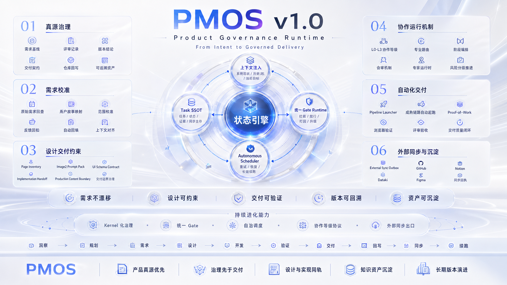

# PMOS v1.0

`PMOS` 是一个面向真实产品交付的产品经理 Agent 平台。

它把需求承接、拆解、评审、治理、交付证据和知识同步放进同一条受控工作流里，目标不是“更像聊天”，而是“更像一个能持续推进产品工作的系统”。



## What PMOS Solves

1. 需求不再散落在聊天、补充说明和临时文档里。
2. 需求可以继续拆到 `function / API / task`。
3. 评审不再只停留在口头建议。
4. 前端交付不再只看截图和代码。
5. 跨设备、跨会话时，不再反复复制粘贴上下文。

## What You Get

1. 统一承接复杂产品需求。
2. `requirement -> function -> API -> task` 深拆链。
3. `specialist review + Hermes governance + proof-of-work` 默认交付闭环。
4. 前端浏览器级验证进入默认产物链。
5. `GitHub + Notion + cloud-mirror` 三层知识连续性。

## Current State

- 当前产品版本：`v1.0`
- 当前运行时基线：`v0.7`
- 当前仓库身份：独立 `PMOS product repo`
- 当前状态：已具备独立安装、构建、启动和继续演进的首版产品骨架

## Quick Start

前置要求：

1. Node.js `22+`
2. npm
3. Git

启动：

```bash
npm install
cp .env.example .env
npm run lint
npm run build
npm start
```

最小验证：

1. `GET /api/health` 返回 `200`
2. 浏览器访问 `/` 返回 `200`

## Read Next

1. [产品介绍](docs/operations/pmaios-introduction.md)
2. [真源索引](docs/operations/platform-truth-source-index.md)
3. [当前版本进度](docs/operations/current-version-progress.md)
4. [首次启动指南](docs/deployment/first-run.md)
5. [API 总览](docs/deployment/api-overview.md)
6. [操作者指南](docs/deployment/operator-guide.md)
7. [运行资产中文索引](docs/operations/pmos-prompts-skills-agents-tools-zh-index.md)
8. [Prompt 中文手册](docs/operations/pmos-prompt-zh-manual.md)
9. [变更记录](CHANGELOG.md)

## Repo Boundary

这个仓库包含：

1. 平台运行时代码
2. `v1.0` 对外真源文档
3. workflow / prompts / config sample
4. 部署和发布说明

这个仓库不包含：

1. 业务子项目主体
2. 私有 inbox 原始材料
3. 真实本地会话历史和隐藏运行态
4. 私钥、token、机器路径等敏感配置

## Status

当前已经可以作为 `v1.0` 对外产品仓继续推进，并以补丁方式持续更新。

后续仍会继续补：

1. 更完整的测试覆盖
2. 更细的 operator 文档
3. 更完整的运行关系说明
