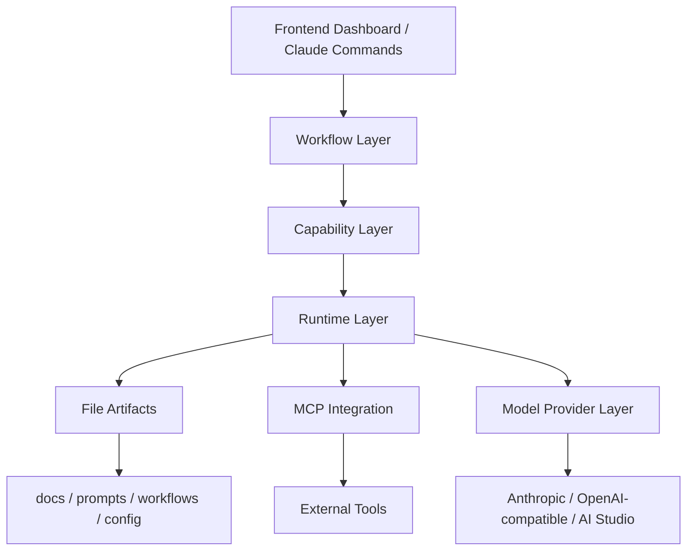
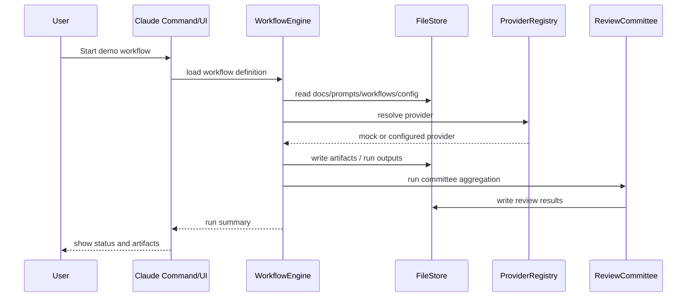
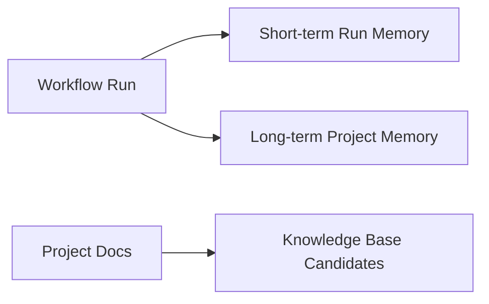

# AI OS v2 架构设计

- 版本：v0.1
- 日期：2026-04-07

---

## 1. 架构原则

1. 文件驱动是系统真源
2. Claude Code 是执行环境，不是仓库内被重造的对象
3. OpenSpec / Superpowers 仅做兼容预留，不在仓库中重复实现
4. 模型调用与工具调用分层设计
5. Review Committee 是正式质量门禁，而非附加说明

---

## 2. 分层架构

### Interface Layer
- `src/frontend/`
- `skills/`
- `~/.codex/skills/`（本机安装层）
- 提供 dashboard 与命令入口

### Workflow Layer
- `workflows/*.md`
- `src/core/workflowEngine.ts`
- 负责阶段编排、状态推进与运行聚合

### Capability Layer
- 行业分析
- PRD
- 架构
- Task
- Review Committee
- Memory
- 多模态产物

### Runtime Layer
- `src/core/fileStore.ts`
- `src/core/providerRegistry.ts`
- `src/core/mcpRegistry.ts`
- `src/core/memoryService.ts`
- `src/core/reviewCommittee.ts`

---

## 3. 模块划分

### docs/
业务产物真源：
- industry analysis
- prd
- architecture
- tasks
- review
- memory
- decisions

### prompts/
角色提示词模板：
- industry analysis
- prd
- architecture
- task
- review

### workflows/
工作流与角色定义：
- 主流程
- 执行规则
- 角色说明
- demo workflow

### src/core/
可执行运行时：
- 文件装载
- workflow 执行
- committee 聚合
- provider registry
- mcp registry
- memory 读写

### src/backend/
提供本地 API：
- workflow 状态
- artifact 列表
- review 输出
- providers / mcp 状态

### src/frontend/
提供 dashboard：
- workflow viewer
- artifact viewer
- review viewer
- system overview

---

## 4. 数据流与调用链

---

## 5. OpenSpec / Superpowers 兼容策略

- 不创建 `openspec/`、`superpowers/` 本地替代实现
- 仅在架构与配置层保留集成点
- 所有业务真源留在本仓库的 `docs/`、`prompts/`、`workflows/`、`config/`
- 未来若接入 OpenSpec / Superpowers，应通过 adapter 读取或映射本仓库资产

---

## 6. Memory 架构

- 短期上下文：运行结果、状态、审查记录
- 长期记忆：项目共识、决策、长期约束
- 知识库：后续可扩展，但首版以文件为主

---

## 7. 前端架构选择

采用 React + Vite + TypeScript。

原因：
- 适合本地优先 dashboard
- 初始化快
- 不强行引入 SSR 和复杂平台约束
- 易于与本地 Express API 配合
