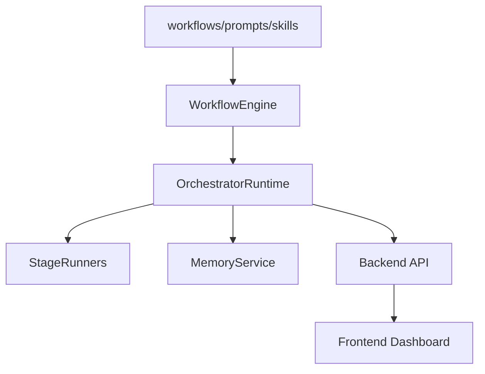

# 架构设计

## 运行上下文
- runId: run-20260406202412
- stageId: architecture
- ownerRole: 系统架构师
- artifactPath: docs/architecture/run-20260406202412.md.md
- currentStage: architecture

## 方法论 Skills
### System Boundary
- id: system-boundary
- category: architecture
- description: 用于定义 AI OS 分层架构、边界与外部能力协作方式。
- prompt: prompts/architecture_prompt.md
- outputs: 分层架构 / Mermaid 图 / 模块职责 / 边界说明

## 项目记忆摘录
- Project Memory
- # Long-term facts
- - Project root is `E:\\AI\\ai-os`
- - Stack baseline is Node.js + TypeScript + React + Vite
- - OpenSpec and Superpowers are external integrations, not in-repo reimplementations
- - AI OS workflow is file-driven and phase-based

## 阶段说明
输出系统分层、调用链与兼容策略。

## 验收标准
- 包含 Mermaid 图
- 包含模块边界
- 包含兼容策略

## 分层架构
- Truth Sources: docs / workflows / prompts / config / skills
- Core Runtime: workflowEngine / orchestratorRuntime / stageRunners / memoryService
- Delivery: backend API / frontend dashboard / future CLI

## Mermaid 图

## 模块职责
- WorkflowEngine 负责 definition/read model/metrics。
- OrchestratorRuntime 负责 run 状态推进。
- StageRunners 负责按阶段生成真实 MVP 产物。

## 数据流与调用链
- initRun -> active stage -> advanceRun -> artifact -> event log -> metrics/review

## 外部能力边界
- Claude Code / OpenSpec / Superpowers 作为外部能力，不在仓库内重造。