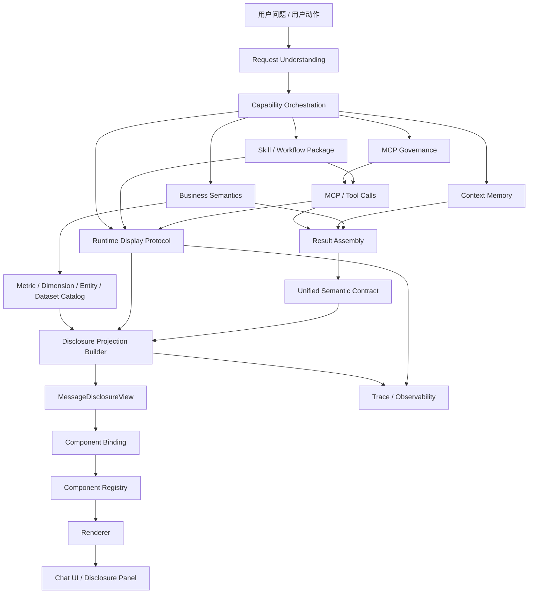

# PMAIOS / Enterprise AI Chat OS 当前目录结构补充建议

> 目标：在当前总纲架构下补齐「过程与依据披露层」的文档、契约、代码、示例、测试与迁移路径。  
> 原则：不新增平行架构，不把披露逻辑硬编码在 UI，不把 Runtime Trace 直接塞进业务结果，不让 Skill 成为新的协议中心。

---

## 1. 当前结构判断

你当前的架构图已经是正确方向：

```txt
Enterprise AI Chat OS
├─ Visual System
├─ Interaction System
├─ Frontend Engineering System
├─ Unified Semantic Contract
├─ Runtime Display Protocol
├─ Disclosure Contract / Disclosure Projection
├─ Component Binding / Registry / Renderer
├─ Orchestration Layer
├─ Execution Layer
└─ Skill / Workflow Packages
```

这个结构里，`Disclosure Contract / Disclosure Projection` 已经被放在一级架构中。现在缺的不是再新建一个系统，而是补齐它的标准落地物：

```txt
1. docs：怎么定义、怎么投影、怎么展示、怎么脱敏、怎么评测
2. contracts：MessageDisclosureView / ExecutionStep / Evidence / Field / QualityCheck
3. builders：如何从 SemanticResult + RuntimeDisplay + Trace + Catalog 生成 Disclosure
4. adapters：如何兼容当前只有 tool_call / raw_result / execution_detail 的旧结构
5. renderers：前端如何渲染右侧过程与依据面板
6. tests：如何防止又退回到“一个来源按钮 + 一个原始 JSON”
```

---

## 2. 推荐更新后的总目录结构

建议将当前目录升级为下面结构。`← 新增` 表示本次要补齐的部分，`← 补强` 表示已有但需要完善边界。

```txt
Enterprise AI Chat OS
├─ ENTERPRISE_AI_CHAT_OS_SPEC.md
├─ 00_SPEC_INDEX.md
├─ 01_EXECUTION_LAYER_INDEX.md
├─ 02_ORCHESTRATION_LAYER_INDEX.md
├─ 03_DISCLOSURE_LAYER_INDEX.md                     ← 新增
├─ 04_PRESENTATION_LAYER_INDEX.md                   ← 新增 / 可选
│
├─ docs/
│  └─ architecture/
│     ├─ architecture-map.md                        ← 补强：放当前总纲架构图
│     │
│     ├─ visual-system/
│     │  ├─ visual-system.md
│     │  ├─ design-tokens.md
│     │  ├─ typography.md
│     │  ├─ spacing.md
│     │  └─ color-and-status-semantics.md
│     │
│     ├─ interaction-system/
│     │  ├─ interaction-system.md
│     │  ├─ message-action-bar.md
│     │  ├─ progressive-disclosure.md
│     │  ├─ disclosure-panel-ux.md                  ← 新增
│     │  ├─ evidence-viewer-ux.md                   ← 新增
│     │  ├─ field-explanation-viewer-ux.md          ← 新增
│     │  └─ runtime-trust-ux.md                     ← 新增
│     │
│     ├─ frontend-engineering-system/
│     │  ├─ frontend-engineering-system.md
│     │  ├─ state-management.md
│     │  ├─ renderer-boundary.md
│     │  ├─ error-boundary.md
│     │  └─ legacy-adapter-policy.md                ← 新增
│     │
│     ├─ unified-semantic-contract/
│     │  ├─ unified-semantic-contract.md
│     │  ├─ semantic-result-contract.md
│     │  ├─ semantic-region-contract.md
│     │  ├─ action-contract.md
│     │  ├─ evidence-ref-contract.md                ← 补强
│     │  ├─ source-ref-contract.md                  ← 补强
│     │  ├─ field-ref-contract.md                   ← 新增
│     │  └─ semantic-result-validation.md
│     │
│     ├─ runtime-display-protocol/
│     │  ├─ runtime-display-protocol.md
│     │  ├─ runtime-event-model.md                  ← 新增
│     │  ├─ tool-call-display-model.md              ← 补强
│     │  ├─ workflow-trace-display-model.md         ← 新增
│     │  ├─ streaming-state-model.md
│     │  ├─ retry-error-recovery-model.md
│     │  ├─ trace-projection-source.md              ← 新增
│     │  └─ runtime-redaction-policy.md             ← 新增
│     │
│     ├─ disclosure-contract/                       ← 新增正式层
│     │  ├─ disclosure-system.md
│     │  ├─ disclosure-contract.md
│     │  ├─ message-disclosure-view.contract.md
│     │  ├─ disclosure-projection-builder.md
│     │  ├─ disclosure-input-sources.md
│     │  ├─ disclosure-scope-model.md
│     │  ├─ execution-step-disclosure.md
│     │  ├─ evidence-disclosure-policy.md
│     │  ├─ source-disclosure-policy.md
│     │  ├─ field-catalog-disclosure.md
│     │  ├─ quality-check-disclosure.md
│     │  ├─ raw-data-disclosure-policy.md
│     │  ├─ disclosure-permission-policy.md
│     │  ├─ disclosure-empty-state-policy.md
│     │  ├─ legacy-runtime-to-disclosure-adapter.md
│     │  └─ disclosure-evaluation.md
│     │
│     ├─ component-binding-registry-renderer/
│     │  ├─ component-binding.md
│     │  ├─ component-registry.md
│     │  ├─ renderer-contract.md
│     │  ├─ resolver-context.md
│     │  ├─ disclosure-resolver.md                  ← 新增
│     │  ├─ disclosure-panel-binding.md             ← 新增
│     │  ├─ evidence-viewer-binding.md              ← 新增
│     │  └─ field-explanation-binding.md            ← 新增
│     │
│     ├─ orchestration-layer/
│     │  ├─ request-understanding/
│     │  │  ├─ request-understanding-system.md
│     │  │  ├─ intent-governance.md
│     │  │  ├─ user-requirement-contract.md
│     │  │  ├─ slot-schema.md
│     │  │  ├─ dictionary-resolution.md
│     │  │  └─ ambiguity-clarification-policy.md
│     │  │
│     │  ├─ capability-orchestration/
│     │  │  ├─ capability-orchestration-system.md
│     │  │  ├─ capability-manifest.md
│     │  │  ├─ mcp-tool-normalization.md
│     │  │  ├─ capability-selection-policy.md
│     │  │  ├─ fallback-policy.md
│     │  │  └─ routing-trace.md                     ← 补强：作为 disclosure input
│     │  │
│     │  ├─ business-semantics/
│     │  │  ├─ business-semantic-layer.md
│     │  │  ├─ metric-catalog.md                    ← 补强：字段披露输入源
│     │  │  ├─ dimension-catalog.md
│     │  │  ├─ entity-catalog.md
│     │  │  ├─ dataset-authority.md                 ← 补强：来源披露输入源
│     │  │  └─ date-granularity-rules.md
│     │  │
│     │  ├─ context-memory/
│     │  │  ├─ conversation-context-system.md
│     │  │  ├─ follow-up-resolution.md
│     │  │  ├─ context-carryover-policy.md
│     │  │  └─ context-expiry-policy.md
│     │  │
│     │  ├─ mcp-governance/
│     │  │  ├─ mcp-tool-governance.md
│     │  │  ├─ tool-onboarding-checklist.md
│     │  │  ├─ tool-capability-normalization.md
│     │  │  └─ tool-versioning.md
│     │  │
│     │  ├─ result-assembly/
│     │  │  ├─ result-assembly-system.md
│     │  │  ├─ tool-result-to-semantic-result.md
│     │  │  ├─ partial-result-policy.md
│     │  │  ├─ insufficient-data-policy.md
│     │  │  └─ disclosure-output-boundary.md         ← 新增：Result 不直接承担披露
│     │  │
│     │  ├─ observability/
│     │  │  ├─ observability-system.md              ← 新增 / 若已有则补强
│     │  │  ├─ trace-model.md
│     │  │  ├─ span-taxonomy.md
│     │  │  ├─ trace-to-runtime-display.md
│     │  │  └─ trace-to-disclosure-projection.md    ← 新增
│     │  │
│     │  └─ prompting/
│     │     ├─ prompting-system.md
│     │     ├─ prompt-fragment-policy.md
│     │     ├─ runtime-narration-policy.md          ← 补强：不能替代 disclosure
│     │     └─ forbidden-disclosure-patterns.md     ← 新增
│     │
│     ├─ execution-layer/
│     │  ├─ validation/
│     │  │  ├─ semantic-result-validator.md
│     │  │  ├─ runtime-display-validator.md
│     │  │  └─ disclosure-view-validator.md         ← 新增
│     │  ├─ adapter/
│     │  │  ├─ legacy-semantic-result-adapter.md
│     │  │  └─ legacy-runtime-disclosure-adapter.md ← 新增
│     │  ├─ registry/
│     │  │  ├─ renderer-registry.md
│     │  │  └─ disclosure-view-registry.md          ← 新增
│     │  ├─ golden-examples/
│     │  │  ├─ semantic-result.examples.md
│     │  │  └─ disclosure-view.examples.md          ← 新增
│     │  ├─ guardrail/
│     │  │  ├─ no-raw-json-default-render.md        ← 新增
│     │  │  ├─ no-ui-hardcoded-field-meaning.md     ← 新增
│     │  │  └─ no-runtime-in-semantic-result.md     ← 补强
│     │  └─ observability/
│     │     ├─ telemetry.md
│     │     └─ disclosure-quality-metrics.md        ← 新增
│     │
│     └─ skill-workflow-packages/
│        ├─ skill-package-system.md
│        ├─ skill-manifest-template.md
│        ├─ workflow-dag-template.md
│        ├─ evidence-policy-template.md             ← 补强：与 disclosure policy 对齐
│        ├─ result-contract-template.md
│        ├─ disclosure-extension-template.md         ← 新增：Skill 只能扩展，不能自建披露体系
│        └─ capability-package-layout.md
│
├─ frontend/
│  └─ src/
│     ├─ contracts/
│     │  ├─ semantic-result/
│     │  ├─ runtime-display/
│     │  └─ disclosure/                             ← 新增
│     │     ├─ types.ts
│     │     ├─ message-disclosure-view.schema.ts
│     │     ├─ constants.ts
│     │     ├─ guards.ts
│     │     ├─ validators.ts
│     │     ├─ normalize.ts
│     │     ├─ builders/
│     │     │  ├─ buildDisclosureView.ts
│     │     │  ├─ buildExecutionSteps.ts
│     │     │  ├─ buildEvidenceDisclosure.ts
│     │     │  ├─ buildFieldCatalogDisclosure.ts
│     │     │  └─ buildQualityChecks.ts
│     │     ├─ adapters/
│     │     │  └─ legacyRuntimeToDisclosure.ts
│     │     ├─ examples/
│     │     │  ├─ report-query.missing-metadata.example.ts
│     │     │  ├─ tool-only.legacy.example.ts
│     │     │  └─ no-tool-context-only.example.ts
│     │     └─ __tests__/
│     │        ├─ disclosureView.contract.test.ts
│     │        ├─ legacyRuntimeToDisclosure.test.ts
│     │        ├─ fieldCoverageQualityCheck.test.ts
│     │        └─ emptyStatePolicy.test.ts
│     │
│     ├─ renderers/
│     │  ├─ registry/
│     │  ├─ resolvers/
│     │  │  ├─ EvidenceResolver.ts
│     │  │  ├─ SourceResolver.ts
│     │  │  ├─ RuntimeResolver.ts
│     │  │  └─ DisclosureResolver.ts               ← 新增
│     │  └─ disclosure/
│     │     ├─ DisclosurePanelRenderer.tsx          ← 新增
│     │     ├─ OverviewTab.tsx
│     │     ├─ ExecutionTab.tsx
│     │     ├─ EvidenceTab.tsx
│     │     ├─ FieldCatalogTab.tsx
│     │     ├─ QualityCheckTab.tsx
│     │     ├─ RawInfoTab.tsx
│     │     └─ EmptyState.tsx
│     │
│     └─ chat/
│        ├─ MessageActionBar.tsx                    ← 补强：入口从“来源”升级为“过程与依据”
│        ├─ MessageDisclosureDrawer.tsx             ← 新增
│        └─ messageState.ts                         ← 补强：按 message_id 绑定 disclosure view
│
├─ schemas/
│  └─ disclosure/
│     ├─ message-disclosure-view.v1.schema.json     ← 新增
│     ├─ execution-step.v1.schema.json              ← 新增
│     ├─ evidence-disclosure.v1.schema.json         ← 新增
│     ├─ field-catalog-disclosure.v1.schema.json    ← 新增
│     └─ quality-check.v1.schema.json               ← 新增
│
├─ examples/
│  └─ disclosure/
│     ├─ report-query-missing-source-and-fields.json
│     ├─ android-attribution-diagnosis.json
│     ├─ partial-result-with-warning.json
│     ├─ no-tool-context-only.json
│     └─ failed-tool-call-with-retry.json
│
├─ tests/
│  ├─ contracts/
│  │  └─ disclosure-contract.test.ts
│  ├─ golden/
│  │  └─ disclosure-golden-cases.test.ts
│  └─ e2e/
│     └─ chat-disclosure-panel.e2e.ts
│
└─ management-center/
   └─ import/
      ├─ disclosure-panel.default-config.json       ← 新增
      ├─ disclosure-permission-policy.example.json  ← 新增
      └─ disclosure-quality-rules.example.json      ← 新增
```

---

## 3. 当前架构图需要微调的地方

你当前链路是：

```txt
Result Assembly
→ Unified Semantic Contract
→ Runtime Display Protocol
→ Disclosure Contract / Projection
→ Component Binding
→ Component Registry
→ Renderer
```

建议补成：

```txt
Request Understanding
→ Capability Orchestration
→ Business Semantics
→ Context Memory
→ MCP Governance
→ Skill / Workflow
→ MCP / Tool Calls
→ Result Assembly
→ Unified Semantic Contract
→ Runtime Display Protocol
→ Disclosure Projection Builder
→ MessageDisclosureView
→ Component Binding / Registry / Renderer
→ Chat UI
```

核心变化是明确：

```txt
Disclosure Projection Builder 不是 UI 组件
MessageDisclosureView 是前端消费的稳定数据契约
Runtime Display Protocol 是披露输入源之一，不是披露本身
Unified Semantic Contract 是披露输入源之一，不是披露本身
Business Semantics / Metric Catalog / Dataset Authority 也是披露输入源
```

建议替换当前 Mermaid 为：



---

## 4. 最小 P0 补充范围

如果只做本次“过程与依据披露层”闭环，P0 不需要补完整目录。最小必须补这些：

```txt
docs/architecture/disclosure-contract/
├─ disclosure-system.md
├─ message-disclosure-view.contract.md
├─ disclosure-projection-builder.md
├─ execution-step-disclosure.md
├─ evidence-disclosure-policy.md
├─ field-catalog-disclosure.md
├─ quality-check-disclosure.md
├─ raw-data-disclosure-policy.md
└─ legacy-runtime-to-disclosure-adapter.md

frontend/src/contracts/disclosure/
├─ types.ts
├─ message-disclosure-view.schema.ts
├─ builders/buildDisclosureView.ts
├─ adapters/legacyRuntimeToDisclosure.ts
├─ validators.ts
├─ examples/report-query.missing-metadata.example.ts
└─ __tests__/

frontend/src/renderers/disclosure/
├─ DisclosurePanelRenderer.tsx
├─ OverviewTab.tsx
├─ ExecutionTab.tsx
├─ EvidenceTab.tsx
├─ FieldCatalogTab.tsx
├─ QualityCheckTab.tsx
├─ RawInfoTab.tsx
└─ EmptyState.tsx

schemas/disclosure/
└─ message-disclosure-view.v1.schema.json

tests/golden/
└─ disclosure-golden-cases.test.ts
```

P0 的验收标准：

```txt
1. 消息操作栏入口从“来源”升级为“过程与依据”。
2. 每条 assistant message 按 message_id 绑定 MessageDisclosureView。
3. 默认打开概览，不默认展示 raw JSON。
4. 能展示执行链路、数据依据、字段口径、质量检查、原始信息。
5. source_refs 为空时必须说明是“未返回来源元数据”，不能只显示空。
6. field_catalog 为空时必须说明是“指标字典未命中/未返回”，不能只显示空。
7. 当前只有 tool_call/raw_result 的旧结构可以通过 legacy adapter 生成最小 DisclosureView。
8. 前端不得通过字段名硬编码业务含义。
9. raw request/response 只出现在 RawInfoTab，并受权限/脱敏策略控制。
10. CI 有 golden case 防止退回到单个来源按钮和单个 JSON 代码块。
```

---

## 5. P1 / P2 补充范围

### P1：可排障

```txt
1. 补 routing_trace → execution_step 的映射。
2. 补 trace_id / span_id / tool_call_id / query_id 关联。
3. 补 requested_metrics vs returned_fields 覆盖检查。
4. 补 Metric Catalog / Dataset Authority 到字段与来源披露。
5. 补权限分层：普通用户、业务用户、研发、管理员。
6. 补“复制排障信息”动作，但不能复制未脱敏 raw。
7. 补 Disclosure Quality Metrics。
```

### P2：企业级 Trace Viewer 体验

```txt
1. 支持 message / task / conversation scope 切换。
2. 支持多工具调用串并行链路展示。
3. 支持 retry / fallback / partial result 的可视化。
4. 支持 trace 平台跳转。
5. 支持多次运行对比。
6. 支持按质量检查自动定位到步骤和字段。
```

---

## 6. 各层职责边界

### Unified Semantic Contract

负责最终业务结果：

```txt
- answer regions
- tables / charts / cards
- insights / risks / recommendations
- action refs
- evidence refs / source refs
```

不负责：

```txt
- 展示完整工具调用过程
- 展示 raw trace
- 决定右侧披露面板布局
```

### Runtime Display Protocol

负责运行过程真源：

```txt
- tool calls
- workflow steps
- streaming state
- retry / fallback / error / recovery
- trace_id / span_id
```

不负责：

```txt
- 解释字段口径
- 判断业务指标是否覆盖用户问题
- 生成最终用户可读的披露视图
```

### Disclosure Contract / Projection

负责披露边界：

```txt
- 把结果、过程、证据、字段、质量检查投影成 MessageDisclosureView
- 决定哪些内容可见、脱敏、隐藏、管理员可见
- 处理空状态和缺失元数据
- 输出前端稳定可渲染结构
```

不负责：

```txt
- 执行工具
- 重新组装业务结果
- 定义 UI 视觉样式
```

### Component Binding / Registry / Renderer

负责展示：

```txt
- 根据 componentBinding 找到 DisclosurePanelRenderer
- 渲染 Overview / Execution / Evidence / FieldCatalog / QualityCheck / RawInfo
- 处理交互、展开、复制、跳转
```

不负责：

```txt
- 从 raw_result 猜字段含义
- 从 toolName 猜业务流程
- 私有定义 evidence/source/action/disclosure 结构
```

---

## 7. MessageDisclosureView 建议契约

```ts
export type DisclosureScope = 'message' | 'task' | 'conversation';

export type DisclosureStatus = 'running' | 'completed' | 'failed' | 'partial';

export interface MessageDisclosureView {
  schemaVersion: 'message-disclosure-view.v1';
  messageId: string;
  conversationId?: string;
  taskId?: string;
  runId: string;
  traceId?: string;
  traceUrl?: string;
  scope: DisclosureScope;
  status: DisclosureStatus;
  startedAt?: string;
  completedAt?: string;
  durationMs?: number;

  overview: DisclosureOverview;
  execution: ExecutionStepDisclosure[];
  evidence: EvidenceDisclosure;
  fields: FieldCatalogDisclosure;
  qualityChecks: QualityCheckDisclosure[];
  rawInfo: RawInfoDisclosure;
  permissions: DisclosurePermissionState;
  emptyStates: DisclosureEmptyState[];
}
```

最低必要对象：

```ts
export interface DisclosureOverview {
  title: string;
  summary: string;
  intentSummary?: string;
  parameterSummary?: Array<{ label: string; value: string }>;
  counters: {
    toolCallCount: number;
    sourceCount: number;
    evidenceCount: number;
    returnedFieldCount: number;
    matchedFieldCount: number;
    warningCount: number;
    errorCount: number;
  };
}

export interface ExecutionStepDisclosure {
  stepId: string;
  stage:
    | 'request_understanding'
    | 'context_resolution'
    | 'capability_selection'
    | 'business_semantic_resolution'
    | 'mcp_tool_call'
    | 'result_assembly'
    | 'quality_check'
    | 'response_generation'
    | 'rendering';
  title: string;
  status: 'success' | 'warning' | 'failed' | 'skipped' | 'running';
  inputSummary?: string;
  outputSummary?: string;
  durationMs?: number;
  traceId?: string;
  spanId?: string;
  toolCallId?: string;
  warnings?: Array<{ code: string; message: string }>;
  requestRedacted?: unknown;
  responseRedacted?: unknown;
}
```

---

## 8. 需要从现有架构补出的输入源

Disclosure Builder 不应该只读 tool_call。它至少需要这些输入：

```txt
1. SemanticResultContract
   - answer regions
   - evidence refs
   - source refs
   - action refs
   - semantic fields

2. RuntimeDisplayProtocol
   - tool calls
   - workflow events
   - routing trace
   - trace_id / span_id
   - runtime status

3. Business Semantic Layer
   - metric catalog
   - dimension catalog
   - entity catalog
   - dataset authority
   - date granularity rules

4. Orchestration Layer
   - request understanding
   - extracted slots
   - selected capability
   - fallback path

5. Result Assembly
   - semantic result mapping
   - partial result reason
   - insufficient data reason

6. Permission / Redaction Policy
   - role-based visibility
   - raw input/output visibility
   - PII / secret masking
```

---

## 9. 需要补的质量检查

至少内置这些 Quality Checks：

```txt
1. intent_resolution_check
   用户请求是否被明确理解。

2. slot_completeness_check
   时间、对象、指标、维度等槽位是否完整。

3. capability_selection_check
   选择的 capability 是否与 intent 匹配。

4. metric_coverage_check
   用户请求指标是否被返回字段覆盖。

5. field_catalog_match_check
   返回字段是否命中字段/指标字典。

6. source_traceability_check
   数据是否有 source_refs / dataset / query_id / snapshot_at。

7. evidence_linkage_check
   结论是否能追溯到 evidence refs。

8. partial_result_check
   是否为部分结果，原因是否披露。

9. raw_visibility_check
   raw request/response 是否按权限脱敏。

10. renderer_binding_check
   disclosure view 是否能被前端 renderer 正常消费。
```

---

## 10. 旧结构迁移规则

当前如果只有：

```txt
- 一个工具调用
- 一个执行详情
- 一个原始返回代码块
- 来源为空
- 字段说明为空
```

不要让 UI 直接显示空。Legacy Adapter 应生成：

```txt
Overview
- 本次回答调用了 1 个工具。
- 未返回可展示的来源元数据。
- 未返回字段口径说明。

Execution
- Step: 工具调用
- Status: success / failed
- Tool: xxx
- Duration: 如果可用则展示

Evidence
- sources: []
- emptyState: 工具未返回 source_refs / dataset authority / query_id

Fields
- returnedFields: 从 raw_result 尽力提取
- matchedFields: 0
- emptyState: 未命中 metric catalog / field catalog

QualityChecks
- source_traceability_check: warning
- field_catalog_match_check: warning
- metric_coverage_check: warning，如果 requested_metrics 与 returned_fields 无法对齐

RawInfo
- redacted request
- redacted response
- raw_result collapsed by default
```

---

## 11. 对当前 architecture-map.md 的补丁建议

当前第 1 节总体目录结构建议改为：

```txt
Enterprise AI Chat OS
├─ Visual System
├─ Interaction System
├─ Frontend Engineering System
├─ Unified Semantic Contract
├─ Runtime Display Protocol
├─ Disclosure Contract / Disclosure Projection
├─ Component Binding / Registry / Renderer
├─ Orchestration Layer
├─ Execution Layer
├─ Skill / Workflow Packages
└─ Management / Evaluation / Governance
```

第 4 节结果层 / 运行层 / 披露层分离图建议补充：

```txt
Business Semantics → Disclosure Plane
Trace / Observability → Runtime Plane
Disclosure Plane → Disclosure Quality Metrics
```

第 6 节 Orchestration Layer 建议改为：

```txt
request-understanding
→ capability-orchestration
→ business-semantics
→ context-memory
→ mcp-governance
→ result-assembly
→ runtime-display-protocol output
→ disclosure input output
→ observability
```

不是让 orchestration 直接生成最终 DisclosureView，而是要求它输出足够的 disclosure input。

---

## 12. Codex CLI 实施任务建议

可以直接给 Codex CLI 的任务说明：

```txt
请在不推翻现有 Enterprise AI Chat OS 总纲的前提下，补齐 Disclosure Contract / Disclosure Projection 层。

目标：
1. 新增 docs/architecture/disclosure-contract/ 下的核心文档。
2. 新增 frontend/src/contracts/disclosure/ 下的 TypeScript 契约、builder、adapter、validator、tests。
3. 新增 schemas/disclosure/message-disclosure-view.v1.schema.json。
4. 新增 frontend/src/renderers/disclosure/ 下的 DisclosurePanelRenderer 与 6 个 tab。
5. 修改 MessageActionBar：入口文案从“来源”升级为“过程与依据”。
6. 修改 message state：按 message_id 绑定 disclosure view，不读全局 currentResult。
7. 增加 legacyRuntimeToDisclosure，兼容当前只有 tool_call / execution_detail / raw_result 的情况。
8. 增加 golden cases，覆盖 source empty、field empty、tool-only、partial result、failed tool with retry。
9. 禁止前端通过字段名硬编码业务含义；字段解释必须来自 Field / Metric Catalog 或 disclosure input。
10. Raw JSON 只能在 RawInfoTab 中折叠展示，并执行脱敏和权限策略。
```

---

## 13. 最终收敛结论

当前架构不用重做。正确补法是：

```txt
Unified Semantic Contract
  继续作为结果真源

Runtime Display Protocol
  继续作为过程真源

Disclosure Contract / Projection
  正式补齐为用户可见过程与依据的投影层

Component Binding / Registry / Renderer
  负责展示披露视图，不负责猜业务含义

Orchestration / Execution / Skill
  提供披露输入，不私有化披露体系
```

做到这一步，当前“只能看到一个来源按钮、一个工具调用、一个原始 JSON”的问题会被系统性解决，而不是用前端硬编码或局部 UI 修补解决。
