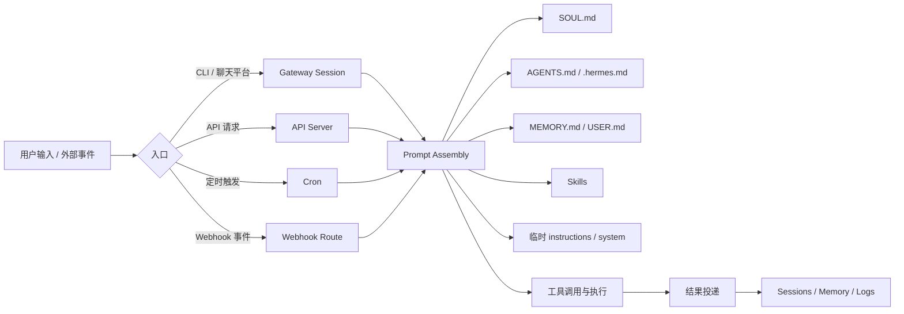

# Hermes Agent 产品侧搭建研究报告

## 执行摘要

截至 2026 年 4 月 19 日，公开资料中最明确、文档最完整、且与“agent 分类 / workflow / 提示词”直接相关的 “Hermes Agent”，是由 entity["organization","Nous Research","ai lab"] 维护的开源项目 `NousResearch/hermes-agent`。其上游官方文档、仓库、发布说明、技能目录、API Server、自动化模板、Profiles、Memory、SOUL/AGENTS 提示词体系都高度完备；而公开能搜到的 “Hermes Agent” 云镜像更多是第三方分发或打包发行，并不是上游产品本体。因此，下面的分析均以官方开源项目为目标对象。当前仓库显示最新发布为 v0.10.0，发布日期为 2026-04-16。citeturn20search0turn20search2turn15view0

如果你的重点是“产品 agent 分类、workflow、提示词”，那么最重要的结论不是先做 Docker/K8s，而是先把 Hermes 的**原生五层能力边界**建清楚：`SOUL.md` 负责长期人格与语气，`AGENTS.md` 负责项目/业务上下文，`MEMORY.md` 与 `USER.md` 负责稳定事实，`skills` 负责可复用流程，`system/instructions` 负责当前渠道或本次任务的临时约束。再往上，决定你要不要拆成多个 agent 的关键不是“功能多不多”，而是**记忆是否需要隔离、权限是否需要隔离、触发方式是否不同、交付对象是否不同**。官方已经提供了 profiles、skills、sessions、cron、webhooks、gateway 与 API server 这些拼装件，所以产品化的推荐路径通常是：**先单 profile 起步，后按边界拆 profile；先把 workflow 固化成 skill，再把稳定触发做成 cron/webhook；把输出风格放 SOUL，把业务规则放 AGENTS，把流程 SOP 放 skill。** citeturn29view0turn33view0turn34view0turn30view0turn29view1turn30view1turn35view0turn36view0turn31view0

## 目标界定

“Hermes Agent” 这个词在公开互联网上并非绝对唯一，但真正可用于工程化落地、且具备官方文档与完整功能说明的目标，基本就是上游开源项目 `NousResearch/hermes-agent`。另一类公开结果通常是第三方打包，例如 entity["organization","GitHub","code hosting platform"] 仓库之外的 AWS Marketplace AMI；这类分发镜像能帮助你更快启动实例，但它们不是产品定义的来源，也不应该作为“agent 分类 / workflow / 提示词设计”的主依据。citeturn20search0turn20search2turn15view0

从官方资料看，Hermes Agent 当前的产品内核已经不是单纯 CLI 聊天工具，而是一套完整的 agent 运行时：它有持久会话、长期记忆、可按需加载的 skills、平台网关、OpenAI 兼容 API server、定时任务、webhook 触发、profile 隔离，以及围绕 prompt assembly 的明确分层机制。换句话说，你要做的不是“再发明一个 agent 框架”，而是用 Hermes 已有原语构造出你的产品角色体系。citeturn32search5turn31view0turn35view0turn36view0turn30view1turn29view0

下面这些官方资源最值得优先读：

| 资源 | 作用 | 为什么先读 |
|---|---|---|
| 官方文档站 citeturn32search5 | 总入口 | 看全貌、导航到 features / guides / reference |
| GitHub 仓库主页 citeturn20search2 | 上游代码与版本事实 | 判断活跃度、版本、目录结构 |
| 发布说明 v0.10.0 citeturn20search0turn20search1 | 最新能力变化 | 判断哪些能力是近几个版本新增 |
| Prompt Assembly 文档 citeturn29view0 | 提示词真实装配顺序 | 这是做产品提示词设计的核心依据 |
| Personality / SOUL 文档 citeturn33view0turn33view1 | 长期人格层 | 决定品牌化语气与行为基线 |
| Context Files 文档 citeturn34view0 | 项目上下文层 | 决定业务规则放哪里 |
| Memory 文档 citeturn30view0 | 长期事实层 | 决定“记什么，不记什么” |
| Skills 文档与技能目录 citeturn29view1turn40view0turn41view0 | 流程复用层 | 决定 workflow 怎么沉淀 |
| Profiles 文档 citeturn30view1 | 多 agent 隔离 | 决定何时拆角色 |
| API Server / Cron / Webhook / Automation Templates citeturn31view0turn35view0turn36view0turn30view2 | 运行流与自动化 | 决定交互入口与触发方式 |

## 基于 Hermes 的 Agent 分类框架

官方并没有把 Hermes 预定义成“产品经理 agent / 运营 agent / 审核 agent”这类业务角色，但它给了你做角色划分所需的全部基础件：profiles 提供实例级状态隔离，skills 提供流程级复用，memory 提供稳定事实注入，API server / gateway / cron / webhook 提供不同触发入口，而 prompt assembly 则把这些能力拼成统一系统提示词。因此，Hermes 最适合的“产品 agent 分类法”，不是按部门名义切，而是按**状态边界 + 触发方式 + 输出责任**来切。citeturn30view1turn29view1turn30view0turn31view0turn35view0turn36view0turn29view0

从官方技能目录看，Hermes 自带的技能已经覆盖 research、productivity、github、devops、software-development、note-taking、media、mlops 等多类能力；这意味着你完全可以把“产品 agent”理解为**一层业务编排**，而不是再造底层能力。比如产品研究 agent 可以组合 `research` 与 `note-taking`；产品运营 agent 可以组合 `webhook`、`cron` 与 `productivity`；质量守门 agent 可以组合 `github-code-review`、`requesting-code-review` 与 `systematic-debugging`。citeturn40view2turn40view3turn40view4turn40view6

基于以上原语，我建议把产品侧 agent 先分成五类。这是**基于官方能力做的设计映射**，不是上游预设分类：

| 类型 | 核心职责 | 推荐 Hermes 映射 | 适合独立 profile 吗 |
|---|---|---|---|
| 对话助理型 | 面向人类问答、澄清需求、输出建议 | 单 profile + SOUL + AGENTS + sessions | 通常不需要 |
| 研究分析型 | 拉资料、比方案、沉淀结论 | 单 profile 起步；配 research / obsidian / documents 类 skill | 当知识域需要独立记忆时再拆 |
| 流程编排型 | 执行 SOP、串工具、固定产出格式 | skill 为主，必要时配 cron / webhook | 风险高时建议拆 |
| 审核守门型 | 评审、验收、合规、打回 | 独立 SOUL + 更严格 AGENTS + 受限 toolsets | 通常建议拆 |
| 事件驱动型 | 根据外部事件自动触发并投递结果 | webhook / cron / API server | 是否拆取决于渠道与权限边界 |

实际落地时，不要一开始就把“每个岗位都拆成一个 profile”。官方 FAQ 已经明确提示：很多场景下，**一个 profile 配合人格切换、`AGENTS.md` 和 cron 就够用**；只有当记忆、会话、技能、API key、网关状态真的需要隔离时，profiles 才值得引入。官方 profiles 文档也说明，每个 profile 都有独立的 `config.yaml`、`.env`、`SOUL.md`、memory、sessions、skills、cron 与 state。citeturn32search13turn30view1turn27search13

## Workflow 设计方法

从产品视角看，Hermes 最实用的 workflow 只有三种：**交互式 workflow、定时 workflow、事件式 workflow**。交互式 workflow 适合“用户来一句，agent 做一串”；定时 workflow 适合日报、监控、定期整理；事件式 workflow 适合 PR、工单、订单、埋点告警、GitHub/GitLab/JIRA/Stripe 这类外部事件驱动。官方文档已经分别用 API server、cron 和 webhook 覆盖了这三条路径。citeturn31view0turn35view0turn36view0turn30view2



上图不是官方原图，而是对官方运行机制的合成：prompt assembly 文档说明了 `SOUL.md`、memory、skills、context files 与临时 overlay 的装配顺序；sessions 文档说明所有对话都会持久化；cron 与 webhook 文档说明它们启动的是新的 agent 执行流；API server 文档说明前端 `system/instructions` 会叠加到 Hermes 自身核心提示词之上。citeturn29view0turn39view0turn35view0turn36view0turn31view0

对产品团队来说，最小可执行的 workflow 我建议这样起：

```bash
# 1) 为“产品研究”建立独立 profile（如果你确认需要隔离）
hermes profile create pm-research

# 2) 初始化它
pm-research setup

# 3) 给它挂一个定时任务：每天早上 9 点巡检竞品更新
pm-research cron create "0 9 * * 1-5" \
  "检查指定竞品博客、发布说明与 issue 更新，输出一份 5 条以内的中文摘要；如果没有新增，返回 [SILENT]。" \
  --name "competitor-digest" \
  --deliver telegram
```

这类用法符合官方 profiles 与 cron 的工作方式：profile 自带独立状态目录；cron 运行在 gateway 调度器中；每次 cron 都是**新 session**，所以提示词要写得自包含、不能依赖“上一个对话你记得吧”。官方还明确说明 cron 输出会自动投递到目标渠道，不需要你在 prompt 里重复要求 `send_message`。citeturn30view1turn35view0

如果你的产品 workflow 是“有事件就处理”，优先用 webhook，而不是把“轮询检查 + 解析 + 通知”塞进一个长 prompt。官方 webhook 路由支持事件过滤、HMAC 校验、模板 prompt、skills 注入、投递目标与 `deliver_only` 零推理直送模式，天然适合产品事件流。citeturn36view0

```yaml
platforms:
  webhook:
    enabled: true
    extra:
      port: 8644
      secret: "global-fallback-secret"
      routes:
        product-feedback-triage:
          events: ["issue_created", "ticket_created"]
          secret: "route-secret"
          prompt: |
            你是产品反馈分诊代理。
            标题：{title}
            来源：{source}
            用户：{user.name}
            内容：{body}
            请输出：
            1. 问题类别
            2. 严重级别
            3. 是否需要人工升级
            4. 下一步建议
          deliver: "slack"
```

如果你要从前端、内部工作台或业务系统调用 Hermes，而不是只做后台自动化，那么 API server 是更好的入口。官方文档说明：前端发来的 `system` 或 `instructions` 不会替换 Hermes 的核心能力，而是叠加到它已有的 tools、memory 与 skills 之上。这意味着你可以把“当前页面是什么角色、该输出什么样式”放在前端 overlay，而不必改动底层 profile。citeturn31view0

```bash
# ~/.hermes/.env
API_SERVER_ENABLED=true
API_SERVER_KEY=change-me-local-dev
API_SERVER_PORT=8642
```

```bash
curl http://localhost:8642/v1/responses \
  -H "Authorization: Bearer change-me-local-dev" \
  -H "Content-Type: application/json" \
  -d '{
    "model": "hermes-agent",
    "input": "分析这条用户反馈并给出产品建议",
    "instructions": "你是一个 B 端产品分析代理。必须输出：问题归类、影响面、复现线索、建议动作。"
  }'
```

## 提示词体系设计

Hermes 的真正强项，在于它的提示词不是“一整坨 system prompt”，而是有明确层次。官方 prompt assembly 文档给出的顺序，简化后大致是：`SOUL.md` 身份层 → 工具行为指导 → memory/user 快照 → skills 索引 → context files（如 `AGENTS.md`）→ 时间戳/会话信息 → 平台提示 → API/前端临时 overlay。官方 Personality、Context Files、Memory、Skills 与 API server 文档分别把这些层的责任边界讲得很清楚。citeturn29view0turn33view0turn34view0turn30view0turn29view1turn31view0

因此，如果你要做“产品 agent 提示词”，最重要的不是把一段超长提示词写漂亮，而是把指令放到**正确层级**：

| 层 | 应放内容 | 不应放内容 | 典型载体 |
|---|---|---|---|
| 身份层 | 长期语气、品牌人格、默认决策风格 | 项目路径、端口、一次性任务 | `SOUL.md` |
| 业务上下文层 | 产品规则、对象模型、关键路径、指标口径、数据源说明 | 风格口头禅、反复执行的 SOP | `AGENTS.md` / `.hermes.md` |
| 稳定事实层 | 用户偏好、组织约束、已知环境、固定偏好 | 长步骤流程 | `MEMORY.md` / `USER.md` |
| 流程层 | 多步骤 SOP、检查清单、验证动作、异常分支 | 纯风格描述 | `SKILL.md` |
| 当前任务层 | 本次输出格式、表格要求、语言要求、临时边界 | 长期规则 | `system` / `instructions` / 当前用户 prompt |

这个分工并不是抽象“最佳实践”，而是 Hermes 官方设计的自然延伸：SOUL 只应承载长期身份；AGENTS 是项目规则；memory 是有限且冻结的事实快照；skills 是按需加载的程序化知识；API overlay 是不污染持久系统提示的临时层。官方 Tips 文档甚至直接给出一句非常适合产品设计的原则：**memory 负责 what，skills 负责 how。** citeturn33view1turn34view0turn30view0turn29view1turn37view0

下面给出一套适合产品研究 agent 的最小提示词分层模板。

首先是 `SOUL.md`。这里不要写“你会读 Jira、你会看埋点、你会访问某某文档”，这些都不是身份，而是业务或流程能力。`SOUL.md` 只定义默认人格与判断习惯。官方文档明确要求它关注“谁、怎么说、避免什么”，而不是 repo 细节。citeturn33view0turn33view1

```markdown
# Identity
你是一个冷静、直接、重证据的产品研究代理。

# Style
- 先界定问题，再给结论
- 明确区分事实、推断、建议
- 默认简洁，但在需要比较方案时展开
- 不迎合，不夸大，不把猜测说成结论

# Avoid
- 空泛套话
- 没有证据支撑的“用户都喜欢”
- 过早下结论
- 明明信息不足却假装确定

# Defaults
当需求含糊时，优先把问题重写成可验证的问题。
当存在冲突信息时，先标记冲突来源，再给出暂定判断。
```

然后是 `AGENTS.md`。这里放你的产品工作台规则、关键数据源、字段定义、优先级口径、输出格式约束。官方 Context Files 文档说明，`AGENTS.md` 就是项目结构、约定、重要说明的主承载层。citeturn34view0

```markdown
# Product Workspace Context

## Goals
- 只处理 SaaS 产品的用户反馈、竞品动态、需求分诊、发布说明总结
- 输出默认使用中文

## Sources of Truth
- 用户反馈主库：Notion / Linear
- 技术缺陷：GitHub Issues
- 竞品动态：官网博客、发布日志、RSS

## Taxonomy
- 类别：Bug / Feature Request / UX / Billing / Integration / Performance / Docs
- 严重级别：S1 / S2 / S3 / S4
- 处理动作：立即修复 / 纳入迭代 / 继续观察 / 拒绝 / 需要人工判断

## Required Output
每次分析必须给出：
1. 归类
2. 严重级别
3. 证据或线索
4. 下一步动作
5. 是否需要人工升级
```

再往下，如果某个流程会重复运行，应该把它升级为 skill，而不是继续堆在 AGENTS 里。官方 skills 文档和贡献指南都强调：**大多数新能力优先做 skill，而不是 tool。** 对产品侧来说，这正适合“反馈分诊”“版本总结”“竞品变化扫描”“工单归并”这类可复用 SOP。citeturn29view1turn38view0

```markdown
---
name: feedback-triage
description: 分诊用户反馈并输出标准化结论
version: 1.0.0
metadata:
  hermes:
    tags: [product, triage, feedback]
---

# Feedback Triage

## When to Use
当输入是用户反馈、工单、客服转录、社区帖文、app store 评论时使用。

## Procedure
1. 提取问题主体、场景、影响对象、复现线索
2. 判断属于 Bug / Feature / UX / Docs / 其他
3. 评估严重级别与影响范围
4. 如果信息不足，明确指出缺口
5. 输出标准化结论

## Output Format
- 分类
- 严重级别
- 依据
- 建议动作
- 是否人工升级
```

最后，才是本次任务 prompt。这里应该尽量短、尽量具体，并且只描述“这一次你要什么”。官方 Tips 文档明确强调：具体 prompt 优于泛 prompt，最好前置上下文、错误信息、文件路径与预期输出。citeturn37view0

一个好的交互式 prompt 会长这样：

```text
请按 feedback-triage 流程处理下面这条反馈。
要求：
- 用中文
- 不超过 180 字
- 若证据不足，明确写“信息不足”
- 若判断为 Bug，补一条最可能的复现线索

反馈内容：
……
```

一个好的 cron prompt 会长这样：

```text
扫描今天新增的竞品发布说明与公开 issue。
只输出：
1. 新增能力
2. 对我们产品的潜在影响
3. 是否建议在本周例会上讨论
如果没有实质更新，只返回 [SILENT]。
```

一个好的 webhook prompt 会长这样：

```text
你是产品事件分诊代理。
请根据传入 payload 判断这是否：
- 高优先级线上问题
- 已知重复反馈
- 需要发给研发的缺陷
- 需要发给产品的需求
输出 JSON，字段固定为：
category, severity, escalate, owner, rationale
```

## 最小可行落地方案

如果你现在就要开工，我建议的最小落地方案不是“五个 agent、十个 profile、三套工作流”一起上，而是下面这个三阶段方法。原因很简单：官方资料表明，Hermes 的 profile、session、memory、cron、webhook、API server 都已经很强，但这些能力一旦同时启用，复杂度也会快速上升；而 prompt 分层和 skill 复用，反而应该最先固化。citeturn30view1turn39view0turn35view0turn36view0turn31view0

第一阶段，做**一个主 profile**。给它一份稳定 `SOUL.md`，一个产品工作台 `AGENTS.md`，再做 3 到 5 个高频 skill，例如 `feedback-triage`、`release-summary`、`competitor-scan`、`spec-review`。这时你已经能覆盖 70% 以上的产品工作。官方文档与 FAQ 都说明，很多看似“多个 agent”的需求，其实一个 profile 加人格切换或上下文文件就能胜任。citeturn32search13turn30view1

第二阶段，把高频但标准化的工作接入**cron 与 webhook**。定时报表、竞品扫描、用户反馈日报进 cron；GitHub / 工单系统 / 监控告警进 webhook。对于只是“转发通知”的场景，优先用 webhook 的 `deliver_only`，这样可以零 LLM 成本。对于需要分析与归类的场景，再让 agent 真正运行。citeturn35view0turn36view0

第三阶段，只有在你确认**需要隔离**时，才拆 profile。比如“产品研究 agent”与“代码审核 agent”如果共享 memory、API key、会话历史、消息渠道会产生污染，那么才拆成两个 profile。官方说明，每个 profile 都有独立的 config、memory、sessions、skills 与 gateway 状态，所以它是可靠的边界，但边界本身也带来运维成本。citeturn30view1turn27search13

下表给出一个更实用的“产品运行模式”对比。它不是官方原表，而是基于官方 profiles、API server、cron、webhook 能力做的产品化选型总结。citeturn30view1turn31view0turn35view0turn36view0

| 模式 | 优点 | 缺点 | 适用场景 |
|---|---|---|---|
| 单 profile 对话模式 | 配置最简单；上下文积累快；易迭代 | 角色容易混；权限与记忆不隔离 | 个人产品助手、早期 MVP |
| 单 profile + skills | SOP 可复用；提示词更短； token 更省 | skill 设计需要维护 | 高频固定流程 |
| 单 profile + cron/webhook | 自动化强；适合日报/告警/事件流 | fresh session 使 prompt 必须自包含 | 运营通知、反馈分诊、例行扫描 |
| 多 profile | 记忆/权限/渠道隔离清晰 | 运维、调试、配置成本更高 | 多团队、多角色、不同 API key 或不同语气人格 |
| API server 前端接入 | 适合内嵌产品、工作台、客户门户 | 要处理认证、调用约束与前端 overlay 设计 | 内部平台、企业集成、RAG/助手入口 |

## 风险与治理

第一类风险是**放错层级**。如果你把端口、路径、repo 规则写进 `SOUL.md`，或者把多步骤流程写进 `MEMORY.md`，Hermes 仍然能跑，但随着对话增多，它会越来越不稳定。官方文档对这件事的边界极其清楚：SOUL 放身份与风格，AGENTS 放项目规则，memory 放稳定事实，skills 放步骤流程。citeturn33view0turn33view1turn34view0turn30view0turn29view1

第二类风险是**误判记忆时效**。官方 memory 文档明确说明：memory 在 session 开始时以冻结快照注入；中途写入虽然已经落盘，但不会即时改写当前 session 的系统提示。因此，如果你刚让 agent “记住一个新规则”，不要又马上要求它在同一 session 按新规则表现得完全一致；更稳妥的做法是下一轮新 session 生效，或者把这类即时规则放到当前任务 prompt 里。citeturn30view0

第三类风险是**上下文优先级误解**。官方 context files 文档说明，同一 session 中项目上下文采用“第一命中优先”的优先级：`.hermes.md` → `AGENTS.md` → `CLAUDE.md` → `.cursorrules`，而不是全都同时叠满。因此，多套规则文件并存时，要非常清楚哪份才是真正上场的那份。citeturn34view0

第四类风险是**自动化 prompt 写得不自包含**。官方 cron 文档明确强调：cron 每次都是全新 session，prompt 必须自己带够上下文；“去看看那个问题”“按之前的方法做”这类表达在 cron 里天然脆弱。webhook 同理，应该用模板把 payload 中足够多的字段映射到 prompt；否则 agent 会因信息不全而输出空泛结论。citeturn35view0turn36view0

第五类风险是**把 API server 当普通聊天接口看待**。官方 API server 文档明确警告：它暴露的是带完整工具权限的 agent，而不是只会回答问题的只读模型。绑定到非回环地址时，应启用 bearer key，并收紧 CORS；否则这不是“AI 问答接口”，而是“带终端能力的代理执行入口”。citeturn31view0

## 官方资源与参考

以下资料应作为你的首要阅读顺序：

1. 官方总文档入口：Hermes Agent Documentation。用于总览功能面、导航到指南与参考页。citeturn32search5  
2. 上游仓库首页：`NousResearch/hermes-agent`。用于确认版本、代码结构、发布与活跃度。citeturn20search2  
3. 最新发布说明：Hermes Agent v0.10.0。用于判断当前版本能力边界与近期开关。citeturn20search0turn20search1  
4. Installation。用于从零安装与确认 Python / Node / extras 依赖。citeturn21view0  
5. Prompt Assembly。用于理解系统提示词的真实装配顺序，是提示词架构设计的核心文档。citeturn29view0  
6. Personality & SOUL.md 与 Use SOUL.md with Hermes。用于设计长期人格层。citeturn33view0turn33view1  
7. Context Files。用于设计 `AGENTS.md` / `.hermes.md` 这类业务上下文层。citeturn34view0  
8. Persistent Memory。用于设计 what/how 的边界与 stable facts 注入。citeturn30view0  
9. Skills System、Bundled Skills Catalog、Optional Skills Catalog。用于设计可复用 workflow 与能力组合。citeturn29view1turn41view0turn30view4  
10. Profiles。用于判断何时拆分多 agent。citeturn30view1  
11. API Server。用于把 Hermes 接进产品前端、工作台或服务端流程。citeturn31view0  
12. Scheduled Tasks、Webhooks、Automation Templates。用于做定时与事件驱动 workflow。citeturn35view0turn36view0turn30view2  
13. Tips & Best Practices。用于把 prompt、context、skills、memory 的使用习惯调到更接近官方推荐姿势。citeturn37view0  
14. Contributing 中 “Should it be a Skill or a Tool?”。用于决定你的产品流程到底该沉淀成 skill、还是必须做成底层 tool。citeturn38view0

综合来看，若你的目标是“做一个可扩展的产品 agent 体系”，Hermes 的正确打开方式不是先堆 infra，而是先把**角色边界、流程复用和提示词层级**设计对：**角色用 profile 隔离，风格用 SOUL 固化，业务规则用 AGENTS 承载，流程用 skill 复用，触发用 cron/webhook/API server 承接。** 只要这五件事放对位置，Hermes 本身已经足够支撑一个工程化、可演进的产品 agent 平台。citeturn29view0turn33view0turn34view0turn29view1turn30view1turn35view0turn36view0turn31view0