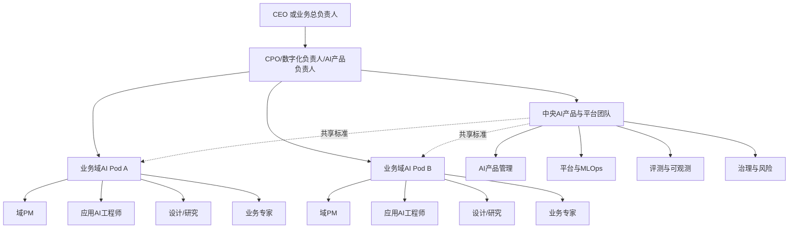
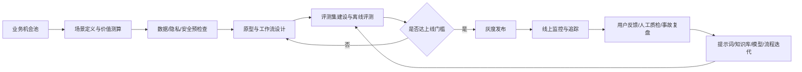

# 企业AI产品团队组织、流程、能力与治理研究报告

## 执行摘要

企业在设计 AI 产品团队时，最容易犯的错误，是把 AI 团队当成“会调模型的传统产品团队”或“做几个 PoC 的创新小组”。这两种理解都不够。AI 产品的核心差异在于：输出具有概率性与可变性，传统功能验收不足以证明其稳定可用；模型、数据、提示词、检索链路与业务流程会共同演化，因此上线不是终点，而是持续评测、监控与改进的起点；同时，合规、隐私、安全与内容风险并不是上线后的附属工作，而应当嵌入需求、设计、开发、发布与运营全流程。OpenAI 的评测指南明确指出，生成式 AI 的非确定性使传统软件测试方法不足；Google 的 MLOps 文档则将 CI/CD/CT、自动化与监控视为生产化 AI 的基本能力；NIST 与中国《生成式人工智能服务管理暂行办法》都强调，应把可信、风险与治理要求纳入 AI 产品全生命周期。citeturn23view4turn23view7turn23view2turn23view3

在组织形态上，对大多数企业最实用的默认答案不是“纯中心化”，也不是“完全分散到各业务线”，而是**中台引领、业务嵌入的 hub-and-spoke 模式**：中央团队负责标准、平台、评测、治理和复用资产，业务 pod 负责场景定义、流程改造、上线运营和价值兑现。这与行业调研中“central-led to hybrid”的演进方向一致，也与 OpenAI 在“研究—应用—部署”三类团队分工上的实践相呼应。citeturn23view0turn26view0turn23view1

如果企业当前行业不限、目标用户未指定、预算未指定，且默认采用“托管基础模型 + 企业知识库 + 轻量后训练/少量微调”的路线，而不是一开始自训基础模型，那么首年核心团队可参考如下建议区间：初创型 5–10 人，中型企业 12–25 人，大型企业 30–80 人核心团队再配业务线 pod。这个区间不是行业标准，而是基于评测、MLOps、治理、设计与业务协同工作量的综合推算；若企业需要自研基础模型、强监管审计或全球多区域部署，人数与预算都应显著上调。其逻辑依据是：生产化 AI 至少需要产品、工程、数据/MLOps、评价/监控、治理五类能力，而不是只配 PM 与算法工程师。citeturn23view7turn23view5turn23view0turn31view1

首年实施优先级建议很清楚：先做**用例分级、角色清晰、评测数据集、监控日志、权限与数据边界**，再做规模化推广和更复杂的训练。用 Google 的工程经验表述，就是先把基础设施做稳、模型做简；用 OpenAI 的企业实践表述，就是先从 evals 开始；用成本视角看，也应先右尺寸运行模型与请求，再决定是否需要微调或更多算力投入。citeturn23view8turn27view1turn36view1turn36view3

## 研究框架与判断标准

本文优先采用官方或一手资料，包括 entity["organization","NIST","us standards agency"]、entity["organization","ISO","standards body"]、entity["organization","欧盟","political union"]、entity["organization","国家互联网信息办公室","china cyberspace regulator"]、entity["company","OpenAI","ai company"]、entity["company","Google","technology company"]、entity["company","Microsoft","technology company"]、entity["company","Anthropic","ai company"]、entity["company","GitHub","software platform company"]、entity["company","阿里云","cloud computing company"]、entity["company","华为","technology company"] 等发布的框架、系统卡、产品文档、法规文本与企业案例；与此同时，辅以全球调研与行业报告，用来判断组织规模、运营方式与落地节奏。citeturn23view2turn31view0turn22view8turn23view3turn26view0turn24view0turn30view0turn37view1turn23view6turn33view1turn33view2turn23view1

本文采用五个判断标准来评估 AI 产品团队是否“设计得对”：  
其一，**业务结果**，即是否改善收入、成本、效率、客户体验或风险损失；其二，**质量与可靠性**，即是否有可复现的评测、发布门槛与线上监控；其三，**可扩展性**，即模型、知识库、工作流与治理能力是否可以复用到多个场景；其四，**合规与风险**，即是否能满足隐私、安全、内容、审计与区域规则要求；其五，**组织吸收能力**，即业务方、研发、设计、法务与一线运营是否真正把 AI 纳入日常流程。这个框架与 NIST AI RMF、ISO/IEC 42001、Microsoft 的 Identify–Measure–Mitigate–Operate 实践，以及 Google PAIR 的“以用户与成功定义为起点”的方法是相互一致的。citeturn23view2turn31view1turn30view1turn24view0

对很多企业而言，AI 团队是否成功，不取决于是否“有一个很强的大模型”，而取决于是否把以下问题答清楚：这个场景为什么值得做；用户真正容忍什么、不能容忍什么；什么叫做“好答案”；出了错如何发现、回退、纠正；上线后由谁对业务结果负责。Google PAIR 明确把“用户需求与成功定义”“数据收集与评估”“解释与信任”“反馈与控制”“错误与优雅失败”放在同一产品流里，这对企业尤其重要。citeturn24view0turn24view1

## 组织结构与岗位设计

从组织演进看，企业做 AI 产品通常经历三种形态：**中心化试点**、**中台+业务 pod**、**平台化联邦治理**。处于试错期时，中心化团队反应更快；进入多场景扩张期后，需要中央团队统筹标准、知识与平台，但让业务团队在场景层面对结果负责；当企业跨地域、多事业部、多监管域运营时，才适合进一步走向联邦治理。行业研究显示，很多取得更好效果的企业在早期都更偏 central-led，而不是一开始就完全下放。citeturn23view0turn23view1

### 推荐的默认组织形态

本文建议大多数企业采用以下默认组织：

这个结构的逻辑，与 OpenAI 在研究、应用、部署三类团队上的分工类似：核心能力不完全等于产品落地能力，落地能力也不等于业务改造能力；必须把“模型能力供给”“产品化”“业务部署”拆开治理。另一方面，McKinsey 对 operating model 的总结也指出，一个有效的 AI operating model 至少要同时覆盖战略 steering、标准 standard setting 与执行 execution 三类活动。citeturn26view0turn23view0

### 不同规模团队对比

下表是**建议区间**，适用于“行业不限、预算未指定、优先托管模型”的常见企业场景。它不是统计均值，而是基于评测、流程、工程、治理与协作工作量的综合推算。citeturn23view0turn23view7turn23view5turn31view1

| 维度 | 初创型团队 | 中型企业团队 | 大型企业团队 |
|---|---|---|---|
| 适用阶段 | 1–3 个高价值场景验证 | 3–10 个场景并行，开始平台化 | 多 BU、多区域、强合规、多产品线 |
| 建议人数 | 5–10 人 | 12–25 人 | 30–80 人核心团队，外加业务 pod |
| 组织形态 | 中心化单队/双队 | hub-and-spoke | 平台化联邦治理 |
| 汇报关系 | Head of Product 或 CTO 直带 | AI 产品负责人向 CPO/数字化负责人汇报，平台能力与 CTO 双协作 | AI 产品负责人、AI 平台负责人、治理负责人并列，进入经营例会 |
| PM 配置 | 1 名 AI PM/负责人 | 2–3 名 PM，按场景或平台拆分 | 4–8 名 PM，按业务域、平台域、治理域拆分 |
| 工程配置 | 2–4 名应用/后端/AI 工程师复合型 | 4–8 名应用 AI 工程师 + 2–4 名数据/ML 工程师 | 10–20 名应用 AI 工程师 + 6–12 名数据/ML 工程师 |
| 平台与 MLOps | 共享或兼职 0.5–1 人 | 1–2 名专职 | 4–8 名专职 |
| 设计与研究 | 共享设计 0.5 人即可 | 1–2 名 UX/对话/研究 | 2–5 名设计与研究 |
| 评测与 QA | AI PM 兼任 + 业务专家 | 1–2 名 eval/AI QA | 3–6 名 eval、AI QA、红队协作 |
| 治理与风险 | 法务/安全共享 | 0.5–1 名专责或双岗 | 2–5 名专门团队，含隐私、合规、内容与安全 |
| 最重要目标 | 找到 PMF、形成评测与上线门槛 | 扩大复用、降低成本、稳定 SLA | 形成平台、审计、资产复用与全球合规能力 |

### 核心岗位与职责拆分

在 AI 团队中，岗位不应只按“产品/算法/开发”三分。更实用的拆法是围绕**场景定义、系统实现、质量保证、平台复用、风险治理**五条链路来设岗。Google 的 PAIR 把 PM 与 UX 拉进 AI 生命周期；Google MLOps 把自动化、监控与运维纳入 ML 工程文化；Microsoft 则把评测、监控、追踪三者并列为 AI observability 的核心能力。citeturn24view0turn23view7turn23view5

| 岗位 | 核心使命 | 关键职责 | 建议汇报关系 | 首要 KPI |
|---|---|---|---|---|
| AI 产品负责人 | 统一 AI 产品组合、业务优先级与治理门槛 | 场景组合管理、资源分配、上线审批、跨部门协调 | 向 CPO/数字化负责人汇报 | 场景 ROI、上线成功率、复用率、重大事故数 |
| AI 产品经理 | 定义 use case、Eval Spec、上线标准与反馈闭环 | 需求拆解、用户研究、风险分级、验收方法、运营优化 | 向 AI 产品负责人汇报 | 业务指标改善、评测通过率、用户采用率 |
| 应用 AI 工程师 | 把模型、知识库、工作流和产品系统接成可运营系统 | 提示词/工作流/RAG/工具调用/API 集成/回退逻辑 | 向工程经理或 pod lead 汇报 | 端到端成功率、延迟、缺陷率 |
| 数据/ML/MLOps 工程师 | 建立数据、实验、部署、监控与版本化能力 | 数据管道、特征/知识资产、模型版本、CI/CD/CT、监控告警 | 向平台负责人汇报 | 发布频次、回滚时间、监控覆盖率、数据新鲜度 |
| AI 设计/研究 | 降低误用与不信任，提升用户心智与交互质量 | 解释、预期设置、反馈机制、错误状态、人工接管体验 | 向设计负责人或 AI 产品负责人汇报 | 任务完成率、信任度、人工转接满意度 |
| 治理与风险负责人 | 把隐私、合规、安全、内容风险前置到产品流程 | 风险登记、PIA/合规审查、红队、审计、供应商条款 | 向法务/合规负责人双汇报至 AI 产品负责人 | 审计通过率、风险处置时效、违规事故数 |

### 推荐岗位 JD 模板

以下 JD 模板为落地版摘要；建议企业把“是否懂 AI”改写为“是否能把业务目标转成评测、风控与运营机制”。其依据是：OpenAI 将 evals视为把模糊目标转成可执行标准的关键；Google PAIR 将“定义成功”视为 AI 产品首步；Microsoft 将质量、安全、可靠性评价贯穿生命周期。citeturn6search5turn24view0turn23view5

| 岗位 | JD 模板摘要 |
|---|---|
| AI 产品经理 | **使命**：把业务问题转化为 AI 可解问题，并对业务结果、评测标准与上线门槛负责。**必备**：产品方法、流程拆解、提示与检索基本原理、A/B 与评测设计、跨部门推动。**加分**：强监管行业经验。**30/90/180 天**：完成场景盘点 → 建立 1 套评测基线 → 推动 1 个场景从 beta 到稳定运营。 |
| 应用 AI 工程师 | **使命**：将模型能力、企业知识与业务系统接成稳定可观测的产品链路。**必备**：后端开发、API 集成、RAG/工具调用、测试、监控、异常处理。**加分**：熟悉 tracing、内容安全、灰度发布。**30/90/180 天**：完成 demo → 接入日志追踪与回退 → 达到上线 SLA。 |
| MLOps/平台工程师 | **使命**：构建可复用的实验、部署、监控、权限与成本治理平台。**必备**：CI/CD、数据管道、容器化、可观测、云平台、权限管理。**加分**：A/B、模型注册、自动化评测。 |
| AI 设计/研究 | **使命**：让用户理解 AI 能做什么、不能做什么，以及出错时怎么办。**必备**：服务设计、复杂系统交互、文案/对话设计、用户研究。**加分**：AI 解释、错误状态与人工接管设计经验。 |
| 治理与风险负责人 | **使命**：把隐私、安全、合规、内容与模型风险纳入立项、评审、上线与运营。**必备**：法规理解、风险登记、审计证据、供应商管理、事件处置。**加分**：PIPL/GDPR/EU AI Act/行业监管经验。 |

## 产品流程与跨职能协作

AI 产品流程必须从“需求—开发—上线”升级为“**机会识别—场景定义—数据与风险检查—原型—评测—灰度—上线—监控—再训练/再提示—复盘**”的闭环。原因很简单：模型性能、数据可用性、用户行为与合规要求都会在运行中变化。OpenAI 将 eval-driven iteration 视为从 demo 走向 production 的关键；Google MLOps 强调自动化与监控覆盖构建全流程；Microsoft 和 Vertex AI 都把离线评测、线上监控与追踪合并为一个持续演进系统。citeturn23view4turn23view7turn23view5turn22view12

### 从需求到上线再到监控的推荐交付物

| 阶段 | 必交付物 | 主责岗位 | 关键参与方 |
|---|---|---|---|
| 机会识别 | 场景清单、价值区间、风险等级、是否值得 AI 化 | AI 产品经理 | 业务负责人、财务、运营 |
| 场景定义 | PRD + Eval Spec + 失败样例 + 人工兜底方案 | AI 产品经理 | 设计、研发、合规 |
| 数据与风险预检查 | 数据来源表、知识边界、PIA、供应商与模型选择记录 | 治理负责人 | 数据、法务、安全 |
| 原型 | Prompt/Workflow 原型、RAG 方案、回退路径 | 应用 AI 工程师 | PM、设计、业务专家 |
| 离线评测 | 评测集、rubric、通过阈值、人工抽检方案 | eval/AI QA | 业务专家、PM、工程 |
| 灰度发布 | 发布计划、回滚条件、灰度名单、变更日志 | 工程负责人 | SRE/MLOps、PM |
| 稳定运营 | 监控看板、告警规则、人工复核样本、运营 SOP | PM + MLOps | 运营、客服、合规 |
| 迭代复盘 | 事故复盘、Prompt/检索/模型改动对比、成本复盘 | PM + 平台 | 全体相关方 |

这里特别强调：**AI 产品经理必须拥有 Eval Spec**。如果只写需求、不写“什么叫好答案、坏答案、不可接受答案”，项目最终会把业务责任转嫁给研发或运营。OpenAI 在企业与 API 文档中反复强调，评测不是附录，而是系统设计本身的一部分。citeturn23view4turn6search5

### 跨职能协作模式

最优协作不是“PM 提需求、研发实现、法务上线前看一眼”，而是**并行协作**：  
业务方负责流程知识、边界条件与价值兑现；研发负责系统集成与稳定性；数据/ML/MLOps 负责数据与运行体系；设计负责用户心智、解释与人工接管；法务/合规/安全负责前置约束、日志、审计与事故机制。中国暂行办法要求在算法设计、训练数据选择、模型生成和优化、提供服务等过程中预防歧视并提升透明度、准确性和可靠性；Microsoft 也建议在开发阶段就记录模型名、版本、用途与评测指标，以支持审计与监管响应。citeturn23view3turn30view2

建议协作制度如下：  
一是建立**每周一次的 AI 变更评审**，评审对象不是代码，而是模型版本、提示词、知识库、工具调用和风险假设；  
二是建立**业务专家样本池**，在评测集建设和上线后抽检中持续参与；  
三是对高风险场景引入**人工在环**与明确 SLA；  
四是对所有外部模型供应商建立**统一条款检查清单**，至少覆盖数据是否默认用于训练、加密、数据驻留、RBAC、审计日志、内容安全与停机策略。citeturn38view2turn38view0turn32view4

## 指标体系、工具栈与预算资源

AI 团队的 KPI 应同时覆盖**结果、采用、质量、风险、工程、成本**六类指标。只看 DAU/调用量会把团队推向“多发请求”，只看模型分数会忽略业务闭环，只看成本会扼杀有效创新。GitHub 的企业指标实践很有代表性：不仅看 adoption 与 engagement，也看 pull request throughput 与 time to merge；而其研究和企业试验说明，生产率评价应同时纳入速度、满意度与真实工作流采用。citeturn23view6turn25view0turn25view2

### 推荐 KPI 体系

| 指标类 | 推荐指标 | 说明 |
|---|---|---|
| 业务结果 | 成本节省、转化提升、工单解决时长、客户满意度、收入贡献 | 必须与场景 ROI 绑定 |
| 采用与活跃 | 周活/28 天活跃、功能渗透率、激活率、复用率 | 用来判断是否真正进入流程 |
| 质量与可靠性 | 任务成功率、事实正确率、引用/接地率、人工复核通过率、回退率 | 应有离线与线上双口径 |
| 风险与安全 | 违规输出率、越权访问率、注入成功率、隐私事件、模型漂移/异常率 | 高风险场景必须进入经营看板 |
| 工程效率 | 发布频次、故障恢复时间、延迟、错误率、trace 完整率 | 反映生产化能力 |
| 成本效率 | 单任务成本、每成功请求成本、token/任务、缓存命中率、单位价值成本 | 用来决定是否右尺寸运行模型 |

建议把 KPI 的归属改成“双主责”：业务结果由 PM 与业务 owner 共担，质量/风险由 PM 与工程/治理共担，成本由平台与 PM 共担。否则会出现“业务方要效果、研发背锅、法务最后否决”的组织内耗。其依据来自 OpenAI 的 evals、Microsoft 的 observability、GitHub 的 adoption/throughput 指标实践。citeturn23view4turn23view5turn23view6

### 常用工具与技术栈

企业级 AI 工具栈的关键不是“工具多”，而是**链路完整**：需求与评测要连起来，评测与发布要连起来，发布与监控要连起来，监控与复盘要连起来。Google、Microsoft、OpenAI、阿里云等官方文档都给出相同方向：评测、监控、追踪、权限、日志与成本治理要并列建设，而不是只管模型调用。citeturn22view12turn23view5turn36view2turn33view1

| 层级 | 需要什么 | 常见企业选择逻辑 |
|---|---|---|
| 需求与知识管理 | 场景池、PRD、Eval Spec、变更记录 | 沿用现有产品工具，但必须新增 Eval 模板与风险模板 |
| 模型接入层 | 多模型路由、密钥/权限、模型版本管理 | 初期优先托管模型，减少基础设施负担 |
| 检索与知识层 | 文档切分、索引、权限、引用、重排 | 先做权限正确与引用可见，再追求复杂检索 |
| 工作流层 | Prompt、RAG、工具调用、Agent 编排 | 先把单任务工作流做稳，再扩展多 Agent |
| 评测层 | 离线数据集、rubric、人工抽检、回归测试 | 上线前必须有红线阈值 |
| 观测层 | 日志、trace、质量抽样、延迟、错误、成本 | 需要与发布系统联动 |
| 安全与合规层 | 内容安全、PII 检测、审计日志、RBAC、驻留/保留控制 | 高风险场景先做，低风险场景也应留审计证据 |
| 成本层 | token 计费、请求计费、缓存/批处理、模型右尺寸 | 需按场景看“每成功任务成本” |

如果企业希望优先参考一手平台能力，当前可直接借助：  
一是 OpenAI 的 evals、production 与 cost optimization 指南；  
二是 Vertex AI 的 GenAI evaluation 与 monitoring；  
三是 Azure AI Foundry 的 evaluation、monitoring、tracing；  
四是阿里云在智能体建设、上下文工程、RAG、性能稳定性与安全合规方面的官方服务拆分。citeturn23view4turn36view2turn36view1turn22view12turn5search2turn23view5turn33view1

### 预算与资源配置建议

在预算未指定时，企业更应采用**比例法**而不是绝对额法。建议初期按“人 > 数据与流程 > 评测与监控 > 模型调用 > 训练”的顺序配置。Google 的工程原则与 OpenAI 的模型优化指南都说明，复杂模型与微调不应早于基础流程和评测准备；AWS 的成本优化文档也强调应根据实际性能需求右尺寸运行模型，而不是过度采购能力。citeturn23view8turn36view0turn36view1turn36view3

| 预算项 | 首年建议占比 | 说明 |
|---|---:|---|
| 人员成本 | 35%–50% | 首年最大头应是 PM、工程、平台与治理的固定能力 |
| 模型/API/推理 | 15%–30% | 按场景增长；需做缓存、批量、模型右尺寸 |
| 数据与知识资产 | 10%–20% | 文档治理、权限、清洗、索引与质量改造 |
| 评测与可观测 | 5%–10% | 常被低估，但对稳定上线最关键 |
| 安全/合规/审计 | 5%–10% | 日志、内容安全、PIA、审计支持 |
| 培训与变更管理 | 5%–10% | AI literacy、业务演练、运营 SOP |
| 预备金 | 5%–10% | 应对峰值调用、供应商变更、事故整改 |

如果是初创型团队，原则是**先买后建**：尽量使用托管模型、托管向量检索、托管监控能力，把固定岗位集中在 PM、应用工程与业务专家上。中型企业开始自建评测、日志和多模型路由。大型企业才有充分理由投入统一 AI 平台、企业级审计与更强的策略控制。citeturn33view1turn36view2turn38view2

## 招聘、能力模型与成熟度评估

AI 产品团队招聘不应只筛“是否懂 LLM”，而应筛三类能力的组合：  
**业务抽象能力**，即把流程问题翻译成可交付的任务边界；  
**系统化能力**，即把产品、提示、知识、评测、发布与监控连成闭环；  
**可信治理能力**，即知道哪些场景不能只靠模型、哪些环节必须人工复核、哪些证据必须保留。NIST、ISO 42001、EU AI Act 和 Microsoft 的 Responsible AI 实践，实际上都在要求企业具备这种复合能力，而不是单点算法能力。citeturn23view2turn31view1turn22view8turn30view1

### 技能矩阵

| 角色 | 业务理解 | Prompt/RAG | 后端工程 | 数据/MLOps | Eval 设计 | UX/研究 | 风险/合规 |
|---|---|---|---|---|---|---|---|
| AI 产品经理 | 高 | 高 | 中 | 中 | 高 | 中高 | 高 |
| 应用 AI 工程师 | 中 | 高 | 高 | 中 | 中高 | 低中 | 中 |
| 数据/ML/MLOps 工程师 | 中 | 中 | 中高 | 高 | 高 | 低 | 中 |
| 设计/研究 | 高 | 中 | 低 | 低 | 中 | 高 | 中 |
| 治理/风险负责人 | 中 | 低中 | 低 | 中 | 中高 | 低 | 高 |

### 培训路径

欧盟 AI Act 的相关 FAQ 明确指出，AI literacy 相关规定自 2025 年 2 月 2 日起适用；这意味着**培训不是可选福利，而正在变成组织能力的一部分**。与此同时，Anthropic Academy、Microsoft Certifications、Google Cloud 培训与阿里云 ACA/ACP 也都在把 AI 能力拆成不同角色路径，而不是仅面向工程师。citeturn22view8turn21search3turn21search0turn21search1turn21search2

| 对象 | 建议路径 | 周期 |
|---|---|---|
| 业务负责人/PM/运营 | AI literacy → 场景识别 → Eval Spec → 风险分级 → 运营与复盘 | 4–6 周 |
| 应用/平台工程师 | 模型 API → RAG/工具调用 → 评测 → 监控/trace → 安全与成本优化 | 6–10 周 |
| 数据/ML 工程师 | 数据质量 → MLOps/CT → 回归评测 → 版本与部署 → 漂移与监控 | 8–12 周 |
| 设计/研究 | AI 用户心智 → 解释与信任 → 反馈与控制 → 人工接管设计 | 4–8 周 |
| 管理层/治理人员 | AI 治理框架 → 隐私/合规 → 审计证据 → 事件响应 → 供应商管理 | 3–6 周 |

### 面试题库要点

下面的问题重点不在“背知识点”，而在于候选人能否把模糊 AI 概念转换成确定的产品、工程与治理动作。题目设计依据来自 OpenAI 对 eval-driven design 的强调、Google PAIR 的用户与失败场景方法、以及 Microsoft 对评测/监控/追踪的生命周期视角。citeturn23view4turn24view0turn23view5

| 能力 | 推荐问题 | 观察要点 |
|---|---|---|
| 场景识别 | “请挑一个你熟悉的流程，说明为什么该流程适合或不适合 AI 化。” | 是否能说清输入、输出、容错与价值 |
| 成功定义 | “若要做一个企业知识问答助手，你如何定义上线标准？” | 是否能提出 eval、阈值、失败样例与人工兜底 |
| 质量权衡 | “正确率、延迟、成本只能优先两个，你怎么选？” | 是否知道按风险与场景分级 |
| 风险意识 | “面对 hallucination、prompt injection、越权引用，你会如何设计防线？” | 是否提出多层控制而非单点过滤 |
| 数据治理 | “企业文档权限不干净时，RAG 为什么不能急着上？” | 是否理解权限、引用、知识边界 |
| 运营闭环 | “上线后第一周你会看哪五个指标？” | 是否看结果、质量、风险、成本、采用 |
| 协作推动 | “法务不同意上线、业务又催得很急，你怎么推进？” | 是否能分级、灰度、留证据而不是对抗 |
| 事故处置 | “出现错误建议导致客户投诉，48 小时内你会做什么？” | 是否包含停用/回滚/定位/沟通/复盘 |
| 平台思维 | “一个场景成功后，如何让第二个场景更便宜更快？” | 是否想到模板化、资产复用、平台化 |
| 学习能力 | “你最近因 AI 认知更新而改变过什么产品判断？” | 是否保持快速迭代的认知弹性 |

### 团队成熟度评估表

建议企业每季度做一次成熟度打分，采用 **1–5 级**：  
1 级为 demo 驱动；2 级为试点可控；3 级为规模化可复制；4 级为平台化治理；5 级为审计友好、跨域复用。该表可直接用于季度经营复盘。其维度来源综合自 NIST AI RMF、ISO 42001、Microsoft Responsible AI 与 Google MLOps。citeturn23view2turn31view1turn30view1turn23view7

| 维度 | 1 级 | 3 级 | 5 级 |
|---|---|---|---|
| 战略与组合 | 零散 PoC | 有场景池与优先级 | 有组合管理、淘汰机制与资本配置 |
| 组织与岗位 | 角色混乱 | 核心岗位基本齐全 | 中台+业务 pod+治理清晰协同 |
| 流程 | 只有原型无门槛 | 有评测、灰度、回滚 | 评测/发布/监控/复盘全自动衔接 |
| 数据与知识 | 文档杂乱、权限不清 | 知识库可引用可更新 | 数据资产化、权限与质量持续治理 |
| 质量与监控 | 靠人工感受 | 有离线评测和线上看板 | 有回归测试、trace、自动告警与抽检 |
| 安全与合规 | 上线前临时把关 | 有风险登记与清单 | 有审计证据、PIA、红队、区域策略 |
| 预算与成本 | 按调用量粗放增长 | 能看单任务成本 | 能按场景做模型右尺寸与 ROI 分配 |
| 人才与变更 | 只培训工程师 | 关键角色完成 AI literacy | 业务、产品、工程、治理全面能力化 |

## 治理与风险管理

AI 治理最忌讳“制度很全，但不进产品流程”。有效治理应表现为：立项有风险分级；设计有边界说明；开发有评测与安全测试；上线有门槛；运行有日志、追踪、监控、告警与人工复查；事故后有复盘与纠偏。NIST AI RMF 与其 Generative AI Profile 共同强调，要把可信性嵌入设计、开发、使用与评估；ISO 42001 则把角色、政策、数据治理、生命周期控制、透明度、监控与持续改进纳入 AI 管理体系；Microsoft 的做法是 Identify–Measure–Mitigate–Operate；中国暂行办法要求发展与安全并重、分类分级监管，并明确提出准确性、可靠性、透明度、反歧视、隐私与知识产权要求。citeturn23view2turn29view0turn31view1turn30view1turn23view3

### 风险分类与控制

| 风险类 | 典型表现 | 必备控制 | 主责 |
|---|---|---|---|
| 模型质量风险 | hallucination、过度拒答、上下文丢失、工具误调用 | 离线评测、线上抽样、引用显示、回退策略 | PM + eval |
| 数据与隐私风险 | PII 泄露、越权检索、驻留不合规、保留周期不清 | 数据分级、权限继承、驻留策略、保留与删除规则 | 治理 + 平台 |
| 安全风险 | prompt injection、越权工具调用、数据外流、恶意滥用 | 输入输出过滤、工具白名单、trace、最小权限、红队 | 安全 + 平台 |
| 合规与审计风险 | 无法说明模型版本、评测证据、上线理由 | 项目档案、模型/提示/知识版本记录、审计日志 | 治理负责人 |
| 业务决策风险 | 高影响场景误导用户或员工 | 风险分级、人审、双轨审批、人工兜底 | 业务 owner + PM |
| 供应商风险 | 数据默认训练、服务中断、价格突变、能力突变 | 供应商清单、合同条款、备选模型、变更评审 | 采购/法务/平台 |

OWASP 的 LLM 应用 Top 10、Google SAIF 以及 Anthropic 与 OpenAI 的安全实践都说明，AI 风险比传统应用更强调**多层防护**：既要防模型本身，也要防工具调用、提示注入、训练/评测偏差和运维误配置。Anthropic 的公开说明已把实时分类器、人工审查和账户级干预作为部署后防护的一部分；OpenAI 的系统卡和 Preparedness Framework 则把部署门槛、风险分类与缓解要求制度化。citeturn22view9turn30view3turn32view4turn32view0turn32view1

### 治理产物清单

企业在每个 AI 项目上，至少应形成以下治理产物：  
场景说明书、风险分级、供应商选择记录、数据与权限边界表、Eval Spec、红线阈值、灰度与回滚方案、审计日志策略、PIA/合规检查记录、事故响应手册、上线后监控口径。Google 的 model cards 提醒企业必须记录适用场景、性能条件与使用限制；Anthropic Transparency Hub 将能力、评测、保障措施公开聚合；OpenAI GPT-4o system card 也明确提出只有缓解后达到规定风险水平的模型才可部署。citeturn37view0turn37view1turn32view1

在供应商选型上，建议把以下问题做成固定打分表：  
是否默认不使用企业数据训练；是否支持加密、数据保留控制与数据驻留；是否提供 RBAC、SCIM、审计日志与使用分析；是否提供内容安全、监控与开发者文档；是否公开系统卡、透明度报告或治理框架。OpenAI 的企业文档已公开数据默认不训练、加密、保留控制、区域驻留与角色权限能力；Microsoft 与 Anthropic 也公开了与审计、合规、透明度有关的文档体系。citeturn38view2turn38view0turn30view2turn37view1

## 成功案例与反面教材

### 正向案例

| 案例 | 做对了什么 | 可迁移启示 |
|---|---|---|
| entity["company","Morgan Stanley","financial services company"] 与 OpenAI | 先做 eval，再做大规模上线；用翻译、摘要、专家评分等多种评测建立信心；官方材料显示，顾问日活达到 98%，文档可达率从 20% 提升到 80%。citeturn26view0turn22view3 | 高价值知识工作场景，应先由业务专家定义“好答案”，再谈部署规模。 |
| entity["company","Klarna","fintech company"] | 通过持续测试与迭代，把客服助手在数月内推到处理约三分之二客服对话、平均解决时长从 11 分钟降到 2 分钟，并带来预期利润改善与组织级 AI 使用提升。citeturn8search1turn28view0 | 成功不在于一次性模型选择，而在于“早启动 + 快迭代 + 全员吸收”。 |
| GitHub 与 Accenture 的 Copilot 试验 | 不只看主观感受，还跟踪采用率、使用频率与真实工作改善；试验显示超过 80% 的参与者成功采用，67% 的参与者每周至少 5 天使用。GitHub 还把 adoption、engagement、PR throughput 与 time to merge 纳入企业指标体系。citeturn25view2turn23view6 | AI 团队要把“真实流程渗透率”纳入核心 KPI，而不是只看试用账号数。 |

### 反面教材

| 案例 | 暴露的问题 | 对团队设计的启示 |
|---|---|---|
| Google Gemini 图像生成人物功能事件 | Google 官方承认，该功能因调优与安全保守策略失衡，生成了不准确甚至冒犯性的结果，因此暂停了人物图像生成功能，并提出要做更充分测试。citeturn39view0 | 发布前不能只做泛化安全测试，还要做历史语境、敏感身份、特定人群与事实准确性测试。AI 设计、评测与政策团队需共同把关。 |
| entity["company","Air Canada","airline company"] 聊天机器人误导案件 | 法律评论与判例摘录表明，裁决认定公司应对其网站聊天机器人的错误信息负责，因为机器人仍是公司网站的一部分。citeturn39view1 | “加免责声明”不足以代替治理。面向公众的 AI 产品必须将政策知识库、引用、人工升级路径与可审计日志作为标配。 |

从这些案例看，成功团队的共同点不是“模型更先进”，而是**评测更清楚、责任更清楚、上线门槛更清楚、业务吸收更深入**；失败案例则往往暴露出**场景测试不足、事实/政策边界不清、错误恢复设计不足**。citeturn26view0turn39view0turn39view1

## 实施路线图

下面给出一套适用于多数企业的 **短中长期路线图**。时间定义为：短期 0–3 个月，中期 3–9 个月，长期 9–18 个月。优先级分为 P0、P1、P2。该路线图将组织、流程、协作、指标、工具、人才、治理与预算连成一个执行序列，而不是并行堆项目。其顺序依据来自评测驱动、MLOps、合规控制与成本优化的一手资料。citeturn23view4turn23view7turn23view2turn36view1

| 维度 | 优先级 | 短期 | 中期 | 长期 |
|---|---|---|---|---|
| 组织结构 | P0 | 明确 AI 产品负责人；选定中心化或 hub-and-spoke；梳理 1 个经营汇报机制 | 建立中央平台/评测/治理共用能力 | 形成平台化联邦治理与跨 BU 组合管理 |
| 岗位与职责 | P0 | 完成 PM、应用工程、平台/MLOps、治理最小组合 | 增设 eval/AI QA、设计/研究岗位 | 形成职级、晋升与跨域专家序列 |
| 产品流程 | P0 | 所有项目统一使用 PRD + Eval Spec + 风险分级模板 | 建立灰度、回滚、事故复盘标准 | 建立自动回归评测与策略化上线门槛 |
| 跨职能协作 | P0 | 建立周度 AI 变更评审与月度场景组合复盘 | 业务专家进入评测样本池；法务/安全前置参与立项 | 形成标准化 RACI 与审计联动 |
| KPI 指标 | P0 | 每个场景定义 1 个业务结果指标 + 1 个质量指标 + 1 个风险指标 | 加入采用率、成本、SLA、回退率 | 形成 portfolio 级 ROI 与资产复用指标 |
| 工具栈 | P1 | 先接入托管模型、日志、基础评测、基本权限控制 | 建立 trace、质量抽样、知识权限与成本监控 | 建立企业级多模型路由、统一观测与审计平台 |
| 招聘与培训 | P1 | 完成核心岗位招聘；对 PM/业务/研发做 AI literacy 培训 | 建立角色路径与认证体系；上线演练和红队演练 | 建立 AI 能力学院与内部案例库 |
| 治理与风险 | P0 | 完成供应商条款、数据边界、日志保留、PIA 基线 | 建立模型卡/系统卡档案、内容安全与事件响应机制 | 对接 ISO/NIST/EU/中国监管要求的审计包 |
| 预算配置 | P1 | 预算倾向人员与基础平台，限制过早训练投入 | 根据 ROI 调整调用与平台成本结构 | 按场景分层定价与模型右尺寸治理 |

如果只允许给出一个最小可行动作清单，那么建议企业先做以下五件事：  
**统一场景立项模板、建设首批评测集、打通日志/trace/监控、明确人工兜底与回滚、建立供应商与数据边界清单。** 这五件事做好后，团队才真正从“做 AI demo”进入“运营 AI 产品”。citeturn23view4turn23view5turn38view2turn23view3

从成熟度的视角看，一支优秀的 AI 产品团队不是“懂模型的人很多”，而是能把**用户问题、业务结果、评测门槛、工程稳定性、合规证据与组织吸收**放进一个持续迭代系统里的团队。组织、流程、能力和治理不是四套体系，而是一套 operating system。只要沿着“先标准、再度量、后规模化”的顺序推进，企业即使不自研基础模型，也能在 12–18 个月内建立一支真正可交付、可审计、可复用的 AI 产品团队。citeturn23view0turn23view2turn31view1turn26view0