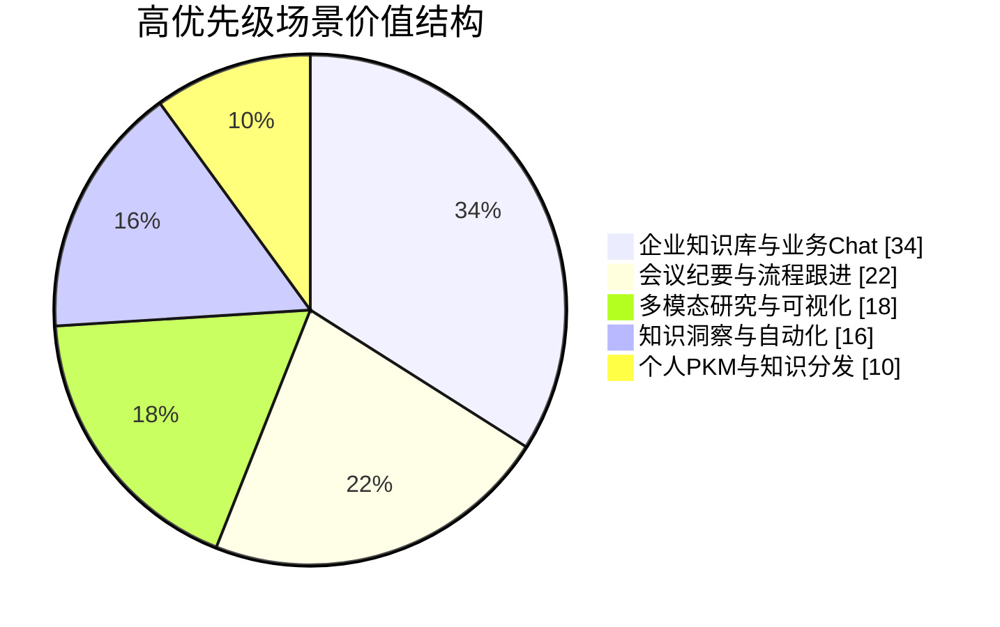
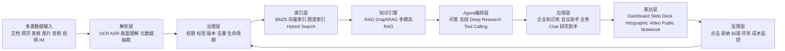
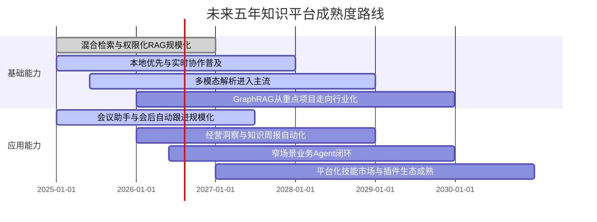

# AI知识库与知识工作平台的未来五年

本文将用户所写的“IA会议纪要”按“AI会议纪要/会议助手”理解，将“NotobookLLM”统一按 Google 的 NotebookLM 理解。基于官方文档、开源仓库、学术论文与行业研究，我的核心判断是：未来五年，知识库将从“文档堆积 + 搜索入口”演进为“多模态采集 + 权限化检索 + Agent 编排 + 可视化分发”的知识工作操作系统。短期最强商业化抓手仍是企业知识库、会议纪要与业务 Chat 补强；中期增长来自知识洞察与自动化；长期壁垒不在单一模型，而在权限治理、工作流闭环、插件生态与低成本扩展能力。知识管理软件、企业搜索与 AI 会议助手三条相邻赛道都在增长，其中知识管理软件市场被预测在 2025–2030 年增加 320.6 亿美元、CAGR 14.3%，企业搜索 2024–2029 年增加 42 亿美元、CAGR 10.5%，AI 会议助手 2024–2029 年增加 34.6 亿美元、CAGR 28.2%。与此同时，企业 AI 虽然普及率很高，但多数组织仍停留在试点，Agent 项目也面临 ROI 与治理挑战。citeturn36view0turn11search3turn11search1turn10search5turn27view1turn8news43

## 执行摘要

知识库行业的主线已经非常清晰：一是“静态文档中心”向“可对话、可执行、可分发的知识系统”迁移；二是“云端统一平台”与“本地优先/私有部署”两条路线并行；三是从“单文档总结”上移到“跨系统检索、跨模态理解、跨工具执行”。从产品谱系看，Notion 正快速从协作文档平台走向 SaaS 化知识工作操作系统，AFFiNE 与 AppFlowy 代表了开源、本地优先与隐私控制路线，WeKnora 代表面向企业 RAG/GraphRAG/IM 分发的可组装框架，NotebookLM 则在“多模态研究助手、内容解释与公共知识分发”上明显领先。citeturn33view5turn33view1turn17view2turn35view0turn14view5turn21view0turn36view0turn36view3turn36view5

商业化上，最值得优先投入的不是“所有人都能用”的泛知识库，而是“预算拥有者明确、结果可量化、权限边界清楚”的场景：例如内部知识问答、销售/客服助手、会议纪要与行动项跟进、经营洞察周报、合规与政策知识辅助。这些场景对应的购买方往往是 IT、运营、客服、销售 enablement、法务与管理层，付费预算比个人 PKM、更公开的知识广场或纯可视化工具更稳定。反过来，个人知识库和知识广场虽然能带来高 DAU 与传播，但直接收入常低于企业场景，更适合作为漏斗上层、内容分发与模板生态。citeturn27view1turn27view2turn33view0turn24search17turn36view5turn38view0

技术上，今天已经成熟到可商用的部分包括：RAG、混合检索、权限继承检索、ASR 转写、基础级多模态理解、CRDT 实时协作，以及面向企业的 API / Webhook / MCP 连接。还在从“可做”走向“可规模稳定赚钱”的部分包括：GraphRAG 的日常化使用、多智能体长期自治、跨模态事实校验、以及多系统 action-taking 的可审计闭环。未来五年的胜负手，不是“有没有大模型”，而是“能否把知识的采集、治理、引用、执行、复盘做成闭环，并控制单位交付成本”。citeturn12search0turn12search1turn12search2turn12search6turn14view3turn24search0turn33view3turn36view7

## 关键结论

首先，企业知识库将继续是最大、最稳的收入池，但产品形态会从“Wiki + 搜索”升级为“Wiki + 检索增强问答 + Agent + 审计与权限”。这也是 Notion 与 WeKnora 在企业场景最有增长空间的原因：前者以 SaaS 与集成能力见长，后者以可私有化、可替换基础组件与 IM 分发能力见长。citeturn33view1turn33view2turn40search0turn21view0turn21view1

其次，会议纪要/会议助手会成为最先规模化的 AI 原生入口之一，因为它天然满足“高频、重复、可量化节省时间”的条件，而且可与任务、CRM、文档管理直接打通。Notion 已把会议纪要直接做进工作流；AppFlowy 正补足 AI Transcript；AFFiNE 更适合“会后整理成可视化产物”；NotebookLM 更适合“会后深度理解与再表达”。citeturn33view0turn16search4turn30search1turn36view3turn10search5

再次，多模态解释与知识分发是 NotebookLM 当前最突出的差异化能力。它把来源限定、引文透明、Mind Map、Audio Overview、Video Overview、Infographic 与 Slide Deck 组合成一个“从理解到表达”的链路；但它的短板也同样明确——更偏研究与解释，而非重协作、重权限工作流或本地部署。citeturn36view0turn36view2turn36view3turn36view9turn36view10turn36view6

再者，开源路线不会自动赢得企业，但会在“隐私、成本可控、国产/本地模型接入、生态可插拔”上持续获得增量。AppFlowy 和 AFFiNE 适合承接这一波需求；其中 AppFlowy 在本地 AI、Vault 离线空间、AI 插件架构上更像“可定制工作台”，AFFiNE 则更像“文档 + 白板 + 演示的一体化创作层”。citeturn34view0turn34view1turn34view2turn14view2turn17view2turn35view0turn35view1

最后，Agent 会成为知识库的重要组成，但不会取代治理。当前企业 AI 的普及率虽然高，但大部分组织仍未走到深度规模化阶段；同时，Gartner 预计到 2027 年超过 40% 的 agentic AI 项目会因成本上升或价值不清而被取消。因此未来最稳妥的策略，是先把高价值场景做成“窄而深”的闭环，再扩展到平台化与生态化。citeturn27view1turn8news43turn40search10turn40search14

下图是本文基于市场规模、付费意愿和交付成熟度做出的“高优先级场景价值结构”主观加权分布，用于帮助判断资源倾斜方向。权重不是外部市场份额，而是产品决策优先级。综合依据主要来自企业 AI 规模化进程、工作流重构重要性、API 高价值用例与三条相关市场的增长预测。citeturn27view1turn27view2turn11search3turn11search1turn10search5

## 详细分析

本节的方法论参考了 entity["organization","中国信息通信研究院","beijing research institute"] 关于“场景筛选—技术适配—业务融合—数据支撑”的框架，以及 entity["organization","McKinsey & Company","management consulting"] 对“AI 使用普及但规模化不足、工作流重构才是价值关键”的判断；同时结合 entity["company","Notion","collaboration software"]、entity["organization","AFFiNE","knowledge os"]、entity["company","AppFlowy","open source workspace"]、由 entity["company","Tencent","technology company"] 开源的 WeKnora，以及由 entity["company","Google","technology company"] 提供的 NotebookLM 的最新官方能力。citeturn9view0turn27view1turn33view5turn17view2turn14view5turn21view0turn36view0

### 企业知识库

**当前痛点与场景。** 企业知识库最大的痛点不是“没有文档”，而是文档分散、可信度不明、权限边界复杂、跨系统检索差，以及知识更新无法嵌入日常工作流。典型场景包括新人入职、SOP 查找、产品/政策问答、售后支持、项目复盘与跨部门协作。Notion 已把知识库、验证页、连接器、企业搜索和团队空间做成一体；WeKnora 则强调企业级文档理解、语义检索、GraphRAG、多租户和私有部署，更适合中大型组织的“自有知识底座”。citeturn33view5turn37view2turn33view1turn21view0turn21view1

**现有产品如何满足。** Notion 的优势是部署快、集成多、协作与权限体系成熟，适合云优先组织；WeKnora 的优势是可替换 LLM、向量数据库和存储后端，并支持 Feishu / Notion 数据源同步以及 Slack / Telegram / 企业 IM 分发；AppFlowy 与 AFFiNE 更适合对自主可控、离线优先和未来自定义要求高的团队，但二者在“大规模企业级连接器、审计和组织治理”的成熟度上仍不及 Notion。NotebookLM 则更像“来源受控的研究与解释层”，适合知识消费与提炼，不是传统企业知识库治理平台。citeturn21view0turn21view1turn33view2turn37view2turn34view2turn17view2turn36view6

**技术可行性。** 这一维度的核心技术已经基本成熟：RAG 解决“把外部知识接入生成”；GraphRAG 解决“跨文档、跨主题、抽象问题”的召回与组织；本地优先与 CRDT 解决协作和数据所有权；真正的难点在于权限继承、版本去重、增量更新、引用可追溯，以及跨系统数据质量。entity["organization","Microsoft Research","research division"] 的 GraphRAG 公开项目已明确把知识图抽取、社区层级摘要和结构化检索组合到统一流程中，这对企业长文档与私有语料尤其重要。citeturn12search0turn12search1turn12search12turn12search16turn12search6turn14view3

**商业化路径与预测。** 最合理的盈利模式是“基础席位费/空间费 + AI 用量/推理积分 + 连接器包 + 私有部署/实施服务 + 行业模板”。未来 1 年，企业知识库会继续从“知识问答”升级到“知识问答 + 简单执行”；未来 3 年，会出现越来越多围绕客服、售前、IT 支持与法务的垂直 agent；未来 5 年，知识库会与 workflow、BI、CRM 和邮件日历融合，成为组织级知识操作系统的一层，而不是独立产品。这个判断与企业 AI 仍在从试点走向规模化、且工作流重构是价值关键的趋势一致。citeturn27view1turn27view2turn11search3turn11search1

### 个人知识库

**当前痛点与场景。** 个人知识库的核心痛点是高输入摩擦、低维护意愿和低召回命中率：用户愿意收藏，却不愿整理；愿意记笔记，却很难稳定复用。典型场景包括学习研究、内容创作、职业积累、读书看课、项目归档和灵感管理。AFFiNE、AppFlowy 与 NotebookLM 是当前三种最典型路径：AFFiNE 强调“写、画、计划”一体化与本地优先；AppFlowy 强调本地 AI 与数据控制；NotebookLM 强调“把已有资料喂进去，然后围绕来源对话、生成解释与学习材料”。citeturn17view2turn17view4turn35view1turn34view1turn34view2turn36view0

**现有产品如何满足。** AFFiNE 的优势在创作体验：文档、白板、演示和 mind map 构成了较完整的“想法到表达”链路；AppFlowy 的优势在本地 AI、语义搜索、离线 Vault 和更可控的数据流；NotebookLM 的优势在来源约束和输出多样化，尤其适合“围绕材料学习和深读”；Notion 仍然是通用性最强的个人/专业混合平台之一，但在本地优先与自托管方面明显落后。citeturn35view1turn34view3turn34view2turn36view2turn36view9turn36view10turn37view2

**技术可行性与商业化。** 个人知识库在技术上最容易落地，因为权限边界简单、数据量适中、用户可接受“弱结构化”。难点实际上在产品运营：如何让系统在不增加用户维护成本的前提下自动组织、自动标引、自动复习、自动复用。商业化则以 freemium 为主：免费版做 capture 与基础检索，高级版卖更大存储、更强 AI、更好同步、更丰富输出格式与模板生态。未来 1 年，个人 PKM 会继续向“自动整理”推进；3 年内，最有价值的差异化会变成“多模态理解 + 个体长期记忆 + 本地隐私”；5 年内，个人知识库预计与邮箱、浏览器、阅读器、会议记录和代码笔记深度融合，但单用户 ARPU 仍普遍低于企业场景。citeturn35view0turn34view0turn29search8turn12search6

### AI会议纪要与会议助手

**当前痛点与场景。** 会议场景非常适合 AI：人们最不想做、却又必须做的，就是记录、整理、追踪行动项。典型场景包括管理例会、销售通话、项目 standup、招聘面试、客户访谈与培训课堂。Notion 的 AI Meeting Notes 已能在会议中转写、提炼关键点与行动项，并在总结里保留可回溯引用；AppFlowy 已推出 AI Transcript Block，把音视频转成可编辑笔记；AFFiNE 有 macOS 会议录音能力，并更适合把会后内容转成演示和视觉产物；NotebookLM 适合把会议记录、附件、PPT、网页等作为会后材料做深度整理；WeKnora 则适合把会后转写导入企业知识底座并进入 IM 问答链路。citeturn33view0turn16search4turn30search1turn35view1turn36view0turn21view0

**技术可行性与商业化。** 这一维度的关键技术是 ASR、说话人切分、摘要、行动项抽取、会议模板化总结、引用追溯以及同意/留存策略。商业上，它有天然付费点：高频使用、节时显著、可接 CRM/任务系统、可被团队采购，且市场增速高于知识管理和企业搜索。未来 1 年，赢家会是“会议纪要 + 行动项 + 跟进提醒”做得最顺滑的产品；3 年内，会从“写纪要”升级为“会中助手”与“会后自动执行”；5 年内，会议助手会变成企业知识库的一级入口之一。citeturn10search5turn33view0turn21view0turn36view10

### 业务 Chat 补强

**当前痛点与场景。** 通用聊天机器人最常见的问题是“能说，但不接组织知识与业务系统”；因此业务 Chat 的核心价值不在“更像人”，而在“更像一个被权限约束、能引用事实、能调用工具的数字员工”。典型场景是客服支持、销售问答、内部 IT helpdesk、产品/政策咨询、研发 runbook 问答。Notion 已把 Enterprise Search、AI Connectors、Notion Agent、Custom Agents 与 MCP 组合起来，能跨 Notion、Slack、Teams、GitHub 等做检索与执行；WeKnora 直接支持 Quick Q&A、ReACT Agent、MCP 工具和 Slack / Telegram / Feishu / WeChat 等 IM 通道，非常贴近“业务 Chat 补强”。citeturn33view1turn33view2turn33view3turn40search0turn40search10turn21view0turn21view1

**技术可行性与商业化。** 这个场景的底层技术已经相对稳定：知识检索、工具调用、权限过滤、上下文记忆与会话审计都能做；真正难的是业务准确率、稳态成本与责任边界。OpenAI 的企业报告显示，API 最常见的高价值用例包括 in-app assistant/search、agentic workflow automation、customer support 与 data analysis/summarization，这与业务 Chat 补强高度一致。未来 1 年，企业会更愿意为“客服、IT、运营”这类有明确工单与 SLA 的场景买单；3 年内，会出现更多“轻 agent + 强审计”的组合；5 年内，业务 Chat 将逐步取代一部分传统 FAQ 与门户入口，但不会替代 ERP/CRM 本身。citeturn27view2turn8news43

### 知识广场与订阅分发

**当前痛点与场景。** 知识常常存在，却分发不到对的人；或者被发布出来，却缺少持续更新、订阅和复用机制。典型场景包括模板市场、公开笔记、行业研究分发、企业产品手册、教育资料和内容创作者的知识订阅。Notion 已有模板图库和模板提交/销售机制；AppFlowy 已有模板市场；AFFiNE 已有模板与 Public Workspaces 社区；NotebookLM 已推出 public notebooks 与 featured notebooks；WeKnora 则把知识助手、浏览器扩展和微信生态分发连接到一起。citeturn38view0turn24search18turn14view4turn17view3turn36view5turn6search12turn21view0

**商业化与预测。** 这一维度的用户价值高，但直接变现往往弱于企业刚需场景。短期更适合做增长渠道、模板生态、线索转化与品牌传播，尤其适合为企业知识产品提供“外部露出层”。未来 1 年，模板与公开知识页的生产会越来越自动化；3 年内，知识内容订阅、课程资料、行业研究摘要、公共知识库会更常见；5 年内，真正有壁垒的不会是“公开发布”，而是“订阅关系 + 品牌信任 + 可交互内容 + 闭环转化”。从产品现状看，NotebookLM 在公开交互式笔记上最前沿，Notion 在模板与公开页面商业化上最成熟。citeturn36view5turn6search12turn38view0turn24search18

### 视频与多模态解读

**当前痛点与场景。** 现代知识工作不再只处理文本，而是同时处理 PDF、表格、图表、图像、网页、音频、视频与演示文稿。用户真正想要的不是“上传更多文件”，而是“从复杂材料中更快理解、比较、解释和再表达”。NotebookLM 在这个维度领先最明显：它支持多种来源导入、用来源做 grounded chat，并进一步生成 Video Overview、Infographic、Slide Deck；AFFiNE 把写作、绘图、mind map 和演示连接起来；WeKnora 增加了 ASR、图片和多格式文档处理；AppFlowy 的 RAG 搜索、文件聊天和 transcript 也在补齐多模态链路。citeturn36view0turn36view3turn36view9turn36view10turn35view1turn21view0turn34view2

**技术可行性与预测。** Multimodal RAG 已成为清晰方向：学术综述普遍认为它能把文本、图片、视频等纳入同一检索生成框架，从而降低纯文本 RAG 在图表、版式、视觉语义上的损失。未来 1 年，多模态读取会先在研究助手、培训材料、售前文档和学习辅导上规模化；3 年内，会进化到“跨文档、跨图表、跨视频片段”的统一推理；5 年内，多模态知识系统会逐渐改变“报告、课程、方案、手册”的消费方式，让内容解释本身成为付费功能。citeturn12search2turn12search13turn36view3turn40news40

### 知识洞察与自动化洞察

**当前痛点与场景。** 大多数组织并不缺内容，而是缺“从内容到洞察再到动作”的能力。典型场景是经营周报、销售异动分析、项目风险预警、工单问题聚类、用户反馈汇总、研究材料的主题抽取。Notion 通过 Dashboards、Charts、Notion Agent、Research mode 与连接器试图把文档、数据库和行动统一；NotebookLM 用 Deep Research、源引用和多种输出格式擅长把“材料”转成“洞察”；WeKnora 则通过 ReACT、GraphRAG 和知识图谱走向更复杂的知识推理；AppFlowy 已把“数据库洞察”“AI Overview”“RAG search”逐步串起来。citeturn33view4turn37view2turn36view4turn21view0turn34view2turn32search2

**技术可行性与商业化。** 这是未来三年最容易从“助手”变成“经营工具”的维度之一，因为购买方通常是管理层、运营与数据团队，愿意为更快的周报、洞察与决策支持付费。难点在于结构化业务数据与非结构化知识数据的融合。行业报告已明确把“企业知识图谱 + 多模态大模型 + 智能决策/流程优化”视为重要方向。我的判断是：1 年内，知识洞察多以“总结 + 提示”存在；3 年内，会出现更多“洞察 + 推荐动作”；5 年内，成熟产品会把知识洞察与流程自动化做成闭环，但只有能接 KPI、权限和审计的产品才真正具备大规模商业价值。citeturn28view0turn27view1turn27view2

### 文档美化与可视化

**当前痛点与场景。** 文档生产最耗时的部分常常不是写内容，而是把内容变成能被快速理解和传播的形式。典型场景包括周报报表、客户汇报、课程讲义、研究摘要、知识卡片、讲解视频。NotebookLM 的 Slide Deck 与 Infographic 直接把知识库变成可展示内容；AFFiNE 的“写—画—演示”链路也非常适合把粗糙笔记变成视觉化表达；Notion 在数据库图表和仪表盘上更强；AppFlowy 则在富文本、PDF、图片与 transcript 块上逐步改善呈现层。citeturn36view9turn36view10turn35view1turn33view4turn29search12turn16search4

**商业化与预测。** 这一维度适合做增购和套餐升级，不一定适合做最核心的独立付费位。短期，用户愿意为“省去做 PPT / 画图 / 整理讲义”的时间付费；但中长期，单纯排版与可视化能力会快速商品化，因此更好的路线是把它嵌入知识工作流：让纪要、报告、洞察、公开知识页都能一键变成适合不同受众的表达形式。1 年内，最强卖点仍是“快”；3 年内，会演变成“品牌化与受众定制”；5 年内，它会成为知识平台的标准层，而不再是独立卖点。citeturn36view10turn36view9turn35view1

### 可插拔 AI 应用生态

**当前痛点与场景。** 如果知识库只是封闭应用，企业很快就会遇到“系统孤岛”问题。因此平台能否通过 API、Webhook、MCP、插件与模板把能力外放，是决定长期天花板的关键。Notion 的 Public API、Webhooks、集成生态和 MCP 已经形成比较完整的外部连接面；AppFlowy 的 LAI 与协作数据层更接近“底层可嵌入能力”；AFFiNE 的 BlockSuite extension system 与社区插件方向正确，但官方插件体系仍在成长；WeKnora 以 MCP、插件架构与可替换底座见长；NotebookLM Enterprise 也已有 notebooks API 和 podcast API，但生态仍明显偏 Google 体系。citeturn24search0turn24search1turn24search10turn33view3turn14view2turn14view3turn18search5turn18search7turn21view1turn36view7turn36view8

**商业化与预测。** 对平台型产品来说，生态是高毛利、高粘性的长期收入池。未来 1 年，模板、连接器和 AI skill 会先于真正繁荣的“应用商店”；3 年内，面向企业内部的定制 skill / agent / workflow marketplace 会出现；5 年内，能把权限、计费、版本、审计和第三方部署做好的平台，会在生态收入和渠道收入上显著领先。反之，如果生态只是“能接，而不可管”，最终会被安全部门卡住。citeturn40search0turn29search15turn36view7turn8news43

## 对比表

下表聚焦用户最关心的几项差异：架构、插件生态、隐私/部署、检索向量化、多模态、成本与可扩展性。

| 产品 | 架构 | 插件/扩展生态 | 隐私与企业部署 | 检索与向量化能力 | 多模态支持 | 成本与可扩展性 | 适合判断 |
|---|---|---|---|---|---|---|---|
| Notion | 闭源 SaaS 为主；无自托管；Business/Enterprise 功能完整。 | Public API、Webhooks、集成生态、MCP、Custom Agents，外部连接能力很强。 | Enterprise 提供 SCIM、审计日志、DLP/SIEM、LLM 提供商零数据保留；但仍是托管云路线。 | 官方已提供 Enterprise Search、AI Connectors、Research mode；底层向量/索引实现未公开，但语义检索能力已产品化。 | 会议转写、文档生成、图表、仪表盘、表单、嵌入等较完整。 | 明确 seat 计费；Plus $10/人月、Business $20/人月；Custom Agents 按 Credits 计费，适合快速横向扩张，但大规模 OPEX 会上升。 | 最适合“协作成熟、接受 SaaS、要快速上线”的团队。 citeturn37view2turn33view0turn33view1turn33view2turn33view3turn33view4 |
| AFFiNE | 开源 + 云服务并行；本地优先；支持自托管。 | 有 BlockSuite 扩展体系与社区插件/工具列表，但官方插件体系仍在演进。 | 自托管时由用户控制数据；AFFiNE AI 使用时会把相关内容发给第三方 AI 厂商；适合重视数据控制但能接受一定工程工作的团队。 | 官方已支持 AI doc embedding/semantic indexing；检索在能力上趋向语义化，但企业级连接器仍较薄。 | 明显偏“写—画—演示”：mind map、presentation、edgeless canvas、会议录音能力。 | 本地 FOSS 免费；AI $8.9/月；Team $10/席/月；云协作扩展性逐步提升。 | 最适合“创作型团队、研究者、设计/内容场景、兼顾本地优先”的用户。 citeturn17view2turn17view4turn18search3turn18search5turn18search7turn35view0turn35view1 |
| AppFlowy | AGPL 开源；桌面/移动/浏览器；支持自托管与本地部署。 | LAI 本地 AI 插件系统、协作数据层、模板市场、Zapier 集成，平台化潜力强。 | Vault Workspace 私有离线，AI 本地运行无数据传输；本地部署可完全控制数据；Local Host 方案甚至可做到纯本机且无外部协作。 | 已支持 smart search、语义搜索、RAG search、AI Overview、切换 embedding 模型、文件聊天。 | Transcript、PDF、图片、文件聊天、本地 AI，偏“实用工作台”。 | 开源免费；云 Pro 约 $12.5/人月；Vault $6/人月；自托管可把成本转为 infra + 运维。 | 最适合“隐私敏感、希望自托管、能接受开源工具成长曲线”的团队。 citeturn14view2turn14view3turn14view5turn26search3turn34view0turn34view1turn34view2turn34view3 |
| WeKnora | MIT 开源框架；更像企业级知识引擎而不是通用办公套件。 | 插件架构、MCP、可替换 LLM/向量库/存储后端；适合集成与二次开发。 | 支持本地与私有云部署；多租户隔离；强调数据主权。 | BM25 + Dense + GraphRAG + parent-child chunking + 多维索引；Qdrant、知识图谱与实体链接能力公开。 | 支持 PDF、Word、图片、Excel、PPT、音频 ASR 等十余格式，并能进 IM 分发。 | 软件本体开源免费，但总成本取决于模型、向量库、解析与运维栈；扩展性高、产品化工作量也高。 | 最适合“企业知识助手、客服/内部问答、需要私有部署或二开”的组织。 citeturn21view0turn21view1 |
| NotebookLM | 闭源；Google 托管；另有 NotebookLM Enterprise。 | 不是插件市场路线，但 Enterprise 已有 notebooks API、Podcast API；生态偏 Google/Cloud。 | Workspace 中已是 core service，并提供 enterprise-grade security & privacy；无本地部署。 | 核心是来源受控检索、内联引用、Deep Research 导源与报告生成；官方强调 grounded chat，不公开底层索引实现。 | 对多模态内容解释最强：Audio/Video Overview、Mind Map、Infographic、Slide Deck。 | 面向消费者、Workspace 与 Google Cloud 多层打包；扩展性强但依赖 Google 生态与配额。 | 最适合“研究、学习、材料消化、公共知识分发、多模态解释”。 citeturn36view0turn36view1turn36view2turn36view3turn36view4turn36view6turn36view7turn36view8turn36view9turn36view10 |

## Top10高优先级用户价值场景

下表中的“市场规模、付费意愿、实现难度”采用 1–5 分制；其中难度分越高表示越难。排序基于本文对市场增长、预算归属、技术成熟与产品现状的综合判断，不是外部机构原始排名。其依据主要来自企业 AI 规模化现状、API 高价值用例、相关赛道市场增长与各产品能力成熟度。citeturn27view1turn27view2turn11search3turn11search1turn10search5

| 排名 | 场景 | 市场规模 | 付费意愿 | 难度 | MVP要素 | 关键技术依赖 | 潜在客户群 | 估算商业化时间线 |
|---|---:|---:|---:|---:|---|---|---|---|
| 1 | 企业知识问答 + 业务 Chat 补强 | 5 | 5 | 3 | 多源接入、权限检索、引用回答、Slack/IM 出口 | RAG、权限过滤、连接器、审计日志、工具调用 | 中大型企业、客服、IT、运营 | 3–6 个月可卖试点；12 个月可扩组织采购 |
| 2 | AI 会议纪要 + 行动项跟进 | 5 | 5 | 2 | 转写、总结模板、行动项、同步任务系统 | ASR、摘要、行动项抽取、会议模板 | 所有知识型团队、销售、招聘、咨询 | 2–4 个月可上线；6–9 个月可付费放量 |
| 3 | 客服/售后知识助手 | 5 | 5 | 3 | 帮助中心导入、工单问答、置信度与转人工 | RAG、知识库治理、CRM/客服系统接入 | SaaS、硬件、互联网服务商 | 3–6 个月 |
| 4 | 销售/投标/方案库 Copilot | 4 | 5 | 3 | 方案检索、案例复用、自动生成 deck/摘要 | 混合检索、模板生成、文档可视化 | B2B 销售、售前团队、咨询公司 | 4–8 个月 |
| 5 | 合规/法务/政策知识辅助 | 4 | 5 | 4 | 法规库、版本管理、引用追溯、审批流 | GraphRAG、版本去重、权限与审计 | 金融、医疗、政府、制造 | 6–12 个月 |
| 6 | 多模态研究助手 | 4 | 4 | 3 | PDF/网页/视频导入、比较问答、引用、报告输出 | Multimodal RAG、OCR/ASR、来源管理 | 高校、研究机构、咨询、内容团队 | 2–6 个月 |
| 7 | 知识洞察与经营周报自动化 | 4 | 4 | 4 | 数据摘要、异常解释、图表/洞察卡片、邮件群发 | 结构化/非结构化融合、Agent、BI 接口 | 管理层、运营、数据团队 | 6–12 个月 |
| 8 | 文档美化与可视化生成 | 3 | 3 | 2 | Slide Deck、Infographic、视频讲解、一键导出 | 文本生成、图形布局、多模态生成 | 市场、教育、咨询、创作者 | 1–3 个月 |
| 9 | 个人多模态第二大脑 | 4 | 2 | 2 | 捕获、语义搜索、回顾、学习卡片、离线模式 | 本地索引、向量化、轻量 LLM、同步 | 学生、研究者、自由职业者 | 3–6 个月，但 ARPU 偏低 |
| 10 | 知识广场 / 模板 / 公共笔记订阅 | 3 | 2 | 3 | 公共页面、复制模板、订阅更新、互动问答 | Web 发布、访问控制、内容分发 | 创作者、教育、品牌方、媒体 | 6–12 个月，更适合作为增长层 |

## 技术路线图与落地建议

### 技术路线图

下图给出未来五年更有胜率的“知识工作平台”技术主路径。它强调的不是更大的模型，而是把多源解析、权限化索引、Agent 执行和分发反馈串成一个可治理的闭环。这个方向与 CAICT 对“场景—技术—业务—数据”框架，以及 GraphRAG、MRAG、CRDT/local-first 等技术演进是一致的。citeturn9view0turn12search1turn12search2turn12search6turn14view3

未来五年的成熟度演进，大致会沿着“先检索问答、再洞察与执行、最后形成平台生态”的顺序展开。下面这个时间线是基于当前产品功能与学术/产业成熟度的推断。citeturn27view1turn12search1turn12search13turn8news43

### 一页落地建议清单

如果目标是做一款未来 3 年更有商业胜率的知识产品，建议优先按以下顺序建设：

| 模块 | 建议 |
|---|---|
| 产品功能 | 第一阶段只做三个核心闭环：多源导入、可引用问答、可执行输出；优先落地“企业知识问答”“会议纪要”“业务 Chat 补强”三类高 ROI 场景。不要一开始追求“万能 Agent”。 |
| 数据策略 | 建立“内容 ingestion 规范 + 权限继承 + 增量更新 + 去重 + 版本快照”五件套；把 FAQ、SOP、会议纪要、投标方案、客服工单、研究材料视作不同数据类型，而非统一 blob。 |
| 技术栈 | 默认采用 Hybrid Search；重要客户或复杂知识域再引入 GraphRAG。多模态先做 OCR/ASR/PDF 版面理解与图片引用，不要过早追求端到端视频理解。 |
| 隐私合规 | 一开始就区分 SaaS、专有云、私有部署三种交付方式；明确模型供应商零保留、日志保留、转写删除、地域与权限策略。面向企业时，审计能力优先级高于花哨生成。 |
| 定价模型 | 不建议只卖 seat。更优结构是“基础席位/空间 + AI 用量 + 高级连接器 + 私有部署/专业服务 + 模板/生态分成”。对会议助手和业务 Chat，可增加“按活跃用户/按时长/按调用量”的混合计费。 |
| 合作伙伴 | 优先接入文档与协作源（Drive、Slack、Teams、Notion、Feishu）、客服与 CRM（Zendesk、Salesforce）、认证与安全（SSO、DLP、SIEM）、本地模型与向量库（Ollama、Qdrant 等）。 |
| GTM 路线 | 先打一个垂直角色，再扩成平台。优先从“客服、IT、运营、销售 enablement、研究团队”切入，因为这些角色已有明确知识痛点和预算。 |
| 成功指标 | 不要只看 DAU。应同时跟踪：首次答案命中率、引用覆盖率、留资/转化率、节省工时、行动项完成率、知识更新滞后天数、单次回答成本。 |

## 参考来源列表

以下列的是本文最主要的官方与高可信来源；文内具体观点以后文引用为准。

**产品官方与开源仓库**

- Notion Pricing：`https://www.notion.com/pricing`
- Notion AI Meeting Notes：`https://www.notion.com/help/ai-meeting-notes`
- Notion Enterprise Search：`https://www.notion.com/help/enterprise-search`
- Notion AI Connectors：`https://www.notion.com/help/notion-ai-connectors`
- Notion MCP：`https://www.notion.com/help/notion-mcp`
- Notion Dashboards：`https://www.notion.com/help/dashboards`
- Notion Templates Guide：`https://www.notion.com/help/guides/the-ultimate-guide-to-notion-templates`
- AFFiNE GitHub：`https://github.com/toeverything/affine`
- AFFiNE Pricing：`https://affine.pro/pricing`
- AFFiNE AI：`https://affine.pro/ai`
- AFFiNE Docs：`https://docs.affine.pro/`
- AppFlowy GitHub：`https://github.com/appflowy-io/appflowy`
- AppFlowy Pricing：`https://appflowy.com/pricing`
- AppFlowy Local AI with Ollama：`https://appflowy.com/blog/appflowy_local_ai_ollama`
- AppFlowy LAI：`https://github.com/AppFlowy-IO/AppFlowy-LAI`
- AppFlowy-Collab：`https://github.com/AppFlowy-IO/AppFlowy-Collab`
- WeKnora GitHub：`https://github.com/Tencent/WeKnora`
- WeKnora 官方站：`https://weknora.online/`
- NotebookLM Help Center：`https://support.google.com/notebooklm/`
- NotebookLM 官方站：`https://notebooklm.google/`
- NotebookLM Enterprise Docs：`https://docs.cloud.google.com/gemini/enterprise/notebooklm-enterprise/docs/overview`

**学术与技术**

- RAG 原始论文：`https://arxiv.org/abs/2005.11401`
- GraphRAG 项目：`https://www.microsoft.com/en-us/research/project/graphrag/`
- GraphRAG 文档：`https://microsoft.github.io/graphrag/`
- Multimodal RAG Survey：`https://arxiv.org/abs/2504.08748`
- Local-First Software 论文：`https://martin.kleppmann.com/papers/local-first.pdf`

**行业与市场**

- 中国信通院《人工智能产业发展研究报告（2025年）》：`https://www.caict.ac.cn/kxyj/qwfb/bps/202602/P020260202487301304903.pdf`
- McKinsey《The State of AI 2025》：`https://www.mckinsey.com/capabilities/quantumblack/our-insights/the-state-of-ai`
- OpenAI《The state of enterprise AI | 2025 Report》：`https://cdn.openai.com/pdf/7ef17d82-96bf-4dd1-9df2-228f7f377a29/the-state-of-enterprise-ai_2025-report.pdf`
- ResearchAndMarkets 知识管理软件市场：`https://www.researchandmarkets.com/reports/5390468/knowledge-management-software-market-2026-2030`
- ResearchAndMarkets 企业搜索市场：`https://www.researchandmarkets.com/reports/5918163/enterprise-search-market`
- ResearchAndMarkets AI 会议助手市场：`https://www.researchandmarkets.com/reports/6113914/ai-meeting-assistants-market`

navlist近期行业动态turn8news43,turn40news40,turn40news44