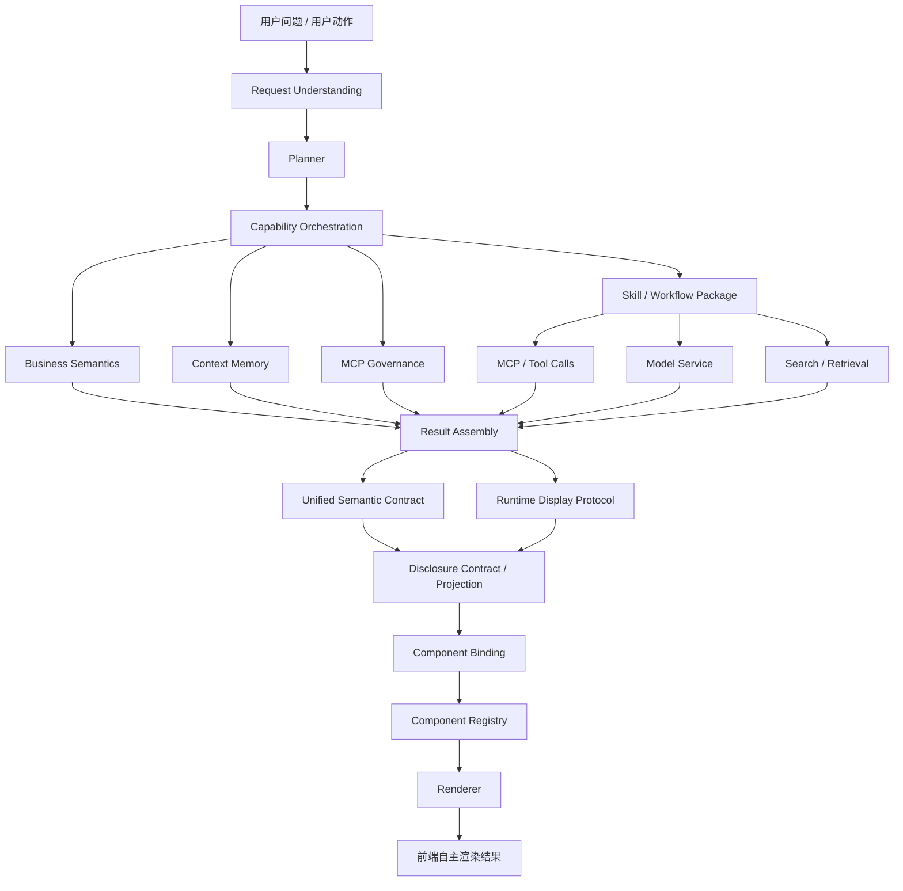
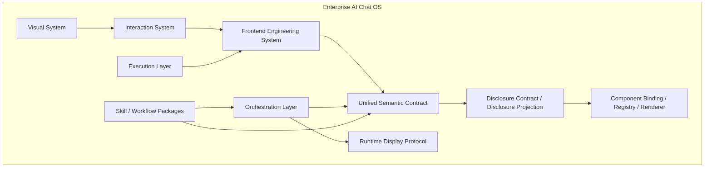
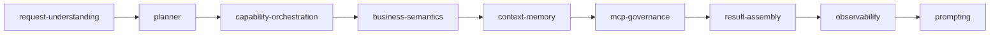
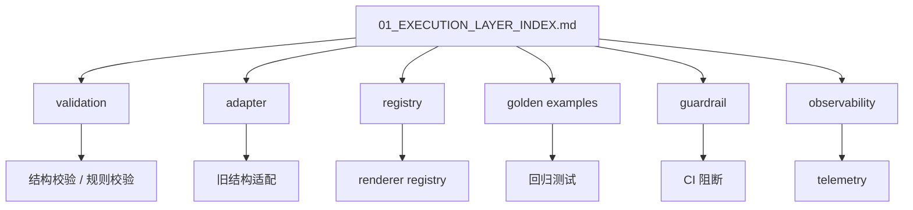
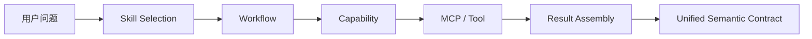

# Enterprise AI Chat OS 架构图

> Canonical overview map for the current architecture.
>
> 参考真源：
> - [ENTERPRISE_AI_CHAT_OS_SPEC.md](./ENTERPRISE_AI_CHAT_OS_SPEC.md)
> - [00_SPEC_INDEX.md](./00_SPEC_INDEX.md)
> - [01_EXECUTION_LAYER_INDEX.md](./01_EXECUTION_LAYER_INDEX.md)
> - [02_ORCHESTRATION_LAYER_INDEX.md](./02_ORCHESTRATION_LAYER_INDEX.md)

## 1. 总体目录结构

```txt
Enterprise AI Chat OS
├─ Visual System
├─ Interaction System
├─ Frontend Engineering System
├─ Unified Semantic Contract
├─ Runtime Display Protocol
├─ Disclosure Contract / Disclosure Projection
├─ Component Binding / Registry / Renderer
├─ Orchestration Layer
│   ├─ Request Understanding（意图理解 / 实体解析 / 信息源仲裁）
│   ├─ Planner（候选计划生成 / 仲裁 / 校验）
│   ├─ Capability Orchestration（能力发现 / 执行策略）
│   ├─ Context Compiler（上下文编译 / 参数补齐）
│   └─ Skill Router（Skill 选择 / 记录）
├─ Execution Layer
│   ├─ MCP / Tool Calls
│   ├─ Model Service（模型路由 / 容错 / 用例运行时）
│   ├─ Search / Retrieval（搜索编排 / Provider 适配 / 公开联网）
│   ├─ Workflow Engine（工作流执行）
│   └─ Automation（调度 / 执行 / 模板）
└─ Skill / Workflow Packages
```

## 2. 总体架构图



## 3. 层级关系图



## 4. 结果层 / 运行层 / 披露层分离图

```mermaid
flowchart LR
  subgraph ResultPlane[Result Plane]
    USC1[Unified Semantic Contract]
    A1[ActionContract]
    E1[EvidenceRef / SourceRef]
    R1[regions[]]
  end

  subgraph RuntimePlane[Runtime Plane]
    RDP1[Runtime Display Protocol]
    T1[Tool Calls]
    T2[Agent / Workflow Trace]
    T3[Streaming State]
    T4[Retry / Error / Recovery]
  end

  subgraph DisclosurePlane[Disclosure Plane]
    DC1[Disclosure Contract]
    DP1[Disclosure Projection]
    D1[来源披露]
    D2[证据披露]
    D3[执行披露]
    D4[字段披露]
  end

  USC1 --> R1
  USC1 --> A1
  USC1 --> E1
  RDP1 --> T1
  RDP1 --> T2
  RDP1 --> T3
  RDP1 --> T4
  USC1 --> DC1
  RDP1 --> DC1
  DC1 --> DP1
  DP1 --> D1
  DP1 --> D2
  DP1 --> D3
  DP1 --> D4
```

## 5. 语义结果渲染链路

```mermaid
flowchart TB
  SR[SemanticResultContract] --> REG[regions[]]
  REG --> BIND[componentBinding]
  BIND --> REGI[Component Registry]
  REGI --> VAL[Renderer.validate()]
  VAL --> REN[Renderer.render()]
  REN --> CTX[RendererContext]
  CTX --> ACT[ActionDispatcher]
  CTX --> EVI[EvidenceResolver]
  CTX --> SRC[SourceResolver]
  CTX --> RUN[RuntimeResolver]
  CTX --> DSP[DisclosureResolver]
```

## 6. Orchestration Layer



### 6.1 这一层的职责

- 识别用户意图（Request Understanding）
- 生成与仲裁候选计划（Planner）
- 发现并选择能力（Capability Orchestration）
- 协调 Skill / Workflow
- 调用 MCP / Tool
- 模型路由与容错（Model Service）
- 搜索编排与检索（Search / Retrieval）
- 组装最终结果
- 输出路由与观测信息

### 6.2 这一层不负责的事

- 不直接定义 UI 组件
- 不直接定义最终渲染协议
- 不直接把 runtime trace 塞进业务结果
- 不新增与 `SemanticResultContract` 平级的结果总协议

## 7. Execution Layer



### 7.1 这一层的职责

- 把规范变成可执行约束
- 在代码和 CI 中阻止结构回退
- 管住旧 DTO / 旧 schema / 旧渲染路径
- 保证 renderer、adapter、validator 可回归

## 8. Skill / Workflow 位置



### 8.1 Skill 的定位

- Skill 是可复用能力包
- Skill 依赖 capability，不直接绑定单一 toolName
- Skill 的输出必须回到统一语义结果
- Skill 的执行过程必须回到运行态协议

### 8.2 Skill 不是什么

- 不是新的总协议层
- 不是新的 UI schema 总入口
- 不是与编排层平行的独立体系

## 9. 当前架构中的关键边界

### 9.1 结果、运行与披露分离

- `Unified Semantic Contract` = 给用户看的最终业务结果
- `Runtime Display Protocol` = AI / Tool / Workflow 的执行过程
- `Disclosure Contract / Projection` = 用户可见的来源、证据、执行、字段披露边界

### 9.2 渲染与协议分离

- `regions[].componentBinding` 负责挂载
- `Component Registry` 负责映射
- `Renderer` 负责呈现

### 9.3 动作与展示分离

- 用户可点击动作统一走 `ActionContract`
- 不允许各组件私有定义动作结构

### 9.4 证据、来源与披露统一

- 结论、洞察、风险、建议必须可追溯
- 统一使用 `EvidenceRef / SourceRef`
- 披露内容必须由 `Disclosure Contract` 统一投影，不直接把 raw runtime data 暴露给用户

## 10. 设计约束

1. 不新增平行总架构。
2. 不让 runtime 侵入业务结果协议。
3. 不让 renderer 私有定义 action / evidence / source / disclosure。
4. 不让 `Skill` 变成新的协议中心。
5. 不让 `VizSpec` 替代 `regions` / `componentBinding`。
6. 不让旧兼容兜底长期占位。

## 11. 一句话总结

Enterprise AI Chat OS 的当前总纲是：

> 以 `Unified Semantic Contract` 作为结果真源，以 `Runtime Display Protocol` 作为过程真源，以 `Disclosure Contract / Disclosure Projection` 作为披露边界，以 `Component Registry` 作为渲染入口，以 `Orchestration Layer` 负责能力编排，以 `Execution Layer` 负责强制落地，以 `Skill` 作为可复用能力包。

