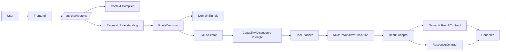
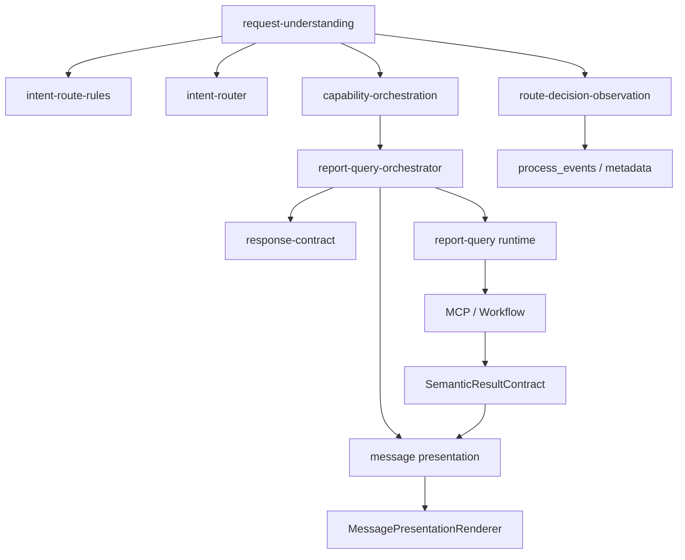
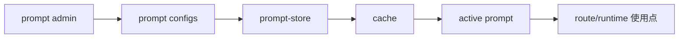
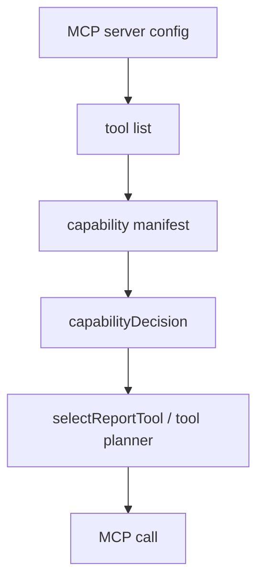
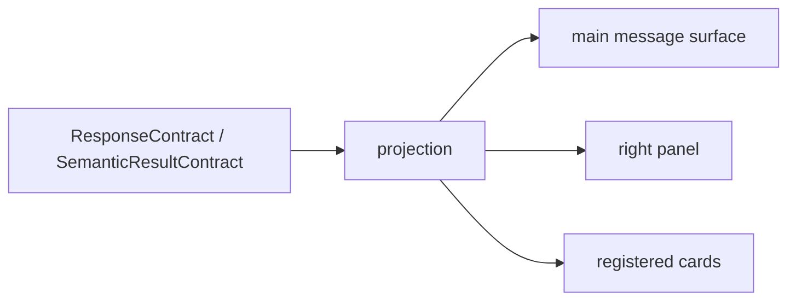
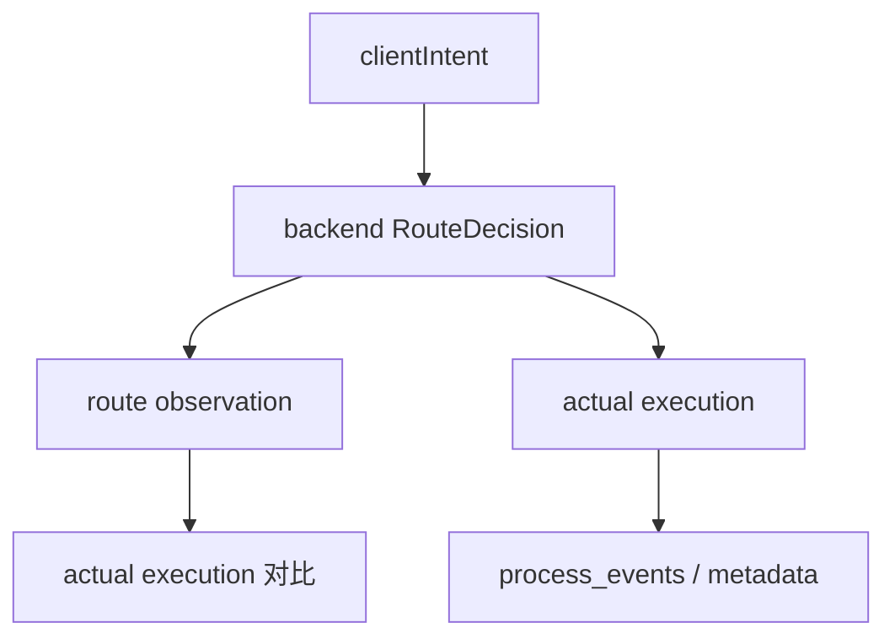

# 2. 总纲索引、架构图与总纲对照

## 2.1 总纲索引清单

### 总纲文档

- `docs/architecture/ENTERPRISE_AI_CHAT_OS_SPEC.md`
- `docs/architecture/ENTERPRISE_AI_CHAT_OS_SPEC_ORCHESTRATION_PATCH.md`
- `docs/architecture/00_SPEC_INDEX.md`
- `docs/architecture/01_EXECUTION_LAYER_INDEX.md`
- `docs/architecture/02_ORCHESTRATION_LAYER_INDEX.md`
- `docs/architecture/03_DISCLOSURE_LAYER_INDEX.md`

### 关键子文档

- `docs/architecture/semantic-contract/semantic-result-contract.md`
- `docs/architecture/semantic-contract/action-contract.md`
- `docs/architecture/semantic-contract/evidence-contract.md`
- `docs/architecture/semantic-contract/source-contract.md`
- `docs/architecture/semantic-contract/component-binding.md`
- `docs/architecture/runtime/runtime-display-protocol.md`
- `docs/architecture/frontend-engineering/component-registry-renderer.md`
- `docs/architecture/frontend-engineering/message-rendering-architecture.md`
- `docs/architecture/frontend-engineering/message-state-management.md`
- `docs/architecture/request-understanding/route-governance-p1.md`
- `docs/architecture/request-understanding/route-golden-spec-p1.md`
- `docs/architecture/prompting/prompt-runtime-contract.md`
- `docs/architecture/observability/audit-telemetry.md`
- `docs/architecture/disclosure-contract/disclosure-system.md`
- `docs/architecture/disclosure-contract/message-disclosure-view.contract.md`

## 2.2 总纲定义的架构域

| 架构域 | 总纲定位 | 子文档/索引 | 代码实现 | 运行时生效 | 后台入口 | 测试 / Golden | 当前状态 |
|---|---|---|---|---|---|---|---|
| Runtime | AI / Agent / Tool / Workflow 的执行过程展示 | `runtime-display-protocol.md` | `contracts/runtime/*`、`trace.ts` | 是 | trace-config | 是 | `implemented` |
| Request Understanding | 识别 serviceIntent / task / routeEvidence / domainSignals | `route-governance-p1.md` | `request-understanding.ts`、`intent-router.ts` | 是 | route rules / entity config / report policy | 是 | `partial` |
| Context Compiler | 编译会话、角色、偏好、项目、slot | `ENTERPRISE_AI_CHAT_OS_SPEC.md` | `context-compiler.ts` | 是 | 间接 | 间接 | `implemented` |
| Domain Protocol | 广告业务域信号、实体解析、指标维度、项目策略 | 总纲 + orchestrator patch | `advertising-domain-pack.ts`、`entity-resolution-config-store.ts`、`metric/dimension catalog` | 是 | 是 | 是 | `partial` |
| Capability Orchestration | 能力发现、preflight、执行决策、fallback | `02_ORCHESTRATION_LAYER_INDEX.md` | `capability-orchestration.ts`、`report-capability-manifest.ts` | 是 | 是 | 是 | `partial` |
| Skill | 业务能力包、选择策略、执行契约 | `docs/architecture/skills/*` | `skill-orchestration.ts`、`skill-contract-store.ts` | 是 | 是 | 是 | `partial` |
| MCP Tool | 外部能力接入与工具调用 | 总纲 + orchestration index | `mcp-server-store.ts`、`mcp-discovery.ts` | 是 | 是 | 部分 | `partial` |
| Prompt Governance | prompt store、seed、cache、版本、fallback | `prompt-runtime-contract.md` | `prompt-store.ts`、`prompt-runtime-policy.ts`、`managed-prompt-seeds.ts` | 是 | 是 | 是 | `drifted` |
| Knowledge / Memory | 个人记忆、上下文记忆 | 相关 memory / project docs | `user-memory-store.ts`、`conversation-context.ts` | 是 | 部分 | 少量 | `partial` |
| Workflow | 自动化、报表生成、运行回放 | 相关 workflow docs | `workflow-task-store.ts`、`workflow-engine.ts`、`automation-*` | 是 | 是 | 少量 | `partial` |
| Semantic Contract | 最终业务结果协议 | `semantic-result-contract.md` | `contracts/semantic/*`、`result-assembly/*` | 是 | 否 | 是 | `implemented` |
| Runtime Display Protocol | 过程协议 | `runtime-display-protocol.md` | `contracts/runtime/*` | 是 | 否 | 是 | `implemented` |
| Component Registry | 渲染挂载与 fallback | `component-registry-renderer.md`、`registry-spec.md` | `contracts/renderer/*` | 是 | 否 | 是 | `implemented` |
| Admin Control Plane | 统一治理控制面 | `00_SPEC_INDEX.md` | `app/admin/page.tsx`、`app/api/xiaoqiao/admin/*` | 是 | 是 | 部分 | `drifted` |
| Evaluation / Observability | trace / audit / golden / observation | `audit-telemetry.md` | `trace.ts`、`route-decision-observation.ts`、`scripts/*` | 是 | 是 | 是 | `implemented` |
| Security / Permission | 可见性、权限、脱敏 | semantic contract / trust UX | `admin-access-store.ts`、`auth-service.ts`、`user-scope.ts` | 是 | 是 | 少量 | `partial` |
| Frontend Rendering Governance | projection、registry、right panel、disclosure | `message-rendering-architecture.md` | `message-presentation.ts`、`message-presentation-projection.ts`、`MessagePresentationRenderer.tsx` | 是 | 否 | 是 | `partial` |

## 2.3 当前真实系统总览图



## 2.4 Chat Runtime 详细调用图



## 2.5 Admin Control Plane 配置加载图

```mermaid
flowchart LR
  AdminUI[Admin UI] --> Routes[API routes]
  Routes --> RuntimeJSON[runtime JSON / seed / store]
  RuntimeJSON --> Loader[runtime loader]
  Loader --> Chat[/api/chat 使用点]
```

## 2.6 Prompt 生效链路图



## 2.7 Capability / MCP 链路图



## 2.8 前端展示链路图



## 2.9 Route Governance / Observation 图



