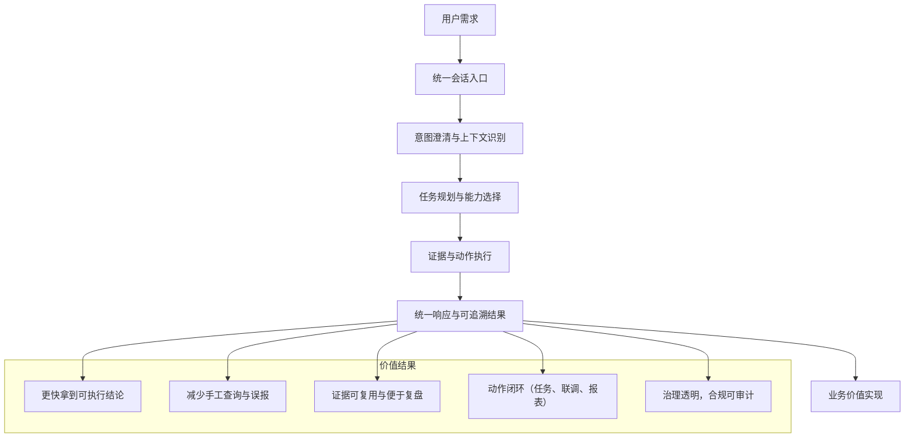
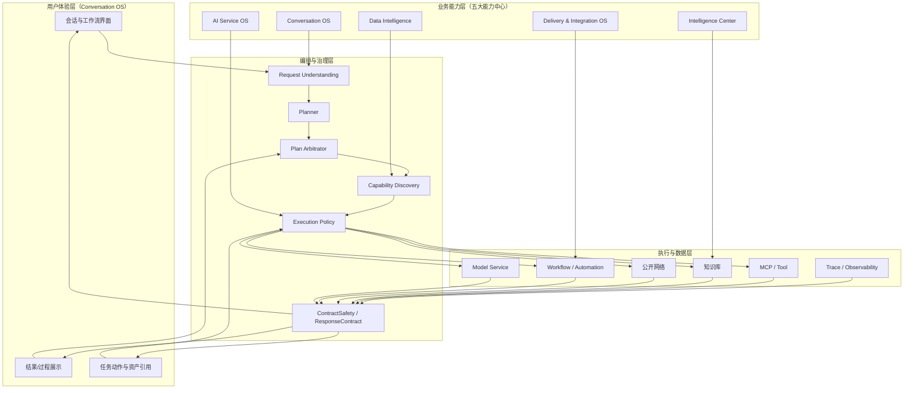
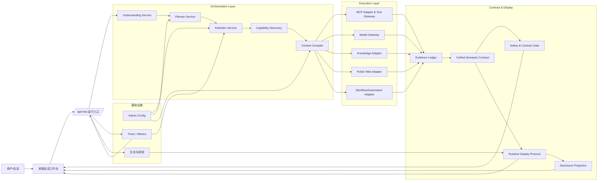
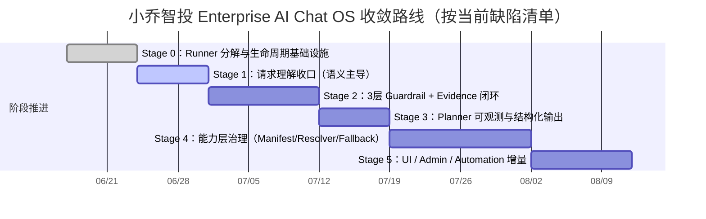
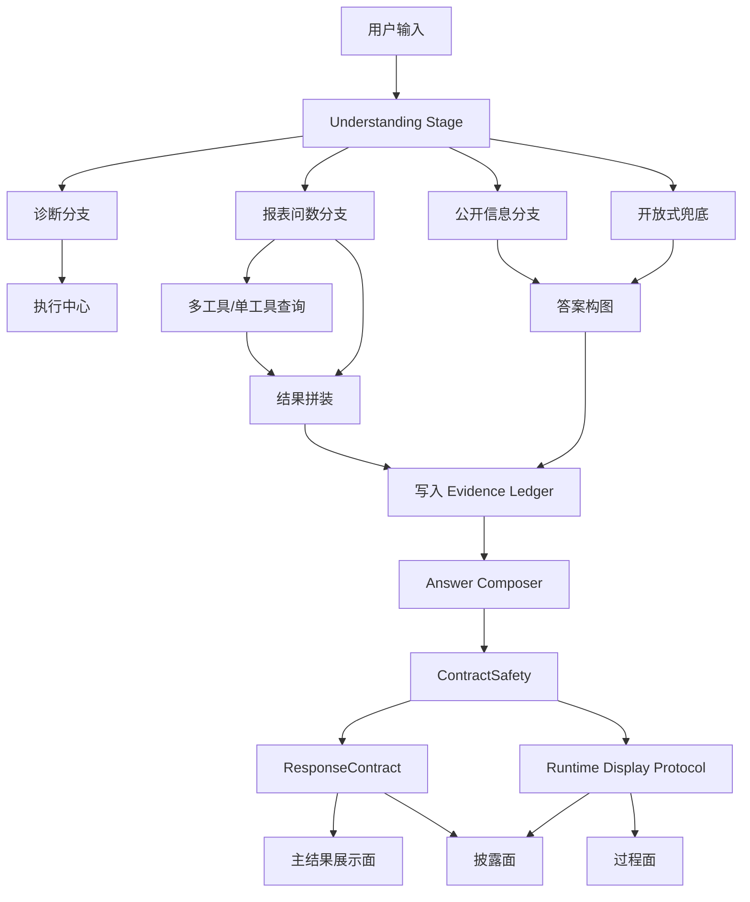
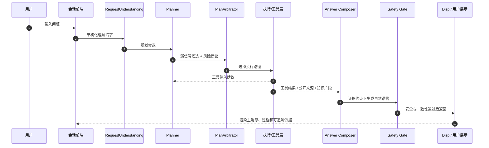
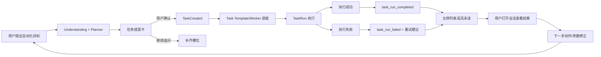

# 小乔智投项目图示（Image2 高清版）

本页仅用于当前项目现状说明，图示风格默认为可直接导入 Mermaid（或同等图形引擎）进行 2K/4K 导出。

---

## 1. 产品价值图

---

## 2. 产品架构图

---

## 3. 技术架构图

---

## 4. 产品线路图（当前缺陷治理与 VNext 收敛）

---

## 5. 运行时图（Pipeline / 结果-运行-披露三平面）

---

## 6. 大模型调用点示意图

---

## 7. 自动化介绍图（Chat-first 任务中心）

---

## 使用说明（高清导出）

- 建议在支持 Mermaid 的渲染器中，分别以独立页面导出 PNG/SVG 后再拼装。
- 如需统一风格输出，可先设置统一背景、字体和线宽，再用 300~600 dpi 导出，作为“image2 高清版”存档。
- 当前图示已与 `ENTERPRISE_AI_CHAT_OS_SPEC.md`、`ai-chat-implementation-guardrails.md`、`ui-guardrail.md` 对齐。
