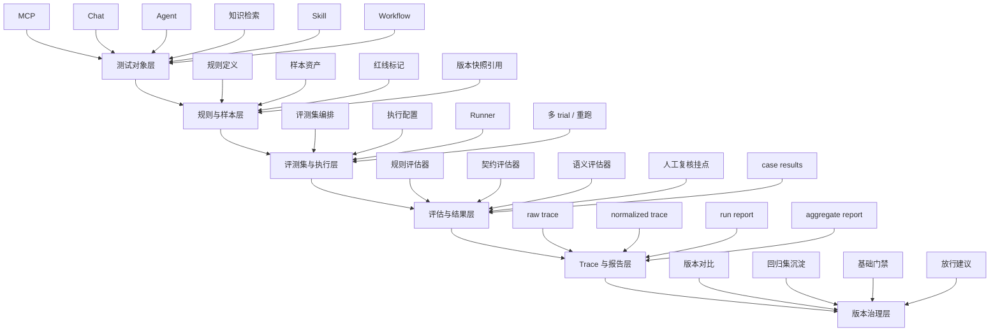

# 连弩产品架构图

- 版本：v0.1
- 日期：2026-04-20
- 状态：Draft
- 项目：连弩-AI测试平台 / ChoKoNu

## 1. 核心结论

连弩的产品架构不是“一个测试首页 + 若干功能页”，而是围绕 AI 应用测试主链构建的六层产品结构：

1. 测试对象层
2. 规则与样本层
3. 评测集与执行层
4. 评估与结果层
5. Trace 与报告层
6. 版本治理层

这六层的核心目标是让不同 AI 应用对象都能进入统一的：

`样本 -> suite -> run -> evaluator -> trace -> report -> compare -> gate`

主链。

## 2. 产品架构总图

## 3. 六层定义

### 3.1 测试对象层

负责定义“测谁”。

当前首版对象固定为：

1. `MCP`
2. `Chat`
3. `Agent`
4. `知识检索`
5. `Skill`
6. `Workflow`

其中：

1. `MCP / Chat / Agent / 知识检索` 是首版主战场
2. `Skill / Workflow` 是首版轻接入对象

### 3.2 规则与样本层

负责定义“按什么标准测”以及“用什么样本测”。

核心对象：

1. 规则定义
2. 样本资产
3. 红线项
4. 预期结果

这一层的价值是把一次性经验沉淀成可复用测试资产。

### 3.3 评测集与执行层

负责定义“怎么批量跑起来”。

核心对象：

1. test suites
2. regression suites
3. run config
4. runner

这一层是平台从静态资产走向运行闭环的关键层。

### 3.4 评估与结果层

负责定义“怎么判定结果”。

核心对象：

1. evaluator
2. case result
3. decision
4. review hook

这一层不只做打分，而是做可解释的判定。

### 3.5 Trace 与报告层

负责定义“怎么复盘和怎么交付结果”。

核心对象：

1. raw trace
2. normalized trace
3. run report
4. aggregate report

这一层让平台具备研发复盘和主管查看的双重价值。

### 3.6 版本治理层

负责定义“怎么支持版本判断”。

核心对象：

1. version compare
2. regression reuse
3. gate result
4. release suggestion

这一层是连弩区别于普通测试工具的关键。

## 4. 对应产品模块

产品模块固定映射如下：

| 产品模块 | 承接层 |
|---|---|
| 样本中心 | 测试对象层 + 规则与样本层 |
| 评测集中心 | 评测集与执行层 |
| 执行中心 | 评测集与执行层 |
| 规则/评估器中心 | 评估与结果层 |
| 结果与 Trace 中心 | 评估与结果层 + Trace 与报告层 |
| 报告与版本对比中心 | Trace 与报告层 + 版本治理层 |

## 5. 首版产品边界

首版明确不做：

1. 通用 Agent Builder
2. 低代码 Workflow 设计器
3. 全量 observability 平台
4. 自动发布阻断编排

首版只做：

1. AI 应用测试对象统一接入
2. 样本化、评测集化、执行化
3. 结果、Trace、报告、版本判断闭环

## 6. 一句话定义

连弩的产品架构，本质上是一套把不同 AI 应用对象统一拉进质量主链的产品架构，而不是一个通用开发平台架构。
