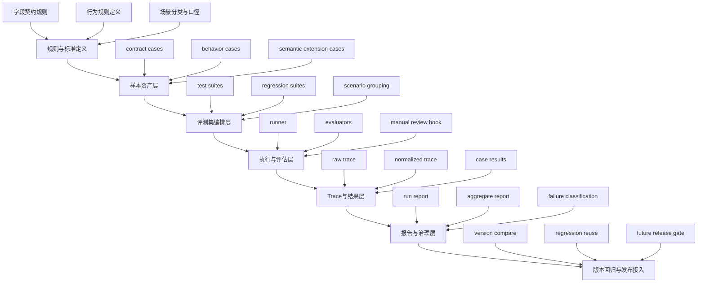

# 连弩首版规划

- 版本：v0.1
- 日期：2026-04-20
- 状态：Draft
- 项目：ChoKoNu / 连弩-AI测试平台

## 1. 规划定位

这份文档不是需求清单，也不是页面说明。

它先回答 4 个上层问题：

1. 连弩首版到底要解决什么问题
2. 连弩首版边界到哪里
3. 连弩首版按什么架构搭起来
4. 后面类似项目可以复用什么规划方法

当前规划输入主要来自：

1. [行业最佳实践调研-游戏与AI测试平台.md](/E:/AI/ai-os/subprojects/tracking-acceptance/docs/research/行业最佳实践调研-游戏与AI测试平台.md)
2. [连弩首版最佳实践约束清单.md](/E:/AI/ai-os/subprojects/tracking-acceptance/docs/research/连弩首版最佳实践约束清单.md)
3. [ChoKoNu首版范围说明.md](/E:/AI/ai-os/subprojects/tracking-acceptance/docs/requirements/ChoKoNu首版范围说明.md)
4. `inbox` 中与 AI 埋点验收、demo 系统规划、测试方法草案相关输入
5. [产品经理专项Skill草案.md](/E:/AI/ai-os/subprojects/tracking-acceptance/docs/requirements/产品经理专项Skill草案.md)

## 2. 首版核心结论

连弩首版不应该从“测试平台页面”开始，也不应该从“埋点验收脚本”开始。

首版正确的规划中心是：

`把测试对象标准化，把样本资产化，把执行可重复化，把结果报告化，把异常可追溯化。`

所以首版的最小闭环不是“提一个需求 -> 跑一个脚本 -> 看一眼日志”，而是：

`规则定义 -> 样本资产 -> 执行编排 -> 评估校验 -> Trace/报告 -> 回归复用`

## 3. 首版目标

### 3.1 业务目标

首版先解决 AI 埋点与 AI 应用测试里最常见的 5 个失控点：

1. 测试规则散落在聊天、文档、脚本里，无法复用
2. 每次验收临时拼 case，无法形成回归集
3. 执行结果只有“过/不过”，没有正式报告
4. 失败后不能快速定位到调用链和异常点
5. 版本上线前没有稳定的质量判断基线

### 3.2 产品目标

首版形成一套可运行的测试资产主链：

1. 可维护的规则与样本
2. 可复用的评测集
3. 可重复的自动执行
4. 可审阅的测试报告
5. 可排查的异常 Trace

### 3.3 平台目标

首版不追求做成全能 AI 质量中台，只追求把这条链做实：

`样本 -> 执行 -> 结果 -> 报告 -> Trace -> 回归`

## 4. 首版边界

### 4.1 首版要做

1. 字段契约类测试样本
2. 行为规则类测试样本
3. 评测集编排
4. 自动化执行
5. 评估器执行与判定
6. 测试报告输出
7. 异常 Trace 关联
8. 基础回归复用

### 4.2 首版暂不做深

1. 全量 AI 语义评测体系
2. 大规模多租户治理
3. 完整 CI/CD 门禁编排
4. 全量线上观测和告警中心
5. 高复杂度协同审批系统

### 4.3 首版必须预留

1. 版本对比
2. 回归集沉淀
3. 线上预警挂接
4. AI 语义评测扩展位
5. 发布门禁扩展位

## 5. 首版架构图

## 6. 五层要素设计

这里的“五层”不是技术分层炫技，而是规划时必须逐层想清楚的 5 个要素层。

### 第一层：目标与标准层

回答：

1. 测什么
2. 为什么测
3. 什么叫通过
4. 什么叫失败

核心要素：

1. 字段契约标准
2. 行为规则标准
3. 场景分类
4. 业务口径
5. 通过/失败判定标准

没有这一层，后面执行只是跑脚本，不是做测试平台。

### 第二层：样本与资产层

回答：

1. 用什么样本来承载标准
2. 样本怎么复用
3. 样本怎么从一次性材料变成长期资产

核心要素：

1. 字段契约样本
2. 行为规则样本
3. 回归样本
4. 高频场景样本
5. 来源、预期、校验方式等元数据

没有这一层，就不会形成回归能力。

### 第三层：执行与评估层

回答：

1. 样本如何被批量执行
2. 谁来判定结果
3. 哪些环节自动，哪些环节人工复核

核心要素：

1. Runner
2. Evaluator
3. 批量执行机制
4. 重跑与失败重试
5. 人工复核挂钩点

没有这一层，平台只有静态资产，没有运行能力。

### 第四层：结果与可追溯层

回答：

1. 执行结果怎么落
2. 失败如何排查
3. 什么信息可以支撑复盘

核心要素：

1. case result
2. raw trace
3. normalized trace
4. failure classification
5. 定位入口

没有这一层，测试结果不可复盘，也没法沉淀成治理能力。

### 第五层：报告与治理层

回答：

1. 谁看结果
2. 用什么视角看
3. 怎么支持版本决策和回归治理

核心要素：

1. 单次测试报告
2. 聚合报告
3. 版本对比
4. 回归集沉淀
5. 未来发布门禁接口

没有这一层，就只是工程执行系统，不是产品化平台。

## 7. 首版模块规划

基于上面的五层要素，首版模块建议收成 6 个：

### 7.1 规则中心

负责：

1. 字段契约定义
2. 行为规则定义
3. 场景和口径分类

### 7.2 样本中心

负责：

1. case 管理
2. 样本导入导出
3. 回归样本沉淀

### 7.3 评测集中心

负责：

1. suite 组织
2. 按场景/版本聚合
3. 执行范围编排

### 7.4 执行中心

负责：

1. 发起执行
2. 调用 runner
3. 挂评估器
4. 管理执行状态

### 7.5 Trace 与结果中心

负责：

1. 结果落库
2. Trace 归一化
3. 错误分类与定位

### 7.6 报告中心

负责：

1. run report
2. aggregate report
3. 版本对比
4. 为回归与门禁输出依据

## 8. 首版动作主链

连弩首版不能只按“模块”理解，还要按“动作”理解。

因为真正落地时，团队不是先做模块，而是先完成一串动作。

首版动作主链固定为：

1. `定义测试标准`
2. `沉淀测试样本`
3. `组织评测集`
4. `配置执行任务`
5. `运行评估器`
6. `归集结果与Trace`
7. `生成测试报告`
8. `沉淀回归集`

这 8 个动作就是首版最小工作流。

## 9. 动作-Skill-产物映射

下面这部分是规划落地的核心。  
每个动作都必须对应 skill，不允许只有模块名、没有能力定义。

### 动作 1：定义测试标准

目标：

把“要测什么、什么算通过”定成可执行标准。

必备 skill：

1. `字段契约定义`
2. `行为规则建模`
3. `业务口径抽取`
4. `场景分类`
5. `通过/失败判定设计`

产物：

1. 规则定义文档
2. 字段契约清单
3. 行为规则清单
4. 场景分类表

### 动作 2：沉淀测试样本

目标：

把标准转成长期可复用的 case 资产。

必备 skill：

1. `contract case 设计`
2. `behavior case 设计`
3. `样本元数据建模`
4. `预期结果设计`
5. `样本来源归档`

产物：

1. 样本库
2. 样本字段模板
3. 高频样本集
4. 回归候选样本集

### 动作 3：组织评测集

目标：

把分散样本编排成可批量执行的 suite。

必备 skill：

1. `suite 编排`
2. `按场景聚合`
3. `按版本聚合`
4. `回归集构建`
5. `执行范围裁剪`

产物：

1. test suites
2. regression suites
3. suite 结构规则

### 动作 4：配置执行任务

目标：

让同一批 suite 可以稳定地重复执行。

必备 skill：

1. `runner 配置`
2. `模型与环境切换`
3. `并发与超时配置`
4. `重试/重跑策略`
5. `人工复核挂点设计`

产物：

1. run 配置模板
2. 执行参数模板
3. 重跑策略说明

### 动作 5：运行评估器

目标：

把执行结果变成可判定的测试结论。

必备 skill：

1. `规则评估器设计`
2. `契约校验`
3. `行为规则校验`
4. `结果分类`
5. `人工复核协同`

产物：

1. evaluator 分类
2. evaluator 执行规则
3. 失败分类规则

### 动作 6：归集结果与 Trace

目标：

让每个失败结果都能回到上下文和异常链。

必备 skill：

1. `结果归集`
2. `trace 采集`
3. `trace 归一化`
4. `异常定位`
5. `case-result-trace 关联`

产物：

1. case result 结果表
2. raw trace / normalized trace
3. 失败定位入口

### 动作 7：生成测试报告

目标：

把运行结果转成主管、测试、研发都能看的正式交付物。

必备 skill：

1. `测试报告编排`
2. `失败归因表达`
3. `聚合统计`
4. `版本对比表达`
5. `问题清单抽取`

产物：

1. run report
2. aggregate report
3. 待回归问题单

### 动作 8：沉淀回归集

目标：

让测试结果反哺样本和版本治理，而不是一次性消耗。

必备 skill：

1. `失败样本回流`
2. `回归集沉淀`
3. `版本基线维护`
4. `风险样本标记`
5. `回归策略调整`

产物：

1. 回归集
2. 版本基线
3. 样本优先级标签

## 10. 首版 Skill 分层设计

为了避免 skill 变成散点工具，连弩首版建议把 skill 分成 5 层。

### 第一层：标准定义 Skill

1. `字段契约定义`
2. `行为规则建模`
3. `业务口径抽取`
4. `场景分类`

### 第二层：样本资产 Skill

1. `contract case 设计`
2. `behavior case 设计`
3. `预期结果设计`
4. `样本元数据建模`
5. `回归样本沉淀`

### 第三层：执行编排 Skill

1. `suite 编排`
2. `runner 配置`
3. `执行参数设计`
4. `重跑策略`
5. `人工复核挂点`

### 第四层：评估追踪 Skill

1. `规则评估器设计`
2. `结果归集`
3. `trace 采集`
4. `trace 归一化`
5. `异常定位`

### 第五层：报告治理 Skill

1. `测试报告编排`
2. `失败归因表达`
3. `版本对比`
4. `回归策略调整`
5. `发布门禁预留`

## 10.1 产品经理 Skill 配套

除了测试/测开 skill，首版还要配一层产品经理 skill，不然规划和同步会继续空转。

当前已单列成文档：

[产品经理专项Skill草案.md](/E:/AI/ai-os/subprojects/tracking-acceptance/docs/requirements/产品经理专项Skill草案.md)

连弩当前阶段最重要的产品经理 skill 是：

1. `研究提炼`
2. `边界收敛`
3. `动作链规划`
4. `架构吸收`
5. `风险显化`
6. `主动同步`

它们负责把输入收进来，把首版规划做实，再把待主管拍板的问题稳定提出来。

## 11. 规划方法沉淀

这部分不是空理念，而是以后做类似平台时可直接复用的方法。

### 方法一：规划先画“动作链”，再画页面

先定：

`标准 -> 样本 -> suite -> run -> evaluator -> trace -> report -> regression`

再去决定页面和接口怎么长。

### 方法二：每个动作必须绑定 skill

如果一个动作说不出需要什么 skill，说明规划还不够实。

所以后续任何版本规划都要检查：

1. 动作是什么
2. 这个动作需要哪些 skill
3. skill 输出什么产物

### 方法三：每个 skill 必须落到资产或结果

skill 不是空方法论，必须最后落到这两类之一：

1. `资产`
   - 规则
   - 样本
   - suite
   - 配置
2. `结果`
   - result
   - trace
   - report
   - regression baseline

### 方法四：规划时同时看“能力闭环”和“数据闭环”

能力闭环：

`定义 -> 执行 -> 判定 -> 报告`

数据闭环：

`规则 -> case -> suite -> run -> result -> trace -> report -> 回流`

两个闭环都通，规划才算成立。

### 方法五：规划时要能反推组织分工

这套动作链还要能反推出谁干什么：

1. 产品/测试负责人：标准、边界、报告口径
2. 测开：执行、评估器、trace、自动化
3. 研发：被测对象接入、日志/trace 配合
4. 主管：范围取舍、版本决策、门禁判断

## 12. 当前规划下的后续输出顺序

规划之后，才应该继续往下走：

1. `连弩首版动作清单`
2. `连弩首版模块清单`
3. `连弩首版页面/工作台规划`
4. `连弩首版需求清单`
5. `连弩首版里程碑与版本计划`

## 13. 一句话结论

连弩首版规划的本质，不是“做一个测试平台首页”，也不是“先列一堆需求”，而是先把：

`动作链 + skill链 + 资产链 + 结果链`

一起搭成一个最小可运行闭环。
