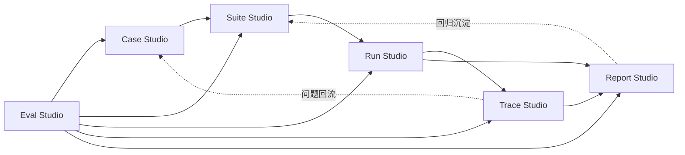

# 连弩工作台关系图 v1

- 版本：v0.1
- 日期：2026-04-21
- 状态：Draft
- 项目：连弩-AI测试平台 / ChoKoNu

## 1. 目标

这份文档不是解释“有什么工作台”，而是解释：

`六个工作台之间怎么衔接，用户为什么要按这个顺序进入。`

## 2. 核心判断

六个工作台不是平铺的六个菜单，而是一条主链上的不同工作段。

主链如下：

`Case Studio -> Suite Studio -> Run Studio -> Trace Studio -> Report Studio`

`Eval Studio` 不在主链前后某一个点，而是横向支持整条主链。

## 3. 工作台关系图

## 4. 工作台职责

## 4.1 Case Studio

Case Studio 是整个系统的起点。

它负责定义：

1. 测什么
2. 用什么输入测
3. 期待什么结果
4. 它属于哪类对象
5. 它有哪些风险标签

如果没有稳定的 case 资产，后面的 suite、run、report 都没有复用价值。

## 4.2 Suite Studio

Suite Studio 负责把单个 case 组织成可以执行的评测集。

它负责：

1. baseline suite
2. regression suite
3. scenario suite
4. suite 与对象类型、版本、环境的绑定

Case Studio 是“资产沉淀”，Suite Studio 是“资产编排”。

## 4.3 Run Studio

Run Studio 负责把静态资产变成动态执行。

它承接：

1. 发起 run
2. 配置环境与参数
3. 管理执行状态
4. 重跑与多 trial

这是系统从“定义”进入“验证”的分界点。

## 4.4 Trace Studio

Trace Studio 负责“为什么会这样”。

它承接：

1. 失败结果下钻
2. 执行过程复盘
3. 节点级问题定位
4. 人工 review 挂点
5. 问题回流到 case

如果没有 Trace Studio，系统只能做“结果展示”，做不到“问题定位”。

## 4.5 Report Studio

Report Studio 负责“结论输出”。

它承接：

1. run report
2. aggregate report
3. 版本 compare
4. 质量判断
5. 放行建议

Report Studio 不是看过程，而是做版本层面的判断。

## 4.6 Eval Studio

Eval Studio 负责整个系统的判定语言。

它承接：

1. evaluator
2. rules
3. thresholds
4. redlines
5. suite 绑定
6. 对象适用范围

Eval Studio 之所以横向存在，是因为它会影响：

1. Case 的定义方式
2. Suite 的组织方式
3. Run 的执行判定
4. Trace 的解释方式
5. Report 的最终结论

## 5. 两条关键回流链

除了主链，还必须有两条回流链。

### 5.1 Trace -> Case

当一次 run 暴露了新问题，Trace Studio 应该支持回流为：

1. 新 case
2. 新风险标签
3. 新 reviewer 规则

这条链决定平台会不会越来越强。

### 5.2 Report -> Suite

当一次版本对比发现某类问题高频出现，Report Studio 应该推动：

1. 生成或补充 regression suite
2. 固化 baseline
3. 调整放行规则

这条链决定平台有没有真正的“回归价值”。

## 6. 为什么不做独立首页大盘

如果独立做一个“大盘首页”，问题是：

1. 用户会被拉到看统计，而不是做工作
2. 工作台之间的关系会被打散
3. 页面会越来越像传统后台

所以更合理的做法是：

1. 默认进入最近活跃工作台
2. 首页只做轻量概览
3. 真正的工作发生在 6 个工作台内部

## 7. 为什么 Compare 不单列为一级工作台

Compare 很重要，但不应该独立成一级区。

原因是：

1. compare 的价值来自 report 结论
2. compare 本质上是版本判断动作，不是长期驻留的资产中心
3. 如果独立出去，会让产品再多一个抽象孤岛

所以更合理的是把 compare 放在 `Report Studio` 内。

## 8. 为什么 Rule 不应该只是配置页

很多系统会把规则做成一个孤立的配置后台。

连弩不应该这样。

因为规则的意义不在“可配置”，而在：

1. 被 case 使用
2. 被 suite 绑定
3. 被 run 触发
4. 被 trace 解释
5. 被 report 汇总

这也是为什么 `Eval Studio` 必须是完整工作台，而不是“设置页”。

## 9. 后续页面设计约束

后续页面如果继续往下画，必须遵守这些约束：

1. 一级导航固定为 6 个工作台
2. 对象类型只作为筛选和标签出现
3. compare 归属 Report Studio
4. rule/evaluator 归属 Eval Studio
5. trace 必须支持回流 case
6. report 必须支持回流 suite

## 10. 一句话结论

连弩的六个工作台关系，本质上是一条 `定义 -> 编排 -> 执行 -> 定位 -> 判断` 的主链，再由 `Eval Studio` 横向提供判定语言，由 `Trace / Report` 反向把问题沉淀回 `Case / Suite`。
