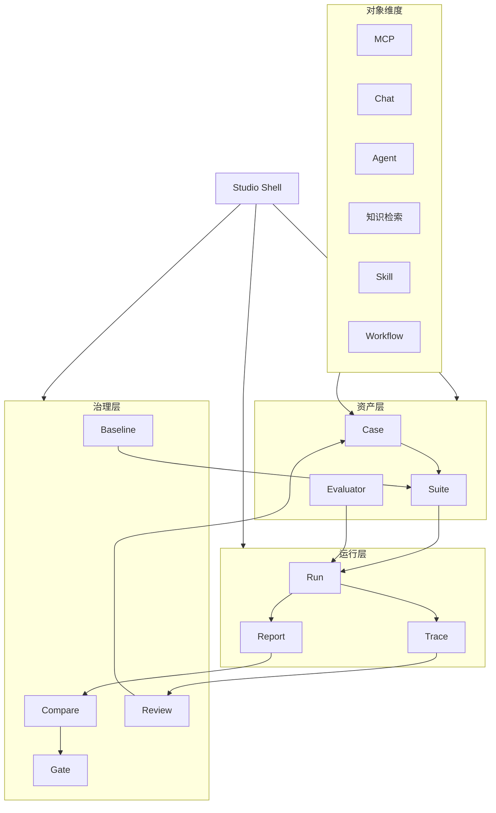

# 连弩整体产品架构图 v1

- 版本：v0.1
- 日期：2026-04-21
- 状态：Draft
- 项目：连弩-AI测试平台 / ChoKoNu

## 1. 目标

这份文档只回答一个问题：

`连弩当前版本的整体产品，到底按什么骨架来组织。`

答案不是“模块列表”，也不是“技术分层”，而是：

`Studio 外壳 + 质量主链 + 六个核心工作台 + 横向治理能力`

## 2. 总体判断

连弩不是通用 Agent 开发平台，也不是传统测试后台。

它当前应该被定义成：

`面向 AI 应用研发迭代的 AI 自动化测试与质量治理工作台`

所以它的产品结构必须服务于下面这条质量主链：

`Case -> Suite -> Run -> Trace -> Report -> Gate`

其中 `Evaluator / Rule / Compare / Review` 不是孤立模块，而是贯穿主链的判定和治理能力。

## 3. 架构总图

## 4. 四层解释

## 4.1 Studio Shell

最外层不是首页，而是统一工作壳。

它负责承接：

1. 当前 workspace
2. 当前环境
3. 全局搜索
4. 当前版本上下文
5. 最近运行入口
6. 快速发起 run

这一层的目标是让产品看起来像 `Studio`，而不是“菜单 + 一堆后台页”。

## 4.2 资产层

资产层承接的是“测试前要定义好的东西”。

当前应固定为 3 个核心对象：

1. `Case`
   最小测试样本与期望
2. `Suite`
   用于组织执行的评测集
3. `Evaluator`
   用于判定结果的规则与评估器

资产层是平台复用价值的来源。没有资产层，后面的执行与报告都只能是一次性工作。

## 4.3 运行层

运行层承接的是“测试真正跑起来以后发生的事情”。

当前应固定为 3 个核心对象：

1. `Run`
   一次执行实例
2. `Trace`
   一次执行的过程证据
3. `Report`
   一次或一组执行的结论输出

这三者必须被清晰区分：

1. `Run` 是动作
2. `Trace` 是证据
3. `Report` 是结论

## 4.4 治理层

治理层不是单独的主站，而是横向穿透。

它负责：

1. `Compare`
   当前版本与 baseline 或历史版本的比较
2. `Review`
   人工复核与例外处理
3. `Gate`
   版本放行判断
4. `Baseline`
   可回归对照集的沉淀

这一层决定连弩是不是一个“企业可用”的系统，而不只是一个“能看结果”的工具。

## 5. 主对象与测试对象的关系

连弩面向的业务测试对象包括：

1. MCP
2. Chat
3. Agent
4. 知识检索
5. Skill
6. Workflow

但这些不是一级导航，也不是一级产品区。

更准确的关系是：

1. 这些是 `Case` 的对象类型
2. 这些会影响 `Suite` 的组织方式
3. 这些会影响 `Evaluator` 的判定维度
4. 这些在 `Run / Trace / Report` 中作为筛选和解释维度出现

也就是说：

`对象类型是内容维度，不是产品骨架。`

## 6. 为什么不能按对象类型做产品

如果主导航按 `MCP / Chat / Agent / RAG / Skill / Workflow` 展开，会出现几个问题：

1. 同一条质量主链被拆碎
2. 公共能力会被重复建设
3. 用户会先感知“技术分类”，而不是“正在完成什么工作”
4. 页面很容易退化成“对象目录”

所以更合理的组织方式是：

1. 导航按工作台
2. 内容按对象类型筛选

## 7. 六个核心工作台

为了把上面的四层落成页面，当前应固定为 6 个核心工作台：

1. `Case Studio`
   负责样本资产沉淀
2. `Suite Studio`
   负责评测集组织
3. `Run Studio`
   负责发起与管理执行
4. `Trace Studio`
   负责下钻与定位
5. `Report Studio`
   负责结论输出与版本判断
6. `Eval Studio`
   负责规则、评估器、阈值与红线项

这 6 个工作台分别承接：

1. Case Studio -> `Case`
2. Suite Studio -> `Suite`
3. Run Studio -> `Run`
4. Trace Studio -> `Trace`
5. Report Studio -> `Report + Compare + Gate`
6. Eval Studio -> `Evaluator + Rule`

## 8. 与竞品的对应关系

如果放到竞品图谱里，连弩当前的位置应理解为：

1. 外壳和工作区组织方式，参考 `Coze Studio`
2. 调试、评测、Trace、回流主链，参考 `Coze Loop`
3. dataset / evaluator / experiment / trace 的联动关系，参考 `LangSmith`
4. compare / gate / release 决策，参考 `Braintrust`

但连弩自己的主语应该更明确：

`企业内部 AI 应用测试与质量治理`

## 9. 首版边界

当前版本应明确：

### 要做

1. `Case -> Suite -> Run -> Trace -> Report` 主链
2. `Evaluator / Compare / Review / Gate` 横向治理
3. 面向 `MCP / Chat / Agent / 知识检索 / Skill / Workflow` 的对象接入

### 不做

1. 通用 Agent Builder
2. 复杂 Workflow 设计器
3. Prompt Playground 作为产品中心
4. 全量线上 observability 中台

## 10. 一句话结论

连弩当前版本的整体产品结构，应该被固定为：

`一个以 Studio Shell 为外壳、以 Case/Suite/Run/Trace/Report/Evaluator 为六个核心工作台、以 Compare/Review/Gate/Baseline 为横向治理能力的 AI Testing Studio。`
