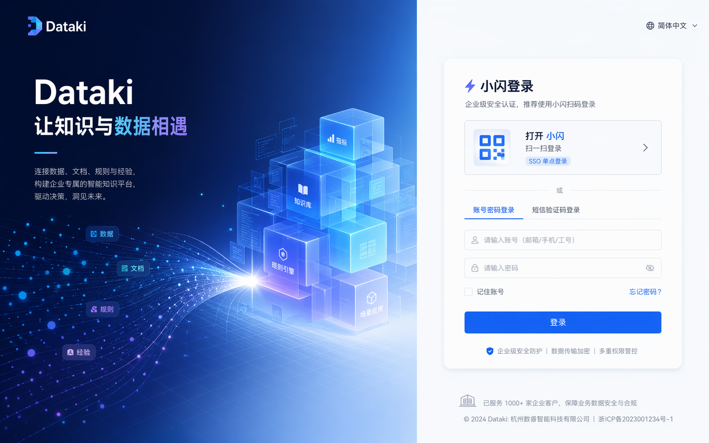
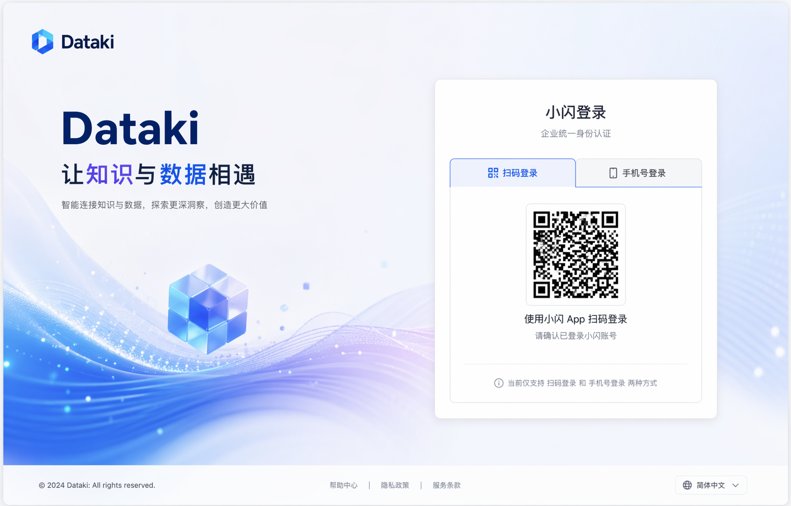
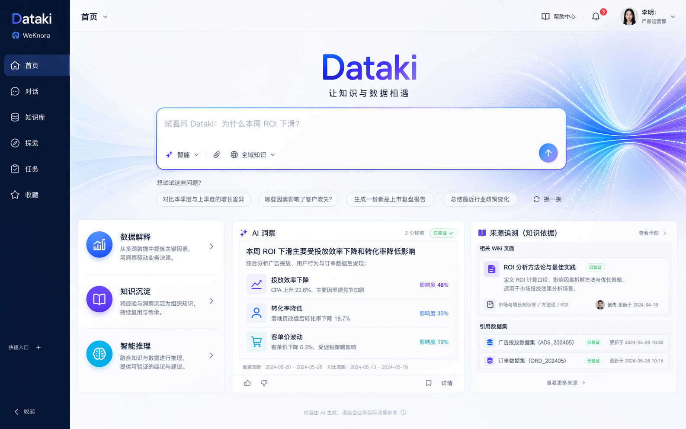
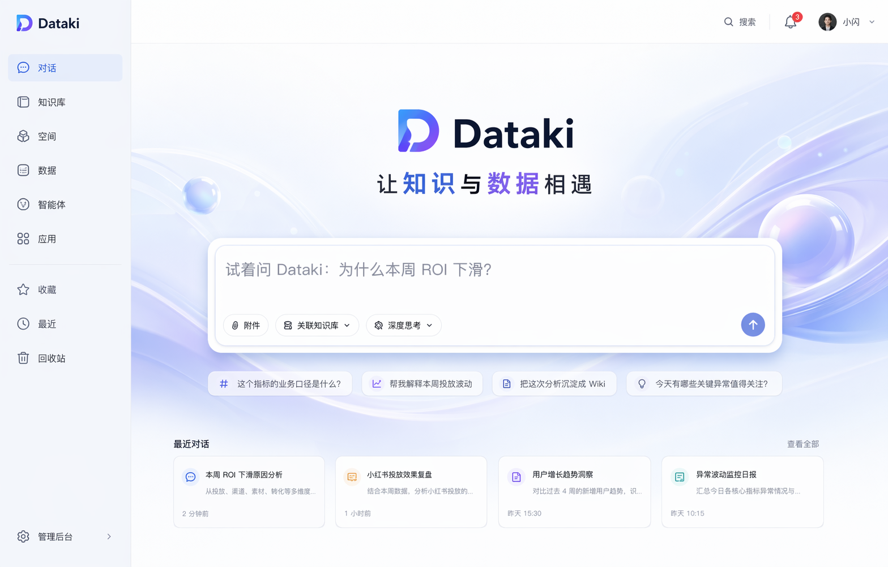
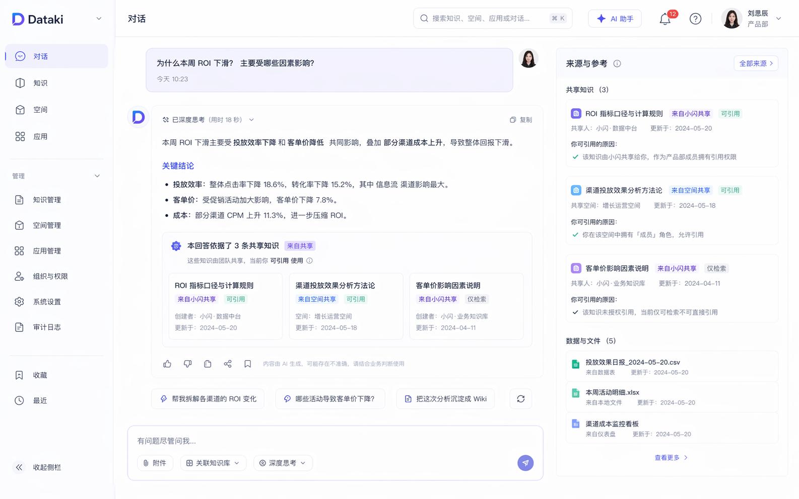
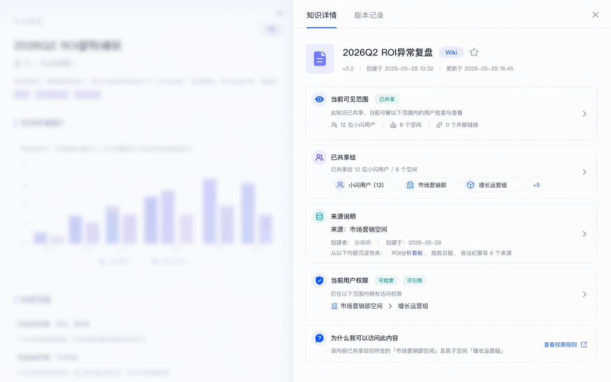
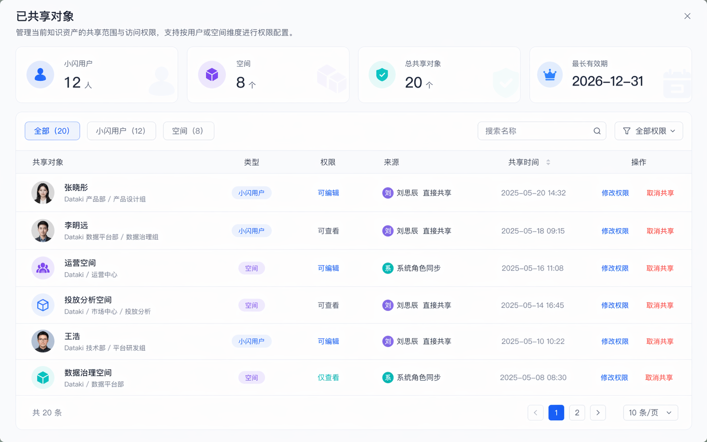
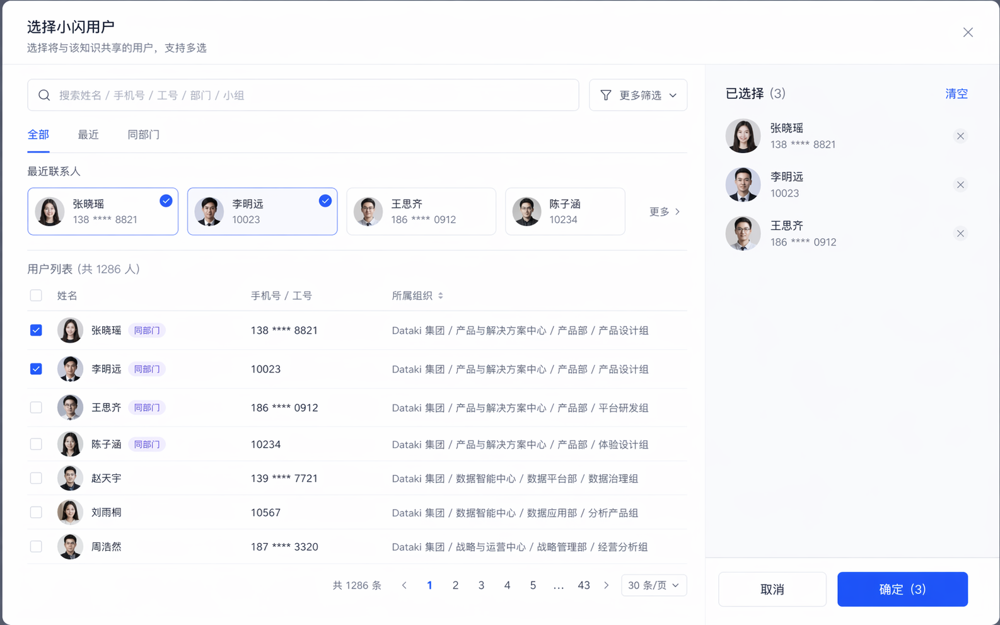
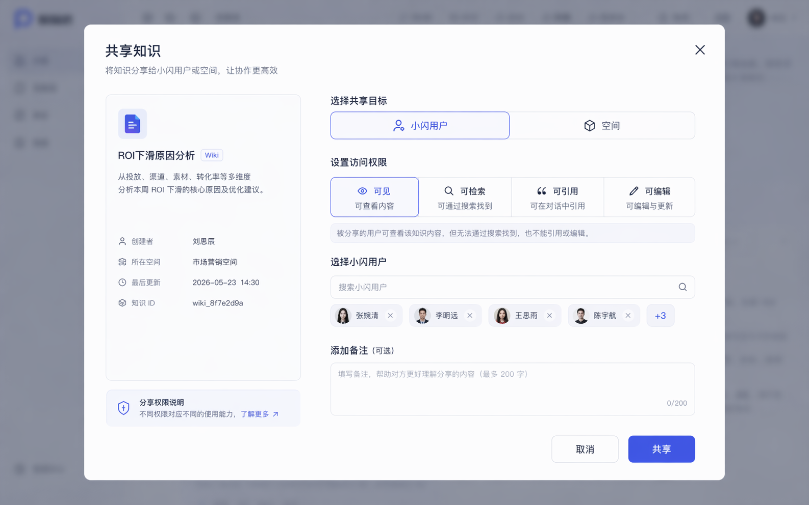

# Dataki 知识库 v1.1.1 最终对齐文档
- 版本：v1.1.1
- 日期：2026-04-24
- 状态：Current
- 适用范围：Dataki 当前唯一对齐文档
- 读者对象：产品、设计、前端、后端、测试、AI

## 0. 对齐规则

从当前时点开始，本文件作为 Dataki 当前唯一目标文档。

执行规则：

1. 后续讨论、设计、开发、验收都以本文件为准
2. 其他同主题文档仅作为历史过程材料或辅助材料
3. 若本文件与旧文档冲突，以本文件为准
4. 若需求变化，优先更新本文件，再更新其他辅助文档

源头依据：

- `E:/AI/ai-os/docs/sources/inbox/Dataki 知识库 v1.1.1.docx`

## 1. 当前版本目标

Dataki 当前版本只围绕两条最终需求展开：

1. 品牌改造
2. 权限改造

当前版本不是大而全的平台重做，而是在基本保留 WeKnora 产品壳的前提下，完成 Dataki 品牌替换和权限治理收敛。

## 2. 最终需求

### 2.1 品牌改造

要求如下：

1. 产品名统一为 `Dataki`
2. Slogan 统一为 `让知识与数据相遇`
3. LOGO 与设计改造以以下资料为准：
   - `Dataki_brand_pack (1).zip`
   - `Dataki_ui_specs.zip`
4. 前端采用统一组件库嵌入
5. 当前版本保留 WeKnora 现有产品壳，不做大规模结构重写
6. 对外定位文案统一为 `LLM-wiki-Agent-MCP-Prompts`
7. 不再使用 `内部知识与数据协同工作台` 作为当前版本主文案

### 2.2 权限改造

要求如下：

1. 增加 `超管` 角色
2. 超管是指定管理人
3. 超管拥有高级设置权限
4. 大模型配置、MCP 配置、系统级高级设置不对普通用户开放
5. 其他用户默认采用统一配置
6. 系统默认内置数据部大模型服务
7. 系统默认内置知识库和数据 MCP 服务
8. 增加用户管理
9. 读取小闪的小组 / 部门 / 公司 / 集团多级组织结构
10. 去掉其他登录方式
11. 日常用户登录只保留：
   - 小闪扫码登录
   - 小闪手机号登录

补充口径：

1. 为保证系统可初始化，仍需保留超管落位能力
2. 普通用户只消费统一下发的模型与 MCP 能力
3. 普通用户不参与系统级配置
4. 能力表达不再使用 `统一账号接入 / 统一模型配置 / 统一知识协同`
5. 统一改为 `内置数据部大模型、知识库和数据 MCP 服务`

## 3. 小闪对接

### 3.1 当前外部依赖

- 开发者密钥暂未提供，待补

### 3.2 测试环境地址

- `https://testwapi.zhimagame.net/robot/openapi/system/user/getFullByThirdAccount`
- `https://testwapi.zhimagame.net/robot/openapi/gettoken`

### 3.3 当前需要接住的信息

通过第三方账号获取小闪用户详细信息，至少包含：

1. `userid`
2. `user_name`
3. `real_name`
4. `group_id`
5. `group_name`
6. `company_id`
7. `company_name`
8. `department_id`
9. `department_name`
10. `org_id`
11. `org_name`
12. `phone`

### 3.4 access_token 约束

1. 有效期 7200 秒
2. 有效期内重复获取会返回相同结果并自动续期
3. 服务端必须缓存 access_token
4. 不能频繁调用 gettoken 接口

## 4. 设计与组件库对接

### 4.1 设计资源

品牌与设计资源以以下资料为准：

1. `docs/sources/inbox/Dataki_brand_pack (1).zip`
2. `docs/sources/inbox/Dataki_ui_specs.zip`

### 4.2 组件库

- 组件库地址：`http://10.236.15.36:6006/`

### 4.3 登录组件参考

- `http://10.236.15.36:6006/?path=/docs/%E4%B8%9A%E5%8A%A1%E7%BB%84%E4%BB%B6-ykloginmodule-%E7%99%BB%E5%BD%95%E7%BB%84%E4%BB%B6--docs`

### 4.4 设计执行原则

1. 所有改动页面先出图，再开发
2. 登录页只允许保留小闪扫码登录与小闪手机号登录
3. 其他登录方式必须去掉
4. 当前版本优先做品牌替换和权限治理页，不主动扩张到知识资产体系重构

## 5. 与 WeKnora 原设计的差异

WeKnora 原本是通用型产品壳，因此天然更倾向：

1. 保留多种登录方式
2. 暴露更开放的模型 / MCP 配置入口
3. 按通用型平台思路组织配置能力

Dataki 当前版本的改造目标正好相反：

1. 登录方式收敛到小闪扫码 + 小闪手机号
2. 大模型和 MCP 改为由指定超管统一管理
3. 普通用户只消费统一配置结果

## 6. 基于当前需求的设计图选用建议

### 6.1 可直接服务当前需求的图

1. 登录页整页方案 A
2. 登录页轻品牌版
3. MCP / 权限相关抽屉和弹窗图

### 6.2 只作为灵感参考的图

1. 大改首页结构的整页图
2. 把 WeKnora 首页完全改造成新工作台的重构图
3. 偏品牌宣讲页的能力卡片和闭环图

## 7. 设计图合集

### 7.1 登录页整页方案 A

说明：

- 可参考 Dataki 品牌语义
- 但当前版本必须进一步收敛到“小闪扫码 + 小闪手机号”两种登录形态

### 7.2 登录页轻品牌版

说明：

- 适合作为当前登录页改造的直接参考
- 但需删除所有非小闪登录形态

### 7.3 首页 / 主入口整页方案 A

说明：

- 仅作探索参考
- 当前版本不按此图做大规模重构

### 7.4 对话首页 / 主入口改动图

说明：

- 仅参考品牌与组件表达
- 不直接作为当前版本实现基线

### 7.5 对话详情页 + 来源与参考侧栏

### 7.6 知识详情右侧抽屉

### 7.7 已共享对象总表弹窗

### 7.8 选择小闪用户弹窗

### 7.9 分享知识主弹窗

## 8. 下一步动作

1. 先按本文件确认最终设计图
2. 再按本文件确认功能和改动点
3. 再按本文件推进二开 Agent
4. 后续所有功能开发确认都回挂本文件

## 9. 文档状态说明

以下文档从当前开始降级为辅助材料，不再作为当前最终口径来源：

1. `Dataki-v1.1最新确认需求清单.md`
2. `Dataki-v1.1首版定义.md`
3. `Dataki-v1.1页面清单与页面流.md`
4. `Dataki-v1.1前后端任务拆分表.md`
5. `Dataki-v1.1设计出图与确认清单.md`

它们后续如需保留，只作为过程记录或拆分执行文档存在。
